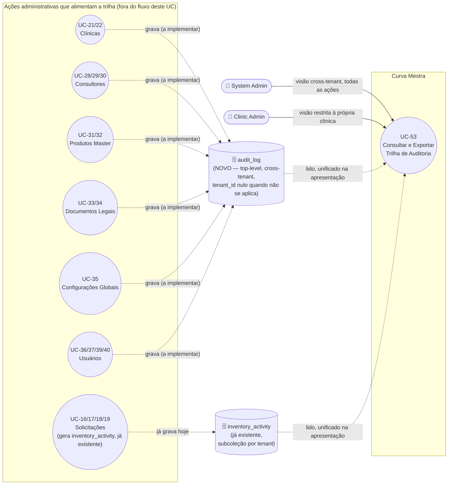

# UC-53: Consultar e Exportar Trilha de Auditoria

**Projeto:** Curva Mestra
**Data de Criação:** 22/07/2026
**Autor:** Guilherme Scandelari (via uml-use-case-writer)
**Status:** Aprovado
**Módulo/Contexto:** Administração do Sistema / Segurança e Conformidade
**Versão:** 1.0

> **Feature nova, ainda não implementada** — reservada na Seção 7.1 do `_MAPA-DE-BUGS-E-MELHORIAS.md` a partir da promessa da landing page ("Trilha de auditoria completa — Quem viu, quem alterou, quando. Exportável a qualquer momento"). Este UC especifica uma nova tela — "Trilha de Auditoria" — em que System Admin (visão cross-tenant, todas as clínicas) e Clinic Admin (visão restrita à própria clínica) consultam e exportam (CSV/PDF) um histórico unificado de **escritas administrativas sensíveis** (criar/editar/ativar/desativar/suspender/mudar papel, nunca leituras/visualizações) sobre um conjunto definido de entidades, somado ao log de movimentação de estoque (`inventory_activity`) que já existe e já é gravado hoje, mas nunca foi exposto em nenhuma tela. Todas as decisões de escopo abaixo foram tomadas explicitamente pelo usuário (Seção 15).

---

## 1. Diagrama UML (Mermaid)

Não há relação `<<include>>`/`<<extend>>` clássica com os UCs de origem — eles não são acionados a partir deste UC nem o acionam; a relação é de **dependência de dados**: cada um deles, ao ser executado, passa a gravar (após a implementação desta feature) uma entrada que este UC lê.

---

## 2. Atores

### 2.1 Ator Primário
**System Admin** e **Clinic Admin**, com escopos de visibilidade diferentes (decisão explícita do usuário):
- **System Admin**: vê a trilha completa, cross-tenant — todas as ações administrativas de todas as clínicas, e todas as movimentações de estoque (`inventory_activity`) de todos os tenants.
- **Clinic Admin**: vê apenas a trilha da própria clínica — ações administrativas restritas ao próprio tenant (hoje, na prática, apenas criação de usuário via UC-40, já que as demais entidades em escopo — clínicas, consultores, produtos master, documentos legais, configurações globais — são geridas exclusivamente por `system_admin`, ver RN-10) somadas ao `inventory_activity` do próprio tenant.

`clinic_user` e `clinic_consultant` **não têm acesso** a esta tela em nenhuma hipótese — decisão explícita do usuário (Seção 15, item 3).

### 2.2 Atores Secundários / Sistemas Externos
Nenhum sistema externo. Os "atores" cujas ações alimentam a trilha (system_admin executando UC-21/22/28/29/30/31/32/33/34/35/36/37/39, clinic_admin executando UC-40) não interagem diretamente com este UC — a gravação de cada entrada é um efeito colateral desses outros casos de uso, não um passo deste fluxo.

---

## 3. Pré-condições
- **Pré-condição de implementação (bloqueante para o "as-is", não para a especificação):** os hooks de gravação em `audit_log` listados na Seção 9 (RN-02) precisam ser adicionados a cada service/rota de origem — esta feature não existe hoje em nenhuma camada (nem UI, nem coleção, nem hooks de escrita).
- Usuário autenticado, com custom claims válidos (`role: 'system_admin'` via `is_system_admin === true`, ou `role: 'clinic_admin'` com `tenant_id` definido).
- Para Clinic Admin: `tenant_id` presente nas claims — a query de `audit_log` e de `inventory_activity` é sempre escopada a esse valor.

---

## 4. Pós-condições

### 4.1 Sucesso (Garantias de Sucesso)
- Nenhum dado é alterado por este caso de uso em si — é somente leitura (a exportação gera um arquivo local, sem gravação no Firestore).
- A tela exibe uma lista unificada e ordenada por data/hora (mais recente primeiro), combinando entradas de `audit_log` (ações administrativas) e de `inventory_activity` (movimentações de estoque), ambas já persistidas por outros casos de uso.
- Filtros (período, entidade, ator, tipo de ação e, para System Admin, clínica) são aplicados sobre os dados já carregados/consultados.
- Exportação (CSV ou PDF) gera um arquivo com exatamente os itens visíveis no momento do clique (respeitando os filtros em vigor).

### 4.2 Falha (Garantias Mínimas)
- Se a consulta falhar (rede, índice Firestore ausente, permissão), a lista é substituída por uma mensagem de erro; nenhum dado parcial enganoso é exibido.
- Se a exportação falhar, a lista em tela permanece intacta e uma mensagem de erro é exibida; nenhum arquivo corrompido é entregue ao usuário.

---

## 5. Gatilho (Trigger)
- **System Admin** clica em "Trilha de Auditoria" no menu lateral do Portal Admin (novo item em `AdminLayout.tsx`, navegando para `/admin/audit-log`).
- **Clinic Admin** clica em "Trilha de Auditoria" no menu da Clínica (novo item em `ClinicLayout.tsx`, visível apenas quando `claims.role === 'clinic_admin'`, navegando para `/clinic/audit-log`).

---

## 6. Fluxo Principal (Basic Flow)

1. Ator (System Admin ou Clinic Admin) clica em "Trilha de Auditoria" no menu; sistema navega para `/admin/audit-log` ou `/clinic/audit-log`, conforme o contexto.
2. Sistema lê `claims.role`/`claims.is_system_admin` e, se Clinic Admin, `claims.tenant_id`.
3. **Se System Admin:** sistema consulta `audit_log` (coleção top-level, sem filtro de tenant) e uma consulta `collectionGroup('inventory_activity')` (todas as subcoleções de todos os tenants), ambas ordenadas por `timestamp` decrescente.
4. **Se Clinic Admin:** sistema consulta `audit_log` filtrada por `where('tenant_id', '==', claims.tenant_id)` e `tenants/{tenantId}/inventory_activity`, ambas ordenadas por `timestamp` decrescente.
5. Sistema combina os resultados das duas fontes em uma única lista, em memória, ordenada por `timestamp` decrescente, atribuindo a cada item uma "categoria" de exibição: "Estoque" (para itens de `inventory_activity`, reaproveitando o campo `tipo` já existente — `reserva`/`consumo_imediato`/etc.) ou o nome da entidade administrativa (para itens de `audit_log` — "Usuário", "Clínica", "Consultor", "Produto Master", "Documento Legal", "Configurações do Sistema").
6. Sistema exibe uma tabela com as colunas: Data/Hora, Ator (nome), Categoria/Entidade, Ação, Descrição e — apenas na visão de System Admin — Clínica afetada (quando o item tiver `tenant_id`; "—" para ações sem escopo de clínica, como consultor/produto master/documento legal/configuração).
7. Ator pode filtrar por: período (data inicial/final), categoria/entidade, tipo de ação, e busca textual por nome do ator — todos aplicados em memória sobre os dados já carregados, mesmo padrão de UC-50/UC-47. **Apenas na visão de System Admin:** filtro adicional por clínica específica.
8. Ator clica em "Exportar CSV" ou "Exportar PDF"; sistema gera o arquivo a partir dos itens **atualmente filtrados** na tela.
9. Caso de uso é concluído a qualquer momento em que o ator navega para fora da tela.

---

## 7. Fluxos Alternativos

### 7a. Nenhuma entrada encontrada após filtro (a partir do passo 7)
1. A combinação de filtros não retorna nenhum item.
2. Sistema exibe "Nenhum registro encontrado" com sugestão de ajustar os filtros.

### 7b. Clínica sem nenhuma ação administrativa registrada, apenas movimentação de estoque (visão Clinic Admin)
1. Como as entidades em escopo desta versão (Clínicas, Consultores, Produtos Master, Documentos Legais, Configurações Globais) são geridas exclusivamente por `system_admin`, um tenant cujo `clinic_admin` nunca usou UC-40 (Criar Usuário para a Própria Clínica) não terá **nenhuma** entrada em `audit_log` filtrada para o seu `tenant_id` — a trilha exibida será composta inteiramente por `inventory_activity`.
2. Sistema exibe normalmente a lista, sem nenhum aviso especial — comportamento esperado dado o escopo definido em RN-10, não um erro.

### 7c. Filtrar por clínica específica (somente System Admin, a partir do passo 7)
1. System Admin seleciona uma clínica no filtro "Clínica".
2. Sistema restringe a lista a itens cujo `tenant_id` corresponda à clínica selecionada (itens sem `tenant_id` — ações sem escopo de clínica — são ocultados quando esse filtro está ativo).

### 7d. Exportar CSV (a partir do passo 8)
1. Sistema gera um arquivo `.csv` com colunas Data/Hora, Ator, Categoria/Entidade, Ação, Descrição, Clínica (quando aplicável e visível), a partir dos itens filtrados.
2. Download é iniciado pelo navegador; nenhum dado do Firestore é alterado — mesmo padrão client-side de UC-47/UC-50 (Exportar Excel).

### 7e. Exportar PDF (a partir do passo 8)
1. Sistema gera um arquivo `.pdf` com a mesma tabela (Data/Hora, Ator, Categoria/Entidade, Ação, Descrição, Clínica quando aplicável), formatada para impressão/arquivamento.
2. Download é iniciado pelo navegador; nenhum dado do Firestore é alterado.

---

## 8. Fluxos de Exceção

### 8a. Erro ao carregar a trilha (a partir dos passos 3/4)
1. A consulta falha (rede, permissão, ou ausência de índice composto do Firestore exigido pela combinação `where('tenant_id', ...)` + `orderBy('timestamp', ...)` — ver RN-11).
2. Sistema exibe "Erro ao carregar trilha de auditoria" no lugar da tabela.

### 8b. Acesso por papel não autorizado
1. Um usuário com `role` diferente de `system_admin`/`clinic_admin` (ex.: `clinic_user`, `clinic_consultant`) tenta acessar `/admin/audit-log` ou `/clinic/audit-log` diretamente pela URL.
2. `ProtectedRoute`/layout do grupo de rota bloqueia o acesso, mesmo padrão já usado em todas as demais telas administrativas (`(admin)` restrito a `system_admin`; dentro de `(clinic)`, o link só aparece para `clinic_admin`, e a página deve verificar `claims.role === 'clinic_admin'` antes de renderizar dados, redirecionando/bloqueando `clinic_user` mesmo que acesse a URL diretamente).

### 8c. Falha na exportação (a partir do passo 8)
1. Geração do CSV/PDF lança exceção (ex.: volume de dados muito grande no cliente).
2. Sistema exibe mensagem de erro; a lista em tela permanece intacta, permitindo nova tentativa (ex.: com filtros mais restritivos).

---

## 9. Regras de Negócio Relacionadas

| ID | Regra | Justificativa |
|----|-------|----------------|
| RN-01 | **[Decisão do usuário]** Escopo do "o quê" é auditado: **somente escritas sensíveis** (criar, editar, ativar, desativar, suspender, reativar, mudar papel/role, definir senha, excluir) sobre as entidades listadas em RN-02. **Leituras/visualizações nunca são registradas** — a promessa "quem viu" da landing page não é implementada por este UC (decisão explícita, registrada aqui para rastreabilidade da divergência entre marketing e produto). | Decisão de escopo do usuário, ver Seção 15. |
| RN-02 | **Tabela de mapeamento entidade → ação → UC de origem → camada de escrita atual → onde o hook de log precisa ser adicionado (a implementar).** Ver tabela abaixo. | Levantamento de código, confirmando os pontos exatos de escrita de cada entidade em escopo. |
| RN-03 | **[Decisão do usuário]** A trilha **unifica**, apenas na camada de apresentação, duas fontes de dados distintas: o novo `audit_log` (ações administrativas, coleção top-level) e o `inventory_activity` já existente (`tenants/{tenantId}/inventory_activity`, movimentações de estoque). Não há migração/cópia de dados entre as duas coleções — cada uma continua gravada por seu próprio mecanismo, e a combinação acontece somente no momento da consulta/exibição. | Decisão de escopo do usuário, ver Seção 15. Confirmado por leitura de `writeActivityLogs` (`solicitacaoService.ts`) que `inventory_activity` já cobre integralmente as movimentações de estoque, sem necessidade de duplicar esse mecanismo. |
| RN-04 | **[Decisão do usuário]** Escopo de visibilidade por papel: `system_admin` vê tudo, cross-tenant (toda entrada de `audit_log`, sem filtro de `tenant_id`, mais uma consulta `collectionGroup('inventory_activity')` cobrindo todos os tenants); `clinic_admin` vê apenas entradas com `tenant_id` igual ao seu próprio (tanto em `audit_log` quanto em `inventory_activity`, escopado à sua subcoleção). `clinic_user` e `clinic_consultant` não têm acesso a esta tela. | Decisão de escopo do usuário, ver Seção 15. |
| RN-05 | **Estrutura proposta do novo documento `audit_log`** (coleção top-level, análoga em espírito a `inventory_activity`, mas cross-tenant por natureza): `tenant_id` (string \| null — nulo para ações sem escopo de clínica: consultor, produto master, documento legal, configuração global), `entity_type` ('user' \| 'consultant' \| 'tenant' \| 'master_product' \| 'legal_document' \| 'system_settings'), `entity_id`, `action` ('create' \| 'update' \| 'activate' \| 'deactivate' \| 'suspend' \| 'reactivate' \| 'change_role' \| 'set_password' \| 'reset_password_link' \| 'delete'), `descricao` (texto legível, mesmo padrão de `inventory_activity.descricao`), `actor_id`, `actor_name`, `actor_role` ('system_admin' \| 'clinic_admin'), `timestamp`, e um campo opcional `metadata` (objeto livre, para casos simples de diff — ex.: mudança de role: `{ de: 'clinic_user', para: 'clinic_admin' }` — sem obrigação de capturar diff completo de campos para toda ação, dado o volume de entidades distintas em escopo). | Desenho proposto, seguindo a mesma convenção de nomenclatura de `inventory_activity` (`writeActivityLogs`, `solicitacaoService.ts`) e dos campos `created_by`/`created_by_name` já usados em outras coleções do projeto. |
| RN-06 | **[Decisão do usuário]** Gatilho técnico de captura: **log explícito, adicionado service a service / rota a rota** (mesmo padrão de `writeActivityLogs`), sem Cloud Function `onWrite` automática nesta versão. **Consequência arquitetural identificada nesta investigação:** como nem toda entidade em escopo escreve hoje através de uma API route com Admin SDK (ver RN-02 — Clínica-edição, Produto Master e Documento Legal/Configurações são client SDK direto), a confiabilidade da captura do "ator" varia por entidade: para escritas via API route, `actor_id` vem do Bearer token verificado no servidor (confiável); para escritas client-side direto, `actor_id` precisa vir de `auth.currentUser.uid` no momento da chamada, e a regra do Firestore para `audit_log` deve exigir `request.resource.data.actor_id == request.auth.uid` na criação (mesmo padrão de proteção já usado para os campos `created_by` do restante do projeto) para impedir que um client escreva uma entrada de auditoria em nome de outro usuário. | Achado arquitetural desta investigação, decorrente da decisão já tomada pelo usuário (RN-06) combinada com a divergência de camada de escrita já documentada em UC-22 (RN-01, edição cadastral de clínica sem API route), UC-31/UC-32 (produtos master sem API route) e UC-33/UC-34/UC-35 (documentos legais e configurações sem API route) — nenhuma dessas divergências é nova; esta regra apenas explicita sua consequência para o desenho deste UC. |
| RN-07 | **[Decisão do usuário]** Exportação disponível em dois formatos: **CSV e PDF**, ambos gerados client-side a partir dos itens atualmente filtrados na tela — mesmo padrão já usado por UC-47 e UC-50 (Exportar Excel), sem chamada adicional ao backend. | Decisão de escopo do usuário, ver Seção 15; padrão de implementação reaproveitado de UCs já aprovados. |
| RN-08 | **[Decisão do usuário]** Retenção do log é **indefinida** nesta versão — sem TTL/expurgo automático. Diferente da política de backup geográfico prometida na landing (retenção de 90 dias, UC-54, ainda não escrito), a trilha de auditoria em si não tem prazo de expiração definido. | Decisão de escopo do usuário, ver Seção 15. |
| RN-09 | **Não retroatividade**: como o mecanismo de captura é um log explícito adicionado a cada service/rota (RN-06), **ações administrativas realizadas antes da implementação desta feature nunca aparecerão retroativamente na trilha** — apenas ações ocorridas a partir do momento em que cada hook entrar em produção. O `inventory_activity` já existente é a única fonte com histórico anterior à implementação deste UC (grava desde sua própria introdução no sistema, independente deste UC). | Consequência direta e inevitável do modelo de captura decidido em RN-06 (log explícito, não uma reconstrução retroativa a partir de outra fonte, que não existe). |
| RN-10 | **[Escopo desta versão]** As entidades cobertas são exatamente as decididas pelo usuário: Usuários e Consultores (UC-28/29/30/36/37/39/40), Clínicas (UC-21/22), Produtos Master (UC-31/32), Documentos Legais e Configurações Globais (UC-33/34/35) — todas de gestão exclusiva de `system_admin`, exceto a criação de usuário por `clinic_admin` (UC-40), que é a única ação administrativa desta lista alcançável por um `clinic_admin`. **Fora de escopo nesta versão** (não avaliado, não decidido): protocolos (UC-20), edição do próprio perfil da clínica pelo `clinic_admin` ("Minha Clínica"/UC-45), solicitações de acesso (UC-01/UC-02/UC-03/UC-05), e qualquer rastreamento de leitura/visualização (RN-01). Consequência observável: a trilha de um `clinic_admin` que nunca usou UC-40 mostrará **somente** movimentação de estoque (ver Fluxo Alternativo 7b) — comportamento esperado, não uma lacuna de implementação. | Escopo de entidades explicitamente decidido pelo usuário, ver Seção 15; a observação sobre o efeito prático em `clinic_admin` é um achado desta investigação, não uma decisão adicional. |
| RN-11 | **Requisito técnico de infraestrutura:** as consultas combinadas (`where('tenant_id', '==', ...)` + `orderBy('timestamp', 'desc')` em `audit_log`; `collectionGroup('inventory_activity')` com `orderBy('timestamp', 'desc')` para a visão de System Admin) exigem a criação de índices compostos no Firestore (`firestore.indexes.json`), que precisam ser implantados junto com o deploy desta feature — sem eles, as consultas falham em tempo de execução (Fluxo de Exceção 8a). | Requisito inerente ao modelo de consulta do Firestore para os filtros combinados propostos neste UC, análogo a outros índices já exigidos por queries filtradas+ordenadas existentes no projeto. |
| RN-12 | Nome de exibição da funcionalidade em ambos os contextos (menu do Portal Admin e menu da Clínica): **"Trilha de Auditoria"** — mesmo termo usado na landing page (decisão do usuário, Seção 15), preservando a consistência entre a promessa comercial e o rótulo real na UI. | Decisão de escopo do usuário, ver Seção 15. |

**Tabela de mapeamento (RN-02) — entidade → ação → UC de origem → camada de escrita → arquivo a instrumentar:**

| Entidade | Ação | UC de Origem | Camada de Escrita Atual | Arquivo Onde o Hook de Log Precisa Ser Adicionado (a implementar) |
|---|---|---|---|---|
| Usuário (cross-tenant) | Criar | UC-39 | API route (Admin SDK) | `src/app/api/users/create/route.ts` |
| Usuário (própria clínica) | Criar | UC-40 | API route (Admin SDK, mesma rota) | `src/app/api/users/create/route.ts` |
| Usuário | Editar dados/função/status | UC-36 | API route (Admin SDK) | `src/app/api/users/[id]/route.ts` (`PUT`) |
| Usuário | Definir senha manualmente | UC-37 | API route (Admin SDK) | `src/app/api/users/[id]/set-password/route.ts` |
| Usuário | Enviar link de redefinição de senha | UC-08 | API route (Admin SDK) | `src/app/api/users/[id]/reset-password/route.ts` |
| Consultor | Criar | UC-28 | API route (Admin SDK) | `src/app/api/consultants/route.ts` (`POST`) |
| Consultor | Editar / mudar status (reativar) | UC-29 | API route (Admin SDK) | `src/app/api/consultants/[id]/route.ts` (`PUT`) |
| Consultor | Suspender | UC-29 | API route (Admin SDK) | `src/app/api/consultants/[id]/route.ts` (`DELETE`) |
| Consultor | Definir senha manualmente | UC-30 | API route (Admin SDK) | `src/app/api/consultants/[id]/set-password/route.ts` |
| Clínica | Criar | UC-21 | API route (Admin SDK) | `src/app/api/tenants/create/route.ts` |
| Clínica | Editar dados cadastrais | UC-22 | **Client SDK direto** (sem API route) | `src/lib/services/tenantServiceDirect.ts` (`updateTenant`) |
| Clínica | Suspender | UC-22 | API route (Admin SDK) | `src/app/api/tenants/[id]/suspend/route.ts` (`POST`) |
| Clínica | Reativar | UC-22 | API route (Admin SDK) | `src/app/api/tenants/[id]/suspend/route.ts` (`DELETE`) |
| Produto Master | Criar | UC-31 | **Client SDK direto** | `src/lib/services/masterProductService.ts` (`createMasterProduct`) |
| Produto Master | Editar | UC-32 | **Client SDK direto** | `src/lib/services/masterProductService.ts` (`updateMasterProduct`) |
| Produto Master | Ativar / Desativar | UC-32 | **Client SDK direto** | `src/lib/services/masterProductService.ts` (`reactivateMasterProduct`/`deactivateMasterProduct`) |
| Documento Legal | Criar | UC-33 | **Client SDK direto** | `src/components/admin/LegalDocumentForm.tsx` (`handleSave`, modo `create`) |
| Documento Legal | Editar / Publicar | UC-34 | **Client SDK direto** | `src/components/admin/LegalDocumentForm.tsx` (`handleSave`, modo `edit`) |
| Documento Legal | Excluir | UC-34 | **Client SDK direto** | `src/app/(admin)/admin/legal-documents/page.tsx` (`handleDelete`) |
| Configurações Globais | Editar | UC-35 | **Client SDK direto** | `src/app/(admin)/admin/settings/page.tsx` (`handleSave`) |

---

## 10. Requisitos Especiais / Não Funcionais

| ID | Descrição | Categoria |
|----|-----------|-----------|
| RNF-01 | A regra do Firestore para a nova coleção `audit_log` deve seguir o mesmo padrão já usado para `users/{userId}` (`allow list` condicionado a `resource.data.tenant_id == request.auth.token.tenant_id`): `allow read: if isSystemAdmin()` (tudo) e `allow read: if belongsToTenant(resource.data.tenant_id)` (escopo próprio); `allow create: if (isSystemAdmin() || isAuthenticated()) && request.resource.data.actor_id == request.auth.uid` (impede que um client grave uma entrada em nome de outro usuário, mitigando o risco descrito em RN-06); `allow update, delete: if false` (auditoria não deve ser alterável/removível, mesmo padrão já usado em `user_document_acceptances`). | Segurança |
| RNF-02 | Como a retenção é indefinida (RN-08) e não há TTL, o volume de `audit_log` cresce sem limite — a tela deve considerar paginação (ex.: `limit()` + "carregar mais") em vez de carregar toda a coleção de uma vez, diferente do padrão hoje usado em UC-50 (que carrega todo o inventário do tenant de uma vez, aceitável pelo volume tipicamente menor). | Desempenho |
| RNF-03 | Multi-tenant garantido por: `audit_log` sempre filtrado por `tenant_id` na visão de `clinic_admin` (nunca uma consulta sem esse filtro); `inventory_activity` continua isolado por subcoleção de tenant (`tenants/{tenantId}/inventory_activity`), reforçado pela regra genérica já existente (`tenants/{tenantId}/{document=**}`). A visão cross-tenant é exclusiva de `system_admin`, coberto pela regra já existente `allow read, write: if isSystemAdmin()`. | Multi-tenant / Segurança |
| RNF-04 | Exportação (CSV e PDF) é inteiramente client-side, sobre os dados já carregados e filtrados — mesmo padrão de desempenho de UC-47/UC-50 (`exportToExcel`), sem chamada adicional ao backend. | Desempenho |
| RNF-05 | A consulta `collectionGroup('inventory_activity')` usada na visão de System Admin exige que a subcoleção mantenha o mesmo nome (`inventory_activity`) em todos os tenants — o que já é garantido hoje, já que `writeActivityLogs` sempre grava em `tenants/{tenantId}/inventory_activity` de forma hardcoded. | Consistência técnica |

---

## 11. Frequência de Uso
Baixa a moderada quanto à **leitura** — consulta ocasional, tipicamente para investigação pontual (ex.: "quem desativou este usuário?") ou revisão periódica de conformidade, não uma tela de uso diário. A **gravação**, por outro lado, é tão frequente quanto a soma de todas as ações administrativas cobertas (UC-21/22/28/29/30/31/32/33/34/35/36/37/39/40) mais as movimentações de estoque já existentes — um volume potencialmente alto ao longo do tempo, justificando a preocupação de paginação (RNF-02).

---

## 12. Casos de Uso Relacionados
- **UC-21/UC-22 (Clínicas), UC-28/UC-29/UC-30 (Consultores), UC-31/UC-32 (Produtos Master), UC-33/UC-34 (Documentos Legais), UC-35 (Configurações Globais), UC-36/UC-37/UC-39/UC-40 (Usuários)** — todos são **fontes de dados** para este UC (cada execução bem-sucedida de uma ação sensível nesses UCs deve, após a implementação desta feature, gravar uma entrada em `audit_log`); nenhum deles é acionado a partir deste UC, nem este UC os inclui/estende no sentido comportamental clássico.
- **UC-08 (System Admin Envia Link de Redefinição de Senha)** — mesma relação de dependência de dados (ação sobre usuário, ver RN-02).
- **UC-16/UC-17/UC-18/UC-19 (Solicitações — Procedimentos)** — fonte indireta, via `inventory_activity` já existente (`writeActivityLogs`), unificada na apresentação deste UC (RN-03).
- **UC-14 (Auditar e Corrigir Inconsistências de Inventário)** — **não relacionado** a este UC, apesar do nome parecido: UC-14 é uma ferramenta de reconciliação de quantidades (`quantidade_reservada`/`quantidade_disponivel`), não um histórico de ações — confirmado por leitura completa do código durante o levantamento deste UC.
- **UC-47 (Gerar Relatórios de Estoque, Vencimento e Consumo)** e **UC-50 (Consultar Inventário e Detalhe do Item de Estoque)** — fonte do padrão de exportação client-side (RN-07/RNF-04) e de filtros aplicados em memória sobre dados já carregados, reaproveitado neste UC.
- **UC-54 (Backup Geográfico Automatizado, reservado, ainda não escrito)** — feature distinta prometida na mesma seção da landing page ("Segurança & conformidade"), mas sem relação técnica direta com este UC (retenção indefinida deste log, RN-08, é deliberadamente diferente da retenção de 90 dias prometida para o backup).

---

## 13. Referências

**Arquivos a serem criados (feature nova):**
- `src/app/(admin)/admin/audit-log/page.tsx` — tela de consulta para System Admin.
- `src/app/(clinic)/clinic/audit-log/page.tsx` — tela de consulta para Clinic Admin.
- `src/lib/services/auditLogService.ts` — novo service: `listAuditLog(params)` (unifica `audit_log` + `inventory_activity`/`collectionGroup`), `writeAuditLog(entry)` (helper reutilizado pelos hooks de cada entidade).
- `src/types/index.ts` — novos tipos `AuditLogEntry`, `AuditEntityType`, `AuditAction` (ver estrutura proposta em RN-05).
- `firestore.rules` — nova regra `match /audit_log/{logId}` (ver RNF-01).
- `firestore.indexes.json` — novos índices compostos (ver RN-11).

**Arquivos existentes a instrumentar (ver tabela completa em RN-02):**
- `src/app/api/users/create/route.ts`, `src/app/api/users/[id]/route.ts`, `src/app/api/users/[id]/set-password/route.ts`, `src/app/api/users/[id]/reset-password/route.ts`
- `src/app/api/consultants/route.ts`, `src/app/api/consultants/[id]/route.ts`, `src/app/api/consultants/[id]/set-password/route.ts`
- `src/app/api/tenants/create/route.ts`, `src/app/api/tenants/[id]/suspend/route.ts`
- `src/lib/services/tenantServiceDirect.ts` (`updateTenant`)
- `src/lib/services/masterProductService.ts` (`createMasterProduct`, `updateMasterProduct`, `deactivateMasterProduct`, `reactivateMasterProduct`)
- `src/components/admin/LegalDocumentForm.tsx` (`handleSave`), `src/app/(admin)/admin/legal-documents/page.tsx` (`handleDelete`)
- `src/app/(admin)/admin/settings/page.tsx` (`handleSave`)

**Arquivos de navegação a alterar:**
- `src/components/admin/AdminLayout.tsx` — novo item de menu "Trilha de Auditoria" (`/admin/audit-log`).
- `src/components/clinic/ClinicLayout.tsx` — novo item de menu "Trilha de Auditoria" (`/clinic/audit-log`), condicionado a `claims.role === 'clinic_admin'` (primeiro item condicional do array `navLinks`, hoje sempre estático).

**Referência de padrão já existente (não alterado por este UC):**
- `src/lib/services/solicitacaoService.ts` (`writeActivityLogs`, linhas 117-151) — padrão de log já em produção, reaproveitado conceitualmente (RN-05) e unificado na apresentação (RN-03).
- `src/app/(clinic)/clinic/inventory/audit/page.tsx` — confirmadamente não relacionado (UC-14, reconciliação de estoque, não trilha de ações).
- `ONLY_FOR_DEVS/PO_BA_Docs/_MAPA-DE-BUGS-E-MELHORIAS.md`, Seção 7.1 — origem da reserva deste UC.
- `public/landing/sections-trust.jsx` (componente `Security`, pilar "Trilha de auditoria completa") — origem da promessa comercial mapeada por este UC.

---

## 14. Perguntas em Aberto / Decisões Pendentes

⚠️ Todas as decisões de escopo necessárias para aprovar este documento já foram tomadas explicitamente pelo usuário (Seção 15). Os itens abaixo são observações não bloqueantes, registradas para transparência de decisões futuras/derivadas:

1. **[Observação, não bloqueante]** RN-10 — o escopo desta versão deixa a trilha de um `clinic_admin` que nunca usou UC-40 restrita apenas a `inventory_activity`. Se, no futuro, o usuário quiser ampliar o escopo de entidades visíveis para `clinic_admin` (ex.: edição do próprio perfil da clínica via "Minha Clínica"/UC-45, gestão de protocolos/UC-20), isso é uma decisão de produto separada, ainda não levantada.
2. **[Observação técnica, não bloqueante]** RN-06/RNF-01 — a diferença de confiabilidade entre captura via API route (Bearer token verificado) e captura client-side direto (dependente de regra do Firestore) é inerente à arquitetura mista já existente no projeto (mesma divergência já registrada em UC-22/UC-31/UC-33/UC-35) — não é uma lacuna nova introduzida por este UC, mas fica registrada como um ponto de atenção de segurança para a implementação dos hooks de Produtos Master, Documentos Legais, Configurações Globais e edição cadastral de Clínica.
3. **[Observação técnica, não bloqueante]** RN-11 — os índices compostos necessários precisam ser definidos e testados durante a implementação; não é possível confirmar seus parâmetros exatos sem o código de consulta final escrito.

---

## 15. Histórico de Versões

| Versão | Data | Autor | O que mudou |
|--------|------|-------|--------------|
| 1.0 | 22/07/2026 | Guilherme Scandelari | Versão inicial. Feature nova (ainda não implementada), especificada a partir de decisões explícitas do usuário sobre: (1) escopo do que é auditado — somente escritas sensíveis, sem rastreamento de leitura/visualização (RN-01); (2) unificação, apenas na camada de apresentação, com o `inventory_activity` já existente, confirmado por leitura de `writeActivityLogs` (`solicitacaoService.ts`) como um log já em produção, porém nunca exposto em nenhuma tela (RN-03); (3) escopo de visibilidade — `system_admin` cross-tenant, `clinic_admin` restrito ao próprio tenant, `clinic_user`/`clinic_consultant` sem acesso (RN-04); (4) gatilho técnico de captura — log explícito service a service/rota a rota, sem Cloud Function automática (RN-06), com o achado arquitetural de que nem toda entidade em escopo escreve hoje via API route (Clínica-edição, Produtos Master, Documentos Legais e Configurações Globais são client SDK direto — RN-02, RN-06, RNF-01); (5) entidades no escopo inicial — Usuários/Consultores, Clínicas, Produtos Master, Documentos Legais e Configurações Globais (RN-10), mapeadas em detalhe, entidade a entidade, aos seus UCs de origem e aos arquivos exatos que precisarão do novo hook de log (tabela RN-02, confirmada por leitura de `solicitacaoService.ts`, `tenantServiceDirect.ts`, `masterProductService.ts`, `LegalDocumentForm.tsx`, `admin/legal-documents/page.tsx`, `admin/settings/page.tsx` e das rotas de API de usuários/consultores/clínicas); (6) exportação em CSV e PDF (RN-07); (7) retenção indefinida, sem TTL (RN-08). Confirmado, por leitura completa do código, que UC-14 (Auditar e Corrigir Inconsistências de Inventário) não tem relação com este UC apesar do nome parecido (é reconciliação de quantidades, não histórico de ações), e que não existe hoje nenhum precedente de rastreamento de leitura/visualização em nenhuma parte do sistema. Estrutura proposta para a nova coleção `audit_log` e para a regra do Firestore correspondente (RN-05, RNF-01), seguindo os mesmos padrões de nomenclatura e segurança já estabelecidos no projeto. Documento aprovado sem pendências bloqueantes — apenas observações não bloqueantes registradas na Seção 14, mesmo padrão de fechamento já usado em UC-51/UC-52. |
