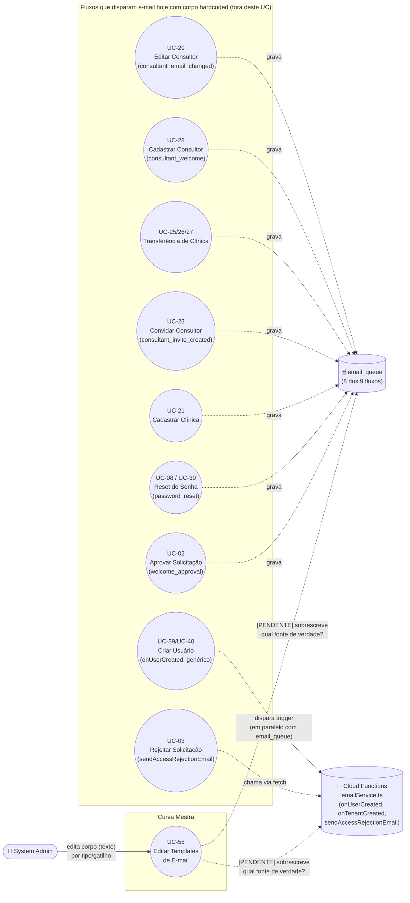

# UC-55: Editar Templates de E-mail

**Projeto:** Curva Mestra
**Data de Criação:** 30/09/2026
**Autor:** Guilherme Stanke Scandelari (via uml-use-case-writer)
**Status:** Rascunho
**Módulo/Contexto:** Administração do Sistema / Comunicação
**Versão:** 1.0

> **Feature ainda não implementada — pedido direto do usuário, não achado de outro UC.** O usuário testou em produção o fluxo real de aprovação de solicitação de acesso (UC-02) e, ao ler o e-mail de fato recebido, avaliou que **"o corpo do e-mail precisa de uma revisão geral"**. A partir disso pediu duas coisas: (1) uma revisão geral de conteúdo/redação de todos os e-mails do sistema hoje com corpo hardcoded em código; (2) uma tela nova para o `system_admin` editar esses corpos manualmente, com "possibilidade ampla de edição do corpo do e-mail para cada regra" — um formulário por tipo/gatilho, não um editor único genérico. Este documento confirma, por leitura direta do código (não por suposição), o inventário completo de onde cada corpo de e-mail vive hoje, incluindo **dois achados arquiteturais não previstos no pedido original** (Seção 9, RN-03/RN-05/RN-11) que mudam o desenho da futura tela. Várias decisões de escopo necessárias para desenhar a tela permanecem **genuinamente pendentes** — ver Seção 14. Este UC não deve ser movido para "Aprovado" enquanto essas pendências não forem resolvidas com o usuário.

---

## 1. Diagrama UML (Mermaid)

Não há relação `<<include>>`/`<<extend>>` clássica entre este UC e os UCs consumidores — a relação é de **dependência de conteúdo**, análoga à de UC-53 com seus UCs de origem: os fluxos listados não são acionados a partir deste UC, mas o texto que eles enviam passa a depender do que for editado aqui, uma vez implementado.

---

## 2. Atores

### 2.1 Ator Primário
**System Admin** (`claims.is_system_admin === true`) — único ator que edita os templates. Nenhuma decisão do usuário até agora sugere que `clinic_admin` tenha qualquer acesso a esta tela (os e-mails editados são textos do sistema como um todo, não por clínica — ver RNF-01).

### 2.2 Atores Secundários / Sistemas Externos
- **Zoho Mail (SMTP)** — servidor externo que efetivamente envia o e-mail (`smtp.zoho.com`, via `nodemailer`, `functions/src/services/emailService.ts`, função `sendEmail`). Não é acionado diretamente por este UC — ele entra em ação depois, quando um dos fluxos consumidores (UC-02, UC-03 etc.) dispara o envio usando o texto já editado.
- Nenhum outro sistema externo interage diretamente com este UC.

---

## 3. Pré-condições
- System Admin autenticado, com custom claims válidos (`is_system_admin === true`).
- ⚠️ **Pendente de decisão (RN-06):** "quais templates existem para editar" depende de onde o texto passa a ser armazenado — se numa nova coleção Firestore (ex.: `email_templates/{tipo}`) ou como override por cima do HTML hardcoded atual. Enquanto isso não for decidido, não é possível especificar com precisão o que a tela carrega ao abrir.

---

## 4. Pós-condições

### 4.1 Sucesso (Garantias de Sucesso)
- O texto editado pelo System Admin passa a ser usado nos próximos disparos do tipo de e-mail editado — ⚠️ mecanismo exato depende de RN-06 (Seção 9).
- Nenhum e-mail já enviado antes da edição é alterado retroativamente (e-mails são HTML estático já entregue).

### 4.2 Falha (Garantias Mínimas)
- Se a gravação da edição falhar, o texto anterior (hardcoded ou já salvo) continua em uso — nenhum fluxo consumidor (UC-02, UC-03 etc.) fica sem corpo de e-mail válido.

---

## 5. Gatilho (Trigger)
System Admin acessa a nova tela de edição de templates a partir do menu do Portal Admin (rota e nome de menu ainda não definidos — ver Seção 14).

---

## 6. Fluxo Principal (Basic Flow)

> Fluxo descrito no nível de detalhe permitido pelo que já foi confirmado com o usuário (itens 1 e 2 do pedido original). Passos que dependem de decisões de escopo ainda pendentes (Seção 14) estão marcados explicitamente como **[PENDENTE]** em vez de especificados como se já estivessem decididos.

1. System Admin acessa a tela "Templates de E-mail" (ou nome equivalente, **[PENDENTE]**) no Portal Admin.
2. Sistema exibe uma lista dos tipos/gatilhos de e-mail disponíveis para edição — **[PENDENTE: RN-02]** quantos e quais dos gatilhos confirmados na Seção 9 (RN-01) entram nesta lista.
3. System Admin seleciona um tipo/gatilho específico (ex.: "Aprovação de Solicitação de Acesso").
4. Sistema exibe um formulário com o corpo atual daquele e-mail para edição — **[PENDENTE: RN-07/RN-08]** se o campo é HTML bruto, editor de texto rico, se o assunto também é editável, e como variáveis dinâmicas (ex.: nome do destinatário, link de redefinição de senha) são representadas e protegidas de remoção acidental.
5. System Admin edita o corpo e clica em "Salvar".
6. Sistema persiste a alteração — **[PENDENTE: RN-06]** onde e como.
7. Sistema confirma a alteração (toast de sucesso) e volta para a lista de tipos/gatilhos.
8. Caso de uso é concluído com sucesso.

---

## 7. Fluxos Alternativos

### 7a. Pré-visualizar antes de salvar (a partir do passo 5) — **[PENDENTE: RN-09]**
Se decidido que a tela terá preview e/ou envio de e-mail de teste, este fluxo precisa ser detalhado após a decisão — não especificado aqui para evitar suposição.

### 7b. Reverter para o texto padrão (a partir do passo 4) — **[PENDENTE: RN-10]**
Se decidido que haverá versionamento/histórico, este fluxo (reverter para uma versão anterior ou para o texto original hardcoded) precisa ser detalhado após a decisão.

---

## 8. Fluxos de Exceção

### 8a. Acesso por papel não autorizado
1. Um usuário sem `is_system_admin === true` tenta acessar a tela diretamente pela URL.
2. Sistema bloqueia o acesso — mesmo padrão já usado em todas as demais telas do grupo de rota `(admin)`.

### 8b. Falha ao salvar (a partir do passo 6)
1. A gravação da edição falha (rede, permissão, validação).
2. Sistema exibe mensagem de erro; o texto anteriormente em uso permanece intacto (Seção 4.2).

---

## 9. Regras de Negócio Relacionadas

| ID | Regra | Justificativa |
|----|-------|----------------|
| RN-01 | **Inventário confirmado, por leitura direta do código nesta sessão, de todos os gatilhos de e-mail com corpo hoje hardcoded.** Ver tabela completa abaixo. Total: **9 gatilhos via `email_queue`** (Next.js API routes, cada um com sua própria função geradora de HTML local) + **4 templates em `functions/src/services/emailService.ts`** consumidos por 2 Cloud Functions trigger e 2 Cloud Functions callable (Seção 9, RN-05/RN-11). | Confirmação de código, arquivo a arquivo, dos 9 arquivos indicados no pedido original mais os arquivos de mecanismo (`processEmailQueue.ts`, `functions/src/index.ts`, `onUserCreated.ts`, `onTenantCreated.ts`, `sendTemporaryPasswordEmail.ts`, `sendRejectionEmail.ts`, `sendCustomEmail.ts`). |
| RN-02 | ⚠️ **Decisão necessária.** Quais dos gatilhos listados em RN-01 entram no escopo inicial da tela de edição? O pedido original citou "boas-vindas de clínica, boas-vindas de consultor, reset de senha, notificação de transferência etc." — não ficou claro se os 4 templates de `emailService.ts` (2 deles hoje **órfãos**, ver RN-05) e os 2 e-mails puramente internos (RN-12) também entram. | Nenhuma resposta do usuário cobre esse ponto ainda — não inferido. |
| RN-03 | **Achado arquitetural confirmado — duplicidade de e-mail.** Em pelo menos **2 fluxos confirmados por leitura de código**, o destinatário final recebe **dois e-mails distintos** para uma única ação: (1) **UC-02 (Aprovar Solicitação de Acesso)** — a criação do documento `users/{uid}` dentro de `access-requests/[id]/approve/route.ts` dispara a Cloud Function `onUserCreated` (trigger em qualquer criação de doc em `users/{userId}`), que envia o e-mail genérico "🎉 Bem-vindo ao Curva Mestra!" (`sendWelcomeEmail`) — **em paralelo e independentemente** do e-mail específico "Sua Solicitação foi Aprovada" (`welcome_approval`, com o link de redefinição de senha) que a própria rota já enfileira em `email_queue`. (2) **UC-28 (Cadastrar Consultor)** — o mesmo padrão: `consultants/route.ts` cria tanto `consultants/{id}` quanto `users/{uid}`, disparando `onUserCreated` (e-mail genérico) **em paralelo** ao e-mail específico "Bem-vindo ao Curva Mestra - Portal do Consultor" (`consultant_welcome`, com o código do consultor) já enfileirado pela mesma rota. Esse padrão de duplicidade já está documentado como achado (RN-02) em `UC-39-criar-usuario-diretamente-para-clinica-via-painel-admin.md` e `UC-40-criar-usuario-para-a-propria-clinica.md`, mas **não estava registrado em UC-02 nem em UC-28** até este levantamento. | Achado de código nesta sessão (`onUserCreated.ts` dispara incondicionalmente em qualquer criação de `users/{uid}`, sem checar se um e-mail equivalente já foi enfileirado pela rota de origem). Relevante para este UC porque, se o e-mail genérico do `onUserCreated` também vira "editável", o admin pode achar que editou o único e-mail de boas-vindas quando na verdade existem dois. |
| RN-04 | ⚠️ **Decisão necessária.** A duplicidade confirmada em RN-03 é corrigida (eliminando o e-mail genérico redundante) como parte do escopo deste UC, ou é tratada como um problema separado, e cada um dos dois e-mails simplesmente vira um "gatilho" editável distinto (aceitando que o usuário final continue recebendo dois e-mails por ação)? | Depende de decisão de produto do usuário — a "revisão geral de conteúdo/redação" pedida poderia ou não incluir eliminar essa duplicidade, e isso não foi perguntado explicitamente ainda. |
| RN-05 | **Achado — correção de uma afirmação do mapa de bugs (Seção 8.1, `_MAPA-DE-BUGS-E-MELHORIAS.md`).** O mapa registrou que o e-mail `welcome_approval` testado pelo usuário é gerado por `sendTemporaryPasswordEmail` (`emailService.ts`). **Não é isso que o código confirma nesta sessão:** o e-mail `welcome_approval` é gerado pela função local `generateWelcomeEmailHtml`, definida dentro de `src/app/api/access-requests/[id]/approve/route.ts` (linhas 28-81), enfileirada diretamente em `email_queue` — **sem nenhuma referência a `emailService.ts`**. Esse e-mail, aliás, não contém mais senha temporária em texto (usa `adminAuth.generatePasswordResetLink`, um link de redefinição), enquanto `sendTemporaryPasswordEmail` (em `emailService.ts`) ainda gera um HTML com senha temporária literal — um template diferente, de um fluxo que não é mais o caminho real. **Confirmado que `sendTemporaryPasswordEmail` está hoje órfã:** a única função que a chama é a Cloud Function callable `sendTempPasswordEmail` (`functions/src/sendTemporaryPasswordEmail.ts`), e uma busca por `httpsCallable`/`sendTempPasswordEmail` em todo `src/` não encontrou nenhum ponto do frontend que a invoque. | Busca de código (`grep`) confirmando ausência de qualquer chamador de `sendTempPasswordEmail` em `src/`, e leitura completa de `access-requests/[id]/approve/route.ts` mostrando a função local que realmente gera o HTML testado pelo usuário. Relevante porque muda qual arquivo é, de fato, "o e-mail que precisa de revisão geral" citado no pedido original. |
| RN-06 | ⚠️ **Decisão necessária.** Onde os textos editados serão persistidos: (a) nova coleção Firestore (ex.: `email_templates/{tipo}`) que **substitui integralmente** os HTMLs hoje hardcoded — cada rota/função passaria a buscar o corpo no Firestore antes de montar o e-mail; ou (b) o editor grava um **override opcional** por cima do HTML hardcoded atual — se não houver override salvo, o sistema usa o texto hardcoded original como fallback. A opção (a) elimina duplicação de fonte de verdade, mas exige alterar os 9+ pontos de código listados em RN-01 para ler do Firestore. A opção (b) é menos invasiva, mas mantém dois lugares (código + Firestore) como possíveis fontes do texto real. | Pergunta central de arquitetura, levantada explicitamente na tarefa recebida — nenhuma resposta do usuário ainda. |
| RN-07 | ⚠️ **Decisão necessária.** Suporte a variáveis/placeholders dinâmicos. Cada template hoje usa interpolação de template string do TypeScript (ex.: `${displayName}`, `${passwordResetLink}`, `${temporaryPassword}`, `${code}`) — variáveis diferentes por template (ver coluna "Variáveis" na tabela de RN-01). Se o editor expõe o HTML bruto, o System Admin pode apagar ou digitar errado um placeholder (ex.: remover `${passwordResetLink}` sem querer, quebrando o e-mail de aprovação). É necessário decidir: o editor usa uma sintaxe de placeholder validável (ex.: `{{resetLink}}`) com lista fixa de variáveis permitidas por template e validação antes de salvar, ou edição de HTML totalmente livre, sob risco do admin? | Pergunta explícita levantada na tarefa recebida — nenhuma resposta do usuário ainda. |
| RN-08 | ⚠️ **Decisão necessária.** O pedido do usuário menciona explicitamente apenas "edição do corpo do e-mail". O assunto (`subject`) também deve ser editável nesta tela, ou fica fixo no código? | Pergunta explícita levantada na tarefa recebida — nenhuma resposta do usuário ainda. |
| RN-09 | ⚠️ **Decisão necessária.** Preview do e-mail renderizado antes de salvar, e/ou envio de e-mail de teste para o próprio System Admin antes de publicar a alteração? | Pergunta explícita levantada na tarefa recebida — nenhuma resposta do usuário ainda. |
| RN-10 | ⚠️ **Decisão necessária.** Versionamento/histórico de alterações do template (quem editou, quando, e possibilidade de reverter para uma versão anterior ou para o texto original hardcoded)? | Pergunta explícita levantada na tarefa recebida — nenhuma resposta do usuário ainda. |
| RN-11 | **Achado — UC-03 usa um mecanismo de envio diferente de todos os outros 8 fluxos via `email_queue`.** A rejeição de solicitação de acesso (`src/app/api/access-requests/[id]/reject/route.ts`) **não** grava em `email_queue` — ela faz um `fetch` HTTP direto para a Cloud Function callable `sendAccessRejectionEmail` (`functions/src/sendRejectionEmail.ts`), autenticando com um custom token gerado on-the-fly (`adminAuth.createCustomToken`), e essa função chama `sendRejectionEmail` (template em `emailService.ts`) diretamente — sem nenhuma gravação intermediária em Firestore. Se a decisão de RN-06 for a opção (a) (Firestore como fonte de verdade única), este fluxo precisa de uma alteração de código à parte para também consultar o Firestore antes de montar o e-mail — os outros 8 fluxos já leem/escrevem em `email_queue`, criando um ponto natural de integração; este não. | Leitura completa de `src/app/api/access-requests/[id]/reject/route.ts` e `functions/src/sendRejectionEmail.ts` nesta sessão, confirmando a divergência de mecanismo. |
| RN-12 | ⚠️ **Decisão necessária.** Dois dos gatilhos confirmados em RN-01 são notificações **internas** (não vão para o cliente final da clínica/consultor): `onTenantCreated` → `sendNewTenantNotification`, enviado sempre para o endereço fixo `scandelari.guilherme@curvamestra.com.br` (já documentado como achado em `UC-21-cadastrar-nova-clinica.md`, RN-09); e `onAccessRequestCreated` → notificação "Nova Solicitação de Acesso" enviada ao próprio `system_admin` configurado (`SYSTEM_ADMIN_EMAIL`). Esses dois entram no escopo de edição da tela (já que tecnicamente também são hardcoded), ou ficam de fora por não serem e-mails voltados ao usuário final da clínica/consultor? | Pergunta explícita levantada na tarefa recebida — nenhuma resposta do usuário ainda. |
| RN-13 | ⚠️ **Decisão necessária.** Dos 9 gatilhos via `email_queue`, 4 têm HTML completo com `<style>` inline e visual "de marca" (cabeçalho colorido, botões) — `welcome_approval`, `password_reset`, `consultant_welcome`, e os 4 templates de `emailService.ts`. Os outros **5 são corpo inline simples** (`
`/`<strong>`, sem `<!DOCTYPE html>`/`<style>`/cabeçalho visual): `consultant_email_changed`, `consultant_transfer_request`, `consultant_invite_created`, `consultant_transfer_approved`, `consultant_transfer_rejected` (todos em fluxos de consultor/transferência). A "revisão geral de conteúdo/redação" pedida pelo usuário deve elevar esses 5 ao mesmo padrão visual dos demais (cabeçalho, `<style>`, identidade visual), ou a revisão é apenas de texto, mantendo a simplicidade visual atual desses 5? | Pergunta explícita levantada na tarefa recebida — nenhuma resposta do usuário ainda. |
| RN-14 | **Achado — mecanismo já existente e diferente, fora da lista de 9 arquivos fornecida, mas relevante para não duplicar esforço.** `src/app/api/tenants/create/route.ts` (UC-21, criação de clínica pelo `system_admin` via painel) já permite que o **próprio `system_admin` componha assunto e corpo customizados** por criação (`data.welcome_email.subject`/`data.welcome_email.body`, vindos do formulário da tela, gravados em `email_queue` **sem** nenhum campo `type`), condicionado a `data.welcome_email?.send`. Esse é um mecanismo de "corpo livre por envio", não um "template editável e reaproveitado nos próximos envios" — diferente do que o pedido original descreve, mas tecnicamente já entrega uma forma de edição de corpo para esse fluxo específico. Não avaliado em profundidade neste UC por estar fora da lista de 9 arquivos fornecida na tarefa; mencionado aqui apenas para conhecimento do usuário antes de decidir o escopo final (RN-02). | Achado de código nesta sessão, fora do escopo explicitamente delimitado pela tarefa recebida — não expandido em RN própria por disciplina de escopo. |

**Tabela de inventário confirmado (RN-01) — gatilho → arquivo → mecanismo → assunto → variáveis → estilo visual:**

| # | Tipo/Gatilho (`type` em `email_queue`, quando existe) | Arquivo que gera o HTML | Mecanismo de envio | Assunto (hardcoded) | Variáveis dinâmicas usadas | HTML completo com estilo? |
|---|---|---|---|---|---|---|
| 1 | `welcome_approval` | `src/app/api/access-requests/[id]/approve/route.ts` (`generateWelcomeEmailHtml`) | `email_queue` → `processEmailQueue` | "Sua Solicitação foi Aprovada - Curva Mestra" | `displayName`, `email`, `businessName`, `passwordResetLink` | Sim |
| 2 | `password_reset` | `src/lib/services/passwordResetService.ts` (`generateResetPasswordEmailHtml`) | `email_queue` → `processEmailQueue`, usado por `users/[id]/reset-password` (UC-08) e `consultants/[id]/reset-password` (UC-30) | "Redefinição de Senha - Curva Mestra" | `displayName`, `resetLink` | Sim |
| 3 | `consultant_welcome` | `src/app/api/consultants/route.ts` (`generateConsultantWelcomeEmail`) | `email_queue` → `processEmailQueue` (UC-28) | "Bem-vindo ao Curva Mestra - Portal do Consultor" | `name`, `email`, `code` | Sim |
| 4 | `consultant_email_changed` | `src/app/api/consultants/[id]/route.ts` (inline, sem função nomeada) | `email_queue` → `processEmailQueue` (UC-29), enviado 2x (e-mail antigo e novo) | "Seu e-mail de acesso foi alterado - Curva Mestra" | `name`, `previousEmail`, `emailLower` | Não (corpo `
` simples) |
| 5 | `consultant_transfer_request` | `src/app/api/consultants/claims/route.ts` (inline) | `email_queue` → `processEmailQueue` (UC-25) | "Pedido de transferência de clínica - Curva Mestra" | `currentConsultantData.name`, `consultantData.name`, `consultantData.code`, `tenantData.name` | Não |
| 6 | `consultant_invite_created` | `src/app/api/tenants/[id]/consultant/invite/route.ts` (inline) | `email_queue` → `processEmailQueue` (UC-23) | "Convite de vínculo com clínica - Curva Mestra" | `consultantData.name`, `tenantData.name` | Não |
| 7 | `consultant_transfer_approved` | `src/app/api/consultants/transfer-requests/[id]/approve/route.ts` (inline) | `email_queue` → `processEmailQueue` (UC-26) | "Transferência aprovada - Curva Mestra" | `requestingConsultantData.name`, `transferData.tenant_name` | Não |
| 8 | `consultant_transfer_rejected` | `src/app/api/consultants/transfer-requests/[id]/reject/route.ts` (inline) | `email_queue` → `processEmailQueue` (UC-27) | "Pedido de transferência não aprovado - Curva Mestra" | `requestingConsultantData.name`, `transferData.tenant_name`, `reason` (opcional) | Não |
| 9 | (sem `type`) `welcome_email` customizado por criação | `src/app/api/tenants/create/route.ts` (corpo vem do formulário, não hardcoded no backend) | `email_queue` → `processEmailQueue` (UC-21) | Definido pelo `system_admin` no formulário, por criação | Livre (definido pelo admin) | Depende do que o admin digitar |
| 10 | (sem `type`, callable direto) | `functions/src/sendRejectionEmail.ts` → `emailService.ts` (`sendRejectionEmail`) | `fetch` HTTP → Cloud Function callable `sendAccessRejectionEmail` (UC-03) — **não usa `email_queue`** | "Atualização sobre sua Solicitação - Curva Mestra" | `displayName`, `businessName`, `rejectionReason` (opcional) | Sim |
| 11 | (trigger automático, genérico) | `functions/src/onUserCreated.ts` → `emailService.ts` (`sendWelcomeEmail`) | Cloud Function `onDocumentCreated` em `users/{userId}` — dispara em **qualquer** criação de usuário (UC-02, UC-28, UC-39, UC-40; ver RN-03) | "🎉 Bem-vindo ao Curva Mestra!" | `displayName`, `role` | Sim |
| 12 | (trigger automático, interno) | `functions/src/onTenantCreated.ts` → `emailService.ts` (`sendNewTenantNotification`) | Cloud Function `onDocumentCreated` em `tenants/{tenantId}` — notificação interna, não vai ao cliente final (UC-02, UC-21) | "🎊 Nova Clínica: {tenantName}" | `tenantName`, `tenantEmail`, `planId` | Sim |
| 13 | (trigger automático, interno) | `functions/src/onAccessRequestCreated.ts` → `sendEmail` inline | Cloud Function `onDocumentCreated` em `access_requests/{requestId}` — notificação interna ao `system_admin`, não vai ao solicitante (UC-01) | "Solicitação de Acesso - {formattedDocument}" | `documentNumber`, `documentType`, `fullName`, `email`, `businessName` | Sim |
| 14 | **Órfã — sem nenhum chamador confirmado hoje** | `functions/src/sendTemporaryPasswordEmail.ts` → `emailService.ts` (`sendTemporaryPasswordEmail`) | Cloud Function callable `sendTempPasswordEmail` — nenhum `httpsCallable('sendTempPasswordEmail')` encontrado em `src/` | "🎉 Sua Solicitação foi Aprovada - Senha Temporária" | `email`, `displayName`, `temporaryPassword`, `businessName` | Sim (porém tecnicamente inatingível hoje — ver RN-05) |
| 15 | **Órfã — sem nenhum chamador confirmado hoje** | `functions/src/sendCustomEmail.ts` → `emailService.ts` (`sendEmail`) | Cloud Function callable `sendCustomEmail` — nenhum `httpsCallable('sendCustomEmail')` encontrado em `src/` | Livre (parâmetro `subject`) | Livre (parâmetro `body`) | N/A (corpo é passado pronto pelo chamador, que não existe hoje) |

---

## 10. Requisitos Especiais / Não Funcionais

| ID | Descrição | Categoria |
|----|-----------|-----------|
| RNF-01 | Os textos editados por este UC são **globais ao sistema**, não escopados por `tenant_id` — nenhum dos 15 gatilhos da tabela de RN-01 hoje varia o corpo por clínica. Diferente da maioria das entidades do projeto, este UC **não tem uma dimensão multi-tenant a proteger** (não há isolamento de dados de clínica em jogo) — apenas controle de acesso por role (`is_system_admin`). | Multi-tenant (confirmação de não aplicabilidade) |
| RNF-02 | Acesso de edição restrito a `system_admin` — precisa de uma regra Firestore (se RN-06 optar pela coleção `email_templates`) equivalente ao padrão já usado em `system_settings`/documentos legais: `allow write: if isSystemAdmin()`. | Segurança |
| RNF-03 | ⚠️ **Pendente de RN-06.** Se os templates passarem a ser lidos do Firestore em tempo de envio (opção (a) de RN-06), cada um dos 13 pontos de código da tabela de RN-01 (exceto os 2 órfãos) precisa de uma leitura adicional ao Firestore antes de montar o e-mail — impacto de latência a avaliar, ainda que pequeno frente ao próprio envio SMTP. | Desempenho |

---

## 11. Frequência de Uso
Baixa — edição pontual, esperada principalmente logo após a implementação (revisão inicial de redação pedida pelo usuário) e depois ocasionalmente, quando o texto de um e-mail precisar de ajuste. Não é uma tela de uso operacional recorrente.

---

## 12. Casos de Uso Relacionados
Relação de **dependência de conteúdo** (mesmo padrão de UC-53 com seus UCs de origem) — nenhum destes UCs é acionado a partir deste UC, mas o texto que cada um envia passa a depender do que for editado aqui, uma vez implementado:

- **UC-01 (Solicitar Acesso ao Sistema)** — gatilho interno #13 (`onAccessRequestCreated`, notificação ao `system_admin`).
- **UC-02 (Aprovar Solicitação de Acesso)** — gatilhos #1 (`welcome_approval`) e #11 (`onUserCreated`, duplicidade confirmada em RN-03) e #12 (`onTenantCreated`, notificação interna).
- **UC-03 (Rejeitar Solicitação de Acesso)** — gatilho #10 (`sendAccessRejectionEmail`, mecanismo diferente, RN-11).
- **UC-08 (System Admin Envia Link de Redefinição de Senha) / UC-30 (Definir Senha do Consultor Manualmente)** — gatilho #2 (`password_reset`).
- **UC-21 (Cadastrar Nova Clínica)** — gatilhos #9 (corpo livre por criação, RN-14) e #12 (`onTenantCreated`).
- **UC-23 (Vincular-se Automaticamente / Convidar Consultor)** — gatilho #6 (`consultant_invite_created`).
- **UC-25/UC-26/UC-27 (Solicitar/Aprovar/Rejeitar Transferência de Clínica)** — gatilhos #5, #7, #8.
- **UC-28 (Cadastrar Consultor)** — gatilhos #3 (`consultant_welcome`) e #11 (`onUserCreated`, duplicidade confirmada em RN-03).
- **UC-29 (Editar, Suspender e Reativar Consultor)** — gatilho #4 (`consultant_email_changed`).
- **UC-36/UC-39/UC-40 (Usuários)** — gatilho #11 (`onUserCreated`, já documentado como achado nesses UCs).
- **UC-53 (Consultar e Exportar Trilha de Auditoria)** — não relacionado diretamente, mas fonte do padrão de documentação de "dependência de dados/conteúdo entre UCs" reaproveitado neste documento.

---

## 13. Referências

**Arquivos com corpo de e-mail hardcoded (confirmados nesta sessão, ver tabela de RN-01):**
- `functions/src/services/emailService.ts` (`sendWelcomeEmail`, `sendTemporaryPasswordEmail`, `sendRejectionEmail`, `sendNewTenantNotification`, `sendEmail`)
- `src/lib/services/passwordResetService.ts` (`generateResetPasswordEmailHtml`)
- `src/app/api/consultants/route.ts` (`generateConsultantWelcomeEmail`)
- `src/app/api/access-requests/[id]/approve/route.ts` (`generateWelcomeEmailHtml`)
- `src/app/api/consultants/[id]/route.ts` (aviso de troca de e-mail, inline)
- `src/app/api/consultants/claims/route.ts` (notificação de pedido de transferência, inline)
- `src/app/api/tenants/[id]/consultant/invite/route.ts` (convite de vínculo, inline)
- `src/app/api/consultants/transfer-requests/[id]/approve/route.ts` (transferência aprovada, inline)
- `src/app/api/consultants/transfer-requests/[id]/reject/route.ts` (transferência rejeitada, inline)

**Arquivos de mecanismo de envio (lidos nesta sessão para confirmar RN-03/RN-05/RN-11):**
- `functions/src/processEmailQueue.ts` — trigger que consome `email_queue` e envia via `sendEmail`.
- `functions/src/onUserCreated.ts`, `functions/src/onTenantCreated.ts`, `functions/src/onAccessRequestCreated.ts` — triggers automáticos, independentes de `email_queue`.
- `functions/src/sendTemporaryPasswordEmail.ts`, `functions/src/sendRejectionEmail.ts`, `functions/src/sendCustomEmail.ts` — Cloud Functions callable.
- `functions/src/index.ts` — confirma quais functions estão de fato exportadas/deployadas.
- `src/app/api/access-requests/[id]/reject/route.ts` — chamador via `fetch` de `sendAccessRejectionEmail` (RN-11).
- `src/app/api/tenants/create/route.ts` — mecanismo de corpo customizado por criação, fora do escopo desta versão (RN-14).

**Referência de origem:**
- `ONLY_FOR_DEVS/PO_BA_Docs/_MAPA-DE-BUGS-E-MELHORIAS.md`, Seção 8.1 — origem da reserva deste UC e do pedido original do usuário (29/09/2026). Ver RN-05 para a correção de uma afirmação técnica dessa seção.
- `ONLY_FOR_DEVS/PO_BA_Docs/UC-21-cadastrar-nova-clinica.md`, `UC-39-criar-usuario-diretamente-para-clinica-via-painel-admin.md`, `UC-40-criar-usuario-para-a-propria-clinica.md` — já documentam o padrão `onUserCreated`/`onTenantCreated` como achado, reaproveitado em RN-03 deste UC.
- `ONLY_FOR_DEVS/PO_BA_Docs/UC-02-aprovar-solicitacao-de-acesso.md`, `UC-03-rejeitar-solicitacao-de-acesso.md` — documentam o disparo do e-mail (o quê, quando, para quem), mas não avaliam conteúdo/redação nem a duplicidade confirmada em RN-03 (não atualizados por este UC — fora do escopo desta tarefa).

---

## 14. Perguntas em Aberto / Decisões Pendentes

⚠️ Este documento não deve ser movido para "Aprovado" enquanto os itens abaixo não forem respondidos pelo usuário. Nenhuma suposição foi usada para preenchê-los.

1. **[RN-02] Escopo exato dos gatilhos editáveis.** Dos 15 pontos confirmados na tabela de RN-01, quais entram na primeira versão da tela? Em especial: os 4 templates de `emailService.ts` entram (mesmo 2 deles sendo hoje órfãos, RN-05/tabela #14-#15)? Os 2 e-mails puramente internos entram (RN-12)?
2. **[RN-04] Duplicidade de e-mail (RN-03) é corrigida como parte deste UC, ou fica de fora?** Hoje, aprovar uma solicitação de acesso (UC-02) e cadastrar um consultor (UC-28) enviam **dois e-mails de boas-vindas diferentes** para o mesmo destinatário, por causa do `onUserCreated` genérico rodando em paralelo com o e-mail específico do fluxo.
3. **[RN-06] Onde os templates editados são persistidos?** Nova coleção Firestore substituindo integralmente os HTMLs hardcoded (exige alterar cada um dos 13 pontos de código não-órfãos para ler de lá), ou um override opcional por cima do hardcoded, com fallback para o texto original quando não houver edição salva?
4. **[RN-07] Suporte a variáveis/placeholders dinâmicos.** Sintaxe validável (ex.: `{{resetLink}}`) com lista fixa de variáveis permitidas por template e validação antes de salvar, ou edição de HTML totalmente livre?
5. **[RN-08] O assunto (`subject`) do e-mail também é editável nesta tela, ou fica fixo no código?**
6. **[RN-09] Haverá preview do e-mail renderizado antes de salvar, e/ou envio de e-mail de teste para o próprio System Admin?**
7. **[RN-10] Haverá versionamento/histórico de alterações (quem editou, quando, reverter para versão anterior)?**
8. **[RN-11] Como o fluxo de UC-03 (mecanismo diferente — `fetch` direto à Cloud Function, sem `email_queue`) se encaixa na solução, caso RN-06 opte por Firestore como fonte única de verdade?**
9. **[RN-12] Os 2 e-mails internos (notificação de nova clínica, notificação de nova solicitação ao `system_admin`) entram no escopo de edição?**
10. **[RN-13] A "revisão geral de conteúdo/redação" pedida deve elevar os 5 e-mails de corpo simples (troca de e-mail, pedido/aprovação/rejeição de transferência, convite) ao mesmo padrão visual com `<style>`/cabeçalho dos demais, ou só o texto muda, mantendo a simplicidade visual atual?**
11. **[Observação, não numerada em RN própria]** O mapa de bugs (Seção 8.1) registrou o e-mail testado pelo usuário como gerado por `sendTemporaryPasswordEmail`; o código confirma que na verdade é `generateWelcomeEmailHtml`, uma função local diferente, sem senha temporária em texto (usa link de redefinição). Confirmar com o usuário se o "corpo que precisa de revisão" citado no pedido original é este mesmo (`welcome_approval` / `generateWelcomeEmailHtml`), já que o nome da função no mapa estava incorreto.

---

## 15. Histórico de Versões

| Versão | Data | Autor | O que mudou |
|--------|------|-------|--------------|
| 1.0 | 30/09/2026 | Guilherme Stanke Scandelari (via uml-use-case-writer) | Versão inicial. Documenta, por leitura direta de código (não suposição), o inventário completo de 15 gatilhos de e-mail hoje com corpo hardcoded — os 9 arquivos indicados no pedido original mais 6 pontos de mecanismo adicionais confirmados durante a investigação (Cloud Functions triggers/callables de `emailService.ts`). Dois achados arquiteturais não previstos no pedido original: (1) duplicidade confirmada de e-mail em UC-02 e UC-28, causada pelo trigger genérico `onUserCreated` rodando em paralelo com o e-mail específico de cada fluxo (RN-03); (2) correção de uma afirmação técnica do mapa de bugs Seção 8.1 — o e-mail `welcome_approval` testado pelo usuário não é gerado por `sendTemporaryPasswordEmail` (hoje órfã, sem nenhum chamador ativo), e sim por uma função local (`generateWelcomeEmailHtml`) dentro da própria rota de aprovação (RN-05). Também confirmado que UC-03 usa um mecanismo de envio (`fetch` direto a Cloud Function callable) diferente dos outros 8 fluxos via `email_queue` (RN-11), e que `sendCustomEmail` está igualmente órfã. Onze perguntas de escopo genuínas permanecem pendentes (Seção 14) — Fluxo Principal e Fluxos Alternativos/Exceção descritos apenas no nível de detalhe já confirmável, com passos dependentes de decisão explicitamente marcados como `[PENDENTE]`. Documento criado com `Status: Rascunho` — não deve avançar para "Aprovado" antes da resolução das pendências. |
