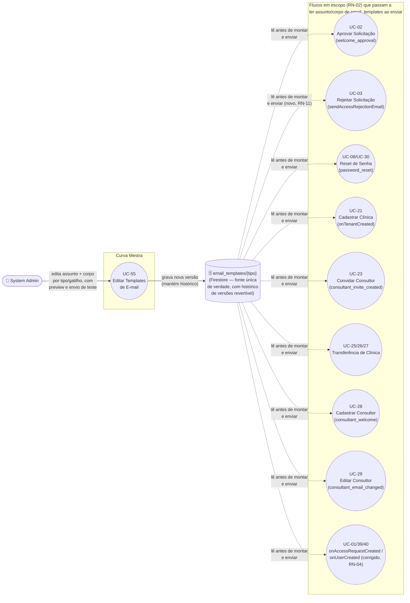

# UC-55: Editar Templates de E-mail

**Projeto:** Curva Mestra
**Data de Criação:** 30/09/2026
**Autor:** Guilherme Stanke Scandelari (via uml-use-case-writer)
**Status:** Aprovado
**Módulo/Contexto:** Administração do Sistema / Comunicação
**Versão:** 1.1

> Feature ainda não implementada — pedido direto do usuário, não achado de outro UC. O usuário testou em produção o fluxo real de aprovação de solicitação de acesso (UC-02) e, ao ler o e-mail de fato recebido (`welcome_approval`, gerado por `generateWelcomeEmailHtml` — RN-05), avaliou que **"o corpo do e-mail precisa de uma revisão geral"**. A partir disso pediu duas coisas: (1) uma revisão geral de conteúdo/redação de todos os e-mails do sistema hoje com corpo hardcoded em código, incluindo elevar os e-mails de corpo simples ao mesmo padrão visual dos demais (RN-13); (2) uma tela nova para o `system_admin` editar assunto e corpo desses e-mails, com Firestore (`email_templates/{tipo}`) como **fonte única de verdade**, substituindo integralmente o HTML hardcoded, com lista fixa de variáveis validadas, preview, envio de e-mail de teste e histórico de versões revertível. Esta v1.1 incorpora as 11 decisões de escopo tomadas pelo usuário em 30/09/2026 sobre a Seção 14 da v1.0, incluindo a decisão de corrigir, como parte deste próprio UC, a duplicidade de e-mail de boas-vindas identificada em UC-02/UC-28 (RN-03/RN-04). Nenhuma pendência genuína de escopo permanece.

---

## 1. Diagrama UML (Mermaid)

Não há relação `<<include>>`/`<<extend>>` clássica entre este UC e os UCs consumidores — a relação é de **dependência de conteúdo**, análoga à de UC-53 com seus UCs de origem: os fluxos listados não são acionados a partir deste UC, mas o texto (e, a partir da v1.1, o mecanismo de leitura) que eles usam para enviar passa a depender do que for editado aqui. Dois pontos que mudam o desenho anterior: (1) `UC-03` deixa de ser uma exceção arquitetural — sua leitura do template passa a vir do mesmo Firestore que os demais 12 gatilhos em escopo (RN-11); (2) o gatilho genérico `onUserCreated`, hoje responsável pela duplicidade de e-mail em `UC-02`/`UC-28`, passa a disparar de forma condicional, evitando o envio duplicado (RN-04).

---

## 2. Atores

### 2.1 Ator Primário
**System Admin** (`claims.is_system_admin === true`) — único ator que edita os templates. Nenhuma decisão do usuário sugere que `clinic_admin` tenha qualquer acesso a esta tela (os e-mails editados são textos do sistema como um todo, não por clínica — ver RNF-01).

### 2.2 Atores Secundários / Sistemas Externos
- **Zoho Mail (SMTP)** — servidor externo que efetivamente envia o e-mail (`smtp.zoho.com`, via `nodemailer`, `functions/src/services/emailService.ts`, função `sendEmail`). Não é acionado diretamente por este UC no fluxo principal — entra em ação (a) quando um dos 13 fluxos consumidores em escopo dispara o envio usando o texto já editado, e (b) dentro do próprio fluxo de edição, quando o System Admin usa "Enviar e-mail de teste" (RN-09).
- Nenhum outro sistema externo interage diretamente com este UC.

---

## 3. Pré-condições
- System Admin autenticado, com custom claims válidos (`is_system_admin === true`).
- A coleção Firestore `email_templates/{tipo}` já foi migrada/populada com os 13 gatilhos em escopo (RN-02) — este UC edita templates já existentes, não cria um template do zero. A migração inicial (carga dos HTMLs hoje hardcoded para o Firestore) é pré-requisito de implementação, não uma ação realizada dentro deste caso de uso.

---

## 4. Pós-condições

### 4.1 Sucesso (Garantias de Sucesso)
- O assunto e/ou corpo editados pelo System Admin são gravados como nova versão em `email_templates/{tipo}` (Firestore) — fonte única usada pelos 13 gatilhos em escopo (RN-02) no próximo disparo daquele tipo de e-mail (RN-06).
- A versão anterior do template é preservada no histórico, disponível para reversão (RN-10).
- Nenhum e-mail já enviado antes da edição é alterado retroativamente (e-mails são HTML estático já entregue).

### 4.2 Falha (Garantias Mínimas)
- Se a gravação da edição falhar (validação de placeholder, rede, permissão), a versão anteriormente ativa do template permanece em uso — nenhum dos 13 fluxos consumidores fica sem assunto/corpo válido.
- Se o envio do e-mail de teste (RN-09) falhar, o conteúdo em edição na tela não é perdido nem persistido — a falha de teste não impede uma nova tentativa de salvar.

---

## 5. Gatilho (Trigger)
System Admin acessa a tela "Templates de E-mail" a partir do menu do Portal Admin. Rota sugerida, seguindo a convenção kebab-case já usada nas demais telas de `src/app/(admin)/admin/*` (ex.: `access-requests`, `audit-log`, `legal-documents`): `/admin/email-templates`. O nome exato da rota/item de menu é detalhe de implementação, sem impacto no escopo de negócio deste UC, e pode ser ajustado livremente na fase de desenvolvimento sem exigir nova aprovação deste documento.

---

## 6. Fluxo Principal (Basic Flow)

1. System Admin acessa a tela "Templates de E-mail" no Portal Admin (rota sugerida `/admin/email-templates` — Seção 5).
2. Sistema exibe a lista dos 13 gatilhos em escopo (RN-02), identificando quais são e-mails ao destinatário final e quais são notificações internas (RN-12), e a qual UC consumidor cada um pertence (Seção 12).
3. System Admin seleciona um gatilho específico (ex.: "Aprovação de Solicitação de Acesso" — `welcome_approval`).
4. Sistema exibe um formulário com: assunto atual, corpo atual (HTML com os placeholders destacados na sintaxe `{{variavel}}`), e a lista fixa de variáveis permitidas para aquele template (RN-07), indicando quais são obrigatórias.
5. System Admin edita o assunto e/ou o corpo (RN-08), podendo usar apenas as variáveis da lista permitida daquele template.
6. (Opcional, quantas vezes quiser) System Admin clica em "Pré-visualizar" — ver Fluxo 7a.
7. (Opcional) System Admin clica em "Enviar e-mail de teste" — ver Fluxo 7b.
8. System Admin clica em "Salvar".
9. Sistema valida o conteúdo: nenhuma variável fora da lista permitida (RN-07) foi usada, e nenhuma variável obrigatória foi removida do assunto/corpo.
10. Sistema grava a edição como nova versão do template em `email_templates/{tipo}` (Firestore), preservando a versão anterior no histórico (RN-10).
11. Sistema confirma a alteração (toast de sucesso) e volta para a lista de gatilhos.
12. Caso de uso é concluído com sucesso.

---

## 7. Fluxos Alternativos

### 7a. Pré-visualizar (a partir do passo 5)
1. System Admin clica em "Pré-visualizar" a qualquer momento durante a edição.
2. Sistema renderiza o assunto e o corpo com valores de exemplo substituindo as variáveis (ex.: `{{nome}}` → "Maria Silva"), em uma área de preview dentro da própria tela — nada é persistido em `email_templates`.
3. Retorna ao fluxo principal no passo 5 (edição continua).

### 7b. Enviar e-mail de teste (a partir do passo 5)
1. System Admin clica em "Enviar e-mail de teste".
2. Sistema solicita um endereço de e-mail de destino (campo livre — não precisa ser o e-mail do próprio System Admin).
3. Sistema envia o conteúdo atualmente em edição (ainda não salvo) para o endereço informado, usando o mesmo mecanismo real de envio (Zoho SMTP / `sendEmail`), com valores de exemplo nas variáveis.
4. Sistema confirma o envio (toast) — o conteúdo em edição na tela permanece inalterado e não persistido.
5. Retorna ao fluxo principal no passo 5.

### 7c. Reverter para uma versão anterior (a partir do passo 4)
1. System Admin abre o histórico de versões do template selecionado.
2. Sistema exibe as versões anteriores salvas (data, autor da edição).
3. System Admin seleciona uma versão anterior e confirma a reversão.
4. Sistema grava a versão revertida como a nova versão atual do template — a própria reversão também gera uma entrada no histórico, preservando rastreabilidade completa (nenhuma versão é apagada).
5. Sistema confirma (toast) e retorna ao fluxo principal no passo 4, com o formulário refletindo o conteúdo revertido.

---

## 8. Fluxos de Exceção

### 8a. Acesso por papel não autorizado
1. Um usuário sem `is_system_admin === true` tenta acessar a tela diretamente pela URL.
2. Sistema bloqueia o acesso — mesmo padrão já usado em todas as demais telas do grupo de rota `(admin)`.

### 8b. Falha de validação ao salvar (a partir do passo 9)
1. Sistema detecta uso de variável fora da lista permitida, ou ausência de uma variável obrigatória (ex.: `{{resetLink}}` removido do template de reset de senha).
2. Sistema bloqueia o salvamento, exibe mensagem de erro apontando o problema específico, e mantém o formulário com o conteúdo digitado (a edição em andamento não é perdida).

### 8c. Falha ao persistir a gravação (a partir do passo 10)
1. A gravação em `email_templates` falha (rede, permissão, indisponibilidade do Firestore).
2. Sistema exibe mensagem de erro; a versão anteriormente ativa permanece intacta e em uso pelos fluxos consumidores (Seção 4.2).

### 8d. Falha ao enviar e-mail de teste (a partir do Fluxo 7b, passo 3)
1. O envio via Zoho SMTP falha (indisponibilidade do provedor, endereço inválido).
2. Sistema exibe mensagem de erro; o conteúdo em edição na tela não é afetado — o System Admin pode tentar novamente ou prosseguir direto para "Salvar".

---

## 9. Regras de Negócio Relacionadas

| ID | Regra | Justificativa |
|----|-------|----------------|
| RN-01 | **Inventário confirmado, por leitura direta do código, de todos os gatilhos de e-mail com corpo hoje hardcoded.** Ver tabela completa abaixo. Total: **9 gatilhos via `email_queue`** (Next.js API routes, cada um com sua própria função geradora de HTML local) + **4 templates em `functions/src/services/emailService.ts`** consumidos por 2 Cloud Functions trigger e 2 Cloud Functions callable (ver RN-05/RN-11), somando 15 pontos — dos quais **13 entram no escopo da v1** (RN-02). | Confirmação de código, arquivo a arquivo, dos 9 arquivos indicados no pedido original mais os arquivos de mecanismo (`processEmailQueue.ts`, `functions/src/index.ts`, `onUserCreated.ts`, `onTenantCreated.ts`, `sendTemporaryPasswordEmail.ts`, `sendRejectionEmail.ts`, `sendCustomEmail.ts`). |
| RN-02 | **Decisão confirmada pelo usuário (30/09/2026).** Escopo da v1: **todos os gatilhos com chamador ativo hoje** — os 13 primeiros itens da tabela de RN-01 (#1 a #13), incluindo os 2 e-mails puramente internos (#12, #13 — ver RN-12, mesmo critério). Ficam **fora da v1** os 2 gatilhos hoje órfãos: #14 (`sendTemporaryPasswordEmail`) e #15 (`sendCustomEmail`), sem nenhum chamador confirmado em `src/`. Caso qualquer um dos dois ganhe um chamador real antes da implementação deste UC, deve ser reavaliado para possível inclusão. | Decisão de escopo do usuário, registrada nesta revisão. |
| RN-03 | **Achado arquitetural confirmado — duplicidade de e-mail.** Em pelo menos **2 fluxos confirmados por leitura de código**, o destinatário final recebe **dois e-mails distintos** para uma única ação: (1) **UC-02 (Aprovar Solicitação de Acesso)** — a criação do documento `users/{uid}` dentro de `access-requests/[id]/approve/route.ts` dispara a Cloud Function `onUserCreated` (trigger em qualquer criação de doc em `users/{userId}`), que envia o e-mail genérico "🎉 Bem-vindo ao Curva Mestra!" (`sendWelcomeEmail`) — **em paralelo e independentemente** do e-mail específico "Sua Solicitação foi Aprovada" (`welcome_approval`, com o link de redefinição de senha) que a própria rota já enfileira em `email_queue`. (2) **UC-28 (Cadastrar Consultor)** — o mesmo padrão: `consultants/route.ts` cria tanto `consultants/{id}` quanto `users/{uid}`, disparando `onUserCreated` (e-mail genérico) **em paralelo** ao e-mail específico "Bem-vindo ao Curva Mestra - Portal do Consultor" (`consultant_welcome`, com o código do consultor) já enfileirado pela mesma rota. Esse padrão já está documentado como achado em `UC-39-criar-usuario-diretamente-para-clinica-via-painel-admin.md` e `UC-40-criar-usuario-para-a-propria-clinica.md`, mas não estava registrado em UC-02 nem em UC-28 até este levantamento. **Correção deste achado é escopo deste UC** — ver RN-04. | Achado de código (`onUserCreated.ts` dispara incondicionalmente em qualquer criação de `users/{uid}`, sem checar se um e-mail equivalente já foi enfileirado pela rota de origem). |
| RN-04 | **Decisão confirmada pelo usuário (30/09/2026): a duplicidade é corrigida agora, como parte do escopo de implementação deste UC** — não é adiada, nem os dois e-mails passam a ser simplesmente aceitos como "dois gatilhos editáveis distintos". Resultado de negócio esperado: cada ação (UC-02 aprovar solicitação, UC-28 cadastrar consultor) deve gerar **um único** e-mail de boas-vindas ao destinatário final. O gatilho genérico `onUserCreated` (#11) continua existindo e editável nesta tela — permanece necessário para os fluxos UC-39/UC-40 (criação direta de usuário, que não têm e-mail específico próprio) — mas seu disparo passa a ser **condicional**: suprimido quando o documento `users/{uid}` for criado a partir de um fluxo que já enfileirou um e-mail de boas-vindas específico em `email_queue` (ex.: via flag no documento ou verificação de origem). O mecanismo técnico exato de supressão fica a critério da fase de implementação/tech design — este UC define o resultado de negócio esperado, não a implementação. | Decisão de produto do usuário, registrada nesta revisão. |
| RN-05 | **Achado — correção de uma afirmação do mapa de bugs (Seção 8.1, `_MAPA-DE-BUGS-E-MELHORIAS.md`).** O mapa registrou que o e-mail `welcome_approval` testado pelo usuário é gerado por `sendTemporaryPasswordEmail` (`emailService.ts`). O código confirma que **não é isso**: o e-mail `welcome_approval` é gerado pela função local `generateWelcomeEmailHtml`, definida dentro de `src/app/api/access-requests/[id]/approve/route.ts` (linhas 28-81), enfileirada diretamente em `email_queue` — sem nenhuma referência a `emailService.ts`. Esse e-mail não contém mais senha temporária em texto (usa `adminAuth.generatePasswordResetLink`, um link de redefinição), enquanto `sendTemporaryPasswordEmail` (em `emailService.ts`) ainda gera um HTML com senha temporária literal — um template diferente, de um fluxo que não é mais o caminho real e que está hoje **órfão** (nenhum chamador em `src/`, confirmado por busca de `httpsCallable`). **Confirmado pelo usuário (30/09/2026): o e-mail efetivamente testado e que motivou o pedido original de revisão é este mesmo, `welcome_approval` / `generateWelcomeEmailHtml`** — encerrando a pendência de confirmação registrada na Seção 14 da v1.0. | Busca de código (`grep`) confirmando ausência de qualquer chamador de `sendTempPasswordEmail` em `src/`, leitura completa de `access-requests/[id]/approve/route.ts`, e confirmação direta do usuário nesta revisão. |
| RN-06 | **Decisão confirmada pelo usuário (30/09/2026): Firestore como fonte única de verdade.** Nova coleção `email_templates/{tipo}` **substitui integralmente** os HTMLs hoje hardcoded — não é um override opcional com fallback para o hardcoded original. Os 13 pontos de código em escopo (RN-02) precisam ser alterados para ler assunto e corpo do Firestore antes de montar e enviar cada e-mail. Cada documento de template guarda, no mínimo: assunto atual, corpo atual, lista de variáveis permitidas (RN-07) e histórico de versões anteriores (RN-10). | Decisão de arquitetura do usuário, registrada nesta revisão. |
| RN-07 | **Decisão confirmada pelo usuário (30/09/2026): lista fixa de variáveis por template, validada.** Ex.: `{{resetLink}}`, `{{nome}}` — não é edição de HTML/placeholder totalmente livre. Cada template em `email_templates/{tipo}` carrega sua própria lista de variáveis permitidas, derivada das variáveis já usadas hoje em cada gatilho (coluna "Variáveis dinâmicas usadas" da tabela de RN-01), com indicação de quais são obrigatórias. O sistema bloqueia o salvamento se uma variável fora da lista for usada ou se uma obrigatória for removida (Fluxo 8b). | Decisão de produto do usuário, registrada nesta revisão. |
| RN-08 | **Decisão confirmada pelo usuário (30/09/2026): o assunto (`subject`) também é editável**, junto com o corpo, nesta mesma tela. | Decisão de produto do usuário, registrada nesta revisão. |
| RN-09 | **Decisão confirmada pelo usuário (30/09/2026): os dois mecanismos** — (1) preview do e-mail renderizado na própria tela, com valores de exemplo, sem persistir nada; e (2) botão "Enviar e-mail de teste", que envia o conteúdo em edição (ainda não salvo) para um endereço à escolha do System Admin, usando o mecanismo real de envio (Zoho SMTP). | Decisão de produto do usuário, registrada nesta revisão. |
| RN-10 | **Decisão confirmada pelo usuário (30/09/2026): versionamento com histórico revertível.** Cada edição salva grava uma nova versão e preserva a versão anterior no histórico do template; o System Admin pode reverter para qualquer versão anterior salva (Fluxo 7c). A própria reversão também gera uma nova entrada de histórico — nenhuma versão é apagada. | Decisão de produto do usuário, registrada nesta revisão. |
| RN-11 | **Achado — UC-03 usa um mecanismo de envio diferente de todos os outros 8 fluxos via `email_queue`.** A rejeição de solicitação de acesso (`src/app/api/access-requests/[id]/reject/route.ts`) **não** grava em `email_queue` — ela faz um `fetch` HTTP direto para a Cloud Function callable `sendAccessRejectionEmail` (`functions/src/sendRejectionEmail.ts`), autenticando com um custom token gerado on-the-fly (`adminAuth.createCustomToken`), e essa função chama `sendRejectionEmail` (template em `emailService.ts`) diretamente — sem nenhuma gravação intermediária em Firestore. **Consequência da decisão de RN-06 (Firestore como fonte única):** o fluxo de UC-03 precisa ser alterado, como parte do escopo de implementação deste UC, para também consultar `email_templates/{tipo}` antes de montar o e-mail de rejeição. Diferente dos outros 8 fluxos via `email_queue` (que já leem/escrevem em Firestore, criando um ponto natural de integração), este exige um ponto de leitura novo dentro de `functions/src/sendRejectionEmail.ts` (ou do endpoint `access-requests/[id]/reject/route.ts`, a definir em tech design). Isto deixa de ser uma pendência em aberto — é uma nota técnica de escopo decorrente das decisões já tomadas. | Leitura completa de `src/app/api/access-requests/[id]/reject/route.ts` e `functions/src/sendRejectionEmail.ts`, confirmando a divergência de mecanismo, e decisão de RN-06 que resolve a consequência. |
| RN-12 | **Decisão confirmada pelo usuário (30/09/2026): os 2 e-mails internos entram no escopo da v1.** `onTenantCreated` → `sendNewTenantNotification` (notificação de nova clínica, sempre para `scandelari.guilherme@curvamestra.com.br`, já documentado como achado em `UC-21-cadastrar-nova-clinica.md`, RN-09) e `onAccessRequestCreated` → notificação "Nova Solicitação de Acesso" ao `system_admin` configurado — ambos entram por terem chamador ativo hoje, mesmo critério da decisão de RN-02. | Decisão de produto do usuário, registrada nesta revisão. |
| RN-13 | **Decisão confirmada pelo usuário (30/09/2026), consequência da revisão geral de conteúdo pedida:** os 5 e-mails hoje com corpo inline simples (sem `<style>`/cabeçalho) — `consultant_email_changed`, `consultant_transfer_request`, `consultant_invite_created`, `consultant_transfer_approved`, `consultant_transfer_rejected` — devem ser **elevados ao mesmo padrão visual dos demais** (HTML completo, `<style>` inline, cabeçalho com identidade visual), como parte da revisão de conteúdo/redação solicitada — não é uma revisão só de texto. Essa elevação visual é parte do trabalho de migração desses 5 templates para `email_templates` (RN-06), não uma tarefa adicional separada. | Decisão de produto do usuário, registrada nesta revisão. |
| RN-14 | **Achado — mecanismo já existente e diferente, fora da lista de 9 arquivos fornecida na tarefa original, mas relevante para não duplicar esforço.** `src/app/api/tenants/create/route.ts` (UC-21, criação de clínica pelo `system_admin` via painel) já permite que o **próprio `system_admin` componha assunto e corpo customizados** por criação (`data.welcome_email.subject`/`data.welcome_email.body`, vindos do formulário da tela, gravados em `email_queue` **sem** nenhum campo `type`), condicionado a `data.welcome_email?.send`. Esse é um mecanismo de "corpo livre por envio", não um "template editável e reaproveitado nos próximos envios". **Nota de escopo:** por ter chamador ativo (UC-21), o gatilho #9 está tecnicamente dentro do critério de RN-02, mas seu mecanismo (corpo 100% livre, digitado a cada criação, sem HTML hardcoded a migrar) é estruturalmente diferente dos demais 12 gatilhos em escopo. Este UC **não altera** esse mecanismo existente — ele já atende, à sua maneira, à "possibilidade ampla de edição do corpo" para esse fluxo específico. Se no futuro fizer sentido oferecer um texto padrão/inicial pré-preenchido a partir de um template em `email_templates` para esse formulário, é uma evolução fora desta v1, não decidida aqui — não foi levantada como pendência pelo usuário nesta rodada, e portanto não bloqueia a aprovação deste documento. | Achado de código, fora do escopo explicitamente delimitado pela tarefa original; nota de escopo não expandida em decisão própria por disciplina de escopo. |

**Tabela de inventário confirmado (RN-01) — gatilho → arquivo → mecanismo → assunto → variáveis → estilo visual → escopo v1:**

| # | Tipo/Gatilho (`type` em `email_queue`, quando existe) | Arquivo que gera o HTML | Mecanismo de envio | Assunto (hardcoded) | Variáveis dinâmicas usadas | HTML completo com estilo? | Em escopo v1 (RN-02)? |
|---|---|---|---|---|---|---|---|
| 1 | `welcome_approval` | `src/app/api/access-requests/[id]/approve/route.ts` (`generateWelcomeEmailHtml`) | `email_queue` → `processEmailQueue` | "Sua Solicitação foi Aprovada - Curva Mestra" | `displayName`, `email`, `businessName`, `passwordResetLink` | Sim | Sim |
| 2 | `password_reset` | `src/lib/services/passwordResetService.ts` (`generateResetPasswordEmailHtml`) | `email_queue` → `processEmailQueue`, usado por `users/[id]/reset-password` (UC-08) e `consultants/[id]/reset-password` (UC-30) | "Redefinição de Senha - Curva Mestra" | `displayName`, `resetLink` | Sim | Sim |
| 3 | `consultant_welcome` | `src/app/api/consultants/route.ts` (`generateConsultantWelcomeEmail`) | `email_queue` → `processEmailQueue` (UC-28) | "Bem-vindo ao Curva Mestra - Portal do Consultor" | `name`, `email`, `code` | Sim | Sim |
| 4 | `consultant_email_changed` | `src/app/api/consultants/[id]/route.ts` (inline, sem função nomeada) | `email_queue` → `processEmailQueue` (UC-29), enviado 2x (e-mail antigo e novo) | "Seu e-mail de acesso foi alterado - Curva Mestra" | `name`, `previousEmail`, `emailLower` | Não → elevar (RN-13) | Sim |
| 5 | `consultant_transfer_request` | `src/app/api/consultants/claims/route.ts` (inline) | `email_queue` → `processEmailQueue` (UC-25) | "Pedido de transferência de clínica - Curva Mestra" | `currentConsultantData.name`, `consultantData.name`, `consultantData.code`, `tenantData.name` | Não → elevar (RN-13) | Sim |
| 6 | `consultant_invite_created` | `src/app/api/tenants/[id]/consultant/invite/route.ts` (inline) | `email_queue` → `processEmailQueue` (UC-23) | "Convite de vínculo com clínica - Curva Mestra" | `consultantData.name`, `tenantData.name` | Não → elevar (RN-13) | Sim |
| 7 | `consultant_transfer_approved` | `src/app/api/consultants/transfer-requests/[id]/approve/route.ts` (inline) | `email_queue` → `processEmailQueue` (UC-26) | "Transferência aprovada - Curva Mestra" | `requestingConsultantData.name`, `transferData.tenant_name` | Não → elevar (RN-13) | Sim |
| 8 | `consultant_transfer_rejected` | `src/app/api/consultants/transfer-requests/[id]/reject/route.ts` (inline) | `email_queue` → `processEmailQueue` (UC-27) | "Pedido de transferência não aprovado - Curva Mestra" | `requestingConsultantData.name`, `transferData.tenant_name`, `reason` (opcional) | Não → elevar (RN-13) | Sim |
| 9 | (sem `type`) `welcome_email` customizado por criação | `src/app/api/tenants/create/route.ts` (corpo vem do formulário, não hardcoded no backend) | `email_queue` → `processEmailQueue` (UC-21) | Definido pelo `system_admin` no formulário, por criação | Livre (definido pelo admin) | Depende do que o admin digitar | Sim, mas mecanismo diferente — ver RN-14 |
| 10 | (sem `type`, callable direto) | `functions/src/sendRejectionEmail.ts` → `emailService.ts` (`sendRejectionEmail`) | `fetch` HTTP → Cloud Function callable `sendAccessRejectionEmail` (UC-03) — passa a ler Firestore, ver RN-11 | "Atualização sobre sua Solicitação - Curva Mestra" | `displayName`, `businessName`, `rejectionReason` (opcional) | Sim | Sim |
| 11 | (trigger automático, genérico) | `functions/src/onUserCreated.ts` → `emailService.ts` (`sendWelcomeEmail`) | Cloud Function `onDocumentCreated` em `users/{userId}` — disparo condicional após correção (RN-04) | "🎉 Bem-vindo ao Curva Mestra!" | `displayName`, `role` | Sim | Sim |
| 12 | (trigger automático, interno) | `functions/src/onTenantCreated.ts` → `emailService.ts` (`sendNewTenantNotification`) | Cloud Function `onDocumentCreated` em `tenants/{tenantId}` — notificação interna (UC-02, UC-21) | "🎊 Nova Clínica: {tenantName}" | `tenantName`, `tenantEmail`, `planId` | Sim | Sim (RN-12) |
| 13 | (trigger automático, interno) | `functions/src/onAccessRequestCreated.ts` → `sendEmail` inline | Cloud Function `onDocumentCreated` em `access_requests/{requestId}` — notificação interna ao `system_admin` (UC-01) | "Solicitação de Acesso - {formattedDocument}" | `documentNumber`, `documentType`, `fullName`, `email`, `businessName` | Sim | Sim (RN-12) |
| 14 | Órfã — sem nenhum chamador confirmado hoje | `functions/src/sendTemporaryPasswordEmail.ts` → `emailService.ts` (`sendTemporaryPasswordEmail`) | Cloud Function callable `sendTempPasswordEmail` — nenhum `httpsCallable('sendTempPasswordEmail')` encontrado em `src/` | "🎉 Sua Solicitação foi Aprovada - Senha Temporária" | `email`, `displayName`, `temporaryPassword`, `businessName` | Sim (tecnicamente inatingível hoje — RN-05) | Não (RN-02) |
| 15 | Órfã — sem nenhum chamador confirmado hoje | `functions/src/sendCustomEmail.ts` → `emailService.ts` (`sendEmail`) | Cloud Function callable `sendCustomEmail` — nenhum `httpsCallable('sendCustomEmail')` encontrado em `src/` | Livre (parâmetro `subject`) | Livre (parâmetro `body`) | N/A | Não (RN-02) |

---

## 10. Requisitos Especiais / Não Funcionais

| ID | Descrição | Categoria |
|----|-----------|-----------|
| RNF-01 | Os textos editados por este UC são **globais ao sistema**, não escopados por `tenant_id` — nenhum dos 13 gatilhos em escopo (RN-02) hoje varia o corpo por clínica. Diferente da maioria das entidades do projeto, este UC **não tem uma dimensão multi-tenant a proteger** — apenas controle de acesso por role (`is_system_admin`). | Multi-tenant (confirmação de não aplicabilidade) |
| RNF-02 | Acesso de edição restrito a `system_admin`. Regra Firestore para a coleção `email_templates` equivalente ao padrão já usado em `system_settings`/documentos legais: `allow write: if isSystemAdmin()`. Leitura pelas Cloud Functions/API routes que montam e-mails ocorre via Admin SDK (contexto de servidor), sem depender de regra client-side. | Segurança |
| RNF-03 | Confirmado (RN-06): cada um dos 13 pontos de código em escopo passa a fazer uma leitura adicional ao Firestore (`email_templates/{tipo}`) antes de montar o e-mail. Impacto de latência esperado é pequeno frente ao próprio envio SMTP (mesmo padrão já usado em outras leituras síncronas ao fluxo, ex.: lookup de tenant/claims) — não é um requisito de cache obrigatório nesta v1, apenas um ponto de observação de desempenho após implementação. | Desempenho |
| RNF-04 | O envio de e-mail de teste (RN-09) usa o mesmo mecanismo real de SMTP (Zoho) dos e-mails de produção — deve ser identificável em logs/monitoramento para não ser confundido nem contabilizado como e-mail de produção em métricas de negócio. | Observabilidade |
| RNF-05 | A validação de variáveis permitidas (RN-07) deve ocorrer tanto no client (UX imediata no formulário) quanto no server/Cloud Function que persiste a gravação — o client nunca é a única fonte de verdade da validação, para não depender só dele. | Segurança / Integridade de Dados |

---

## 11. Frequência de Uso
Baixa — edição pontual, esperada principalmente logo após a implementação (revisão inicial de redação pedida pelo usuário) e depois ocasionalmente, quando o texto de um e-mail precisar de ajuste. Não é uma tela de uso operacional recorrente.

---

## 12. Casos de Uso Relacionados
Relação de **dependência de conteúdo** (mesmo padrão de UC-53 com seus UCs de origem) — nenhum destes UCs é acionado a partir deste UC, mas o texto (e, a partir da v1.1, o mecanismo de leitura via Firestore) que cada um usa para enviar passa a depender do que for editado aqui:

- **UC-01 (Solicitar Acesso ao Sistema)** — gatilho interno #13 (`onAccessRequestCreated`, notificação ao `system_admin`, RN-12).
- **UC-02 (Aprovar Solicitação de Acesso)** — gatilhos #1 (`welcome_approval`), #11 (`onUserCreated`, disparo agora condicional — RN-04) e #12 (`onTenantCreated`, notificação interna, RN-12).
- **UC-03 (Rejeitar Solicitação de Acesso)** — gatilho #10 (`sendAccessRejectionEmail`); a partir da implementação deste UC, passa a também ler o template de `email_templates` (Firestore), alinhando-se ao mesmo mecanismo dos demais 12 gatilhos (RN-11).
- **UC-08 (System Admin Envia Link de Redefinição de Senha) / UC-30 (Definir Senha do Consultor Manualmente)** — gatilho #2 (`password_reset`).
- **UC-21 (Cadastrar Nova Clínica)** — gatilhos #9 (corpo livre por criação, mecanismo próprio — RN-14) e #12 (`onTenantCreated`).
- **UC-23 (Vincular-se Automaticamente / Convidar Consultor)** — gatilho #6 (`consultant_invite_created`).
- **UC-25/UC-26/UC-27 (Solicitar/Aprovar/Rejeitar Transferência de Clínica)** — gatilhos #5, #7, #8.
- **UC-28 (Cadastrar Consultor)** — gatilhos #3 (`consultant_welcome`) e #11 (`onUserCreated`, disparo agora condicional — RN-04).
- **UC-29 (Editar, Suspender e Reativar Consultor)** — gatilho #4 (`consultant_email_changed`).
- **UC-36/UC-39/UC-40 (Usuários)** — gatilho #11 (`onUserCreated`), já documentado como achado nesses UCs.
- **UC-53 (Consultar e Exportar Trilha de Auditoria)** — não relacionado diretamente, mas fonte do padrão de documentação de "dependência de dados/conteúdo entre UCs" reaproveitado neste documento.

---

## 13. Referências

**Arquivos com corpo de e-mail hardcoded hoje (a migrar para `email_templates`, ver tabela de RN-01):**
- `functions/src/services/emailService.ts` (`sendWelcomeEmail`, `sendTemporaryPasswordEmail`, `sendRejectionEmail`, `sendNewTenantNotification`, `sendEmail`)
- `src/lib/services/passwordResetService.ts` (`generateResetPasswordEmailHtml`)
- `src/app/api/consultants/route.ts` (`generateConsultantWelcomeEmail`)
- `src/app/api/access-requests/[id]/approve/route.ts` (`generateWelcomeEmailHtml`)
- `src/app/api/consultants/[id]/route.ts` (aviso de troca de e-mail, inline)
- `src/app/api/consultants/claims/route.ts` (notificação de pedido de transferência, inline)
- `src/app/api/tenants/[id]/consultant/invite/route.ts` (convite de vínculo, inline)
- `src/app/api/consultants/transfer-requests/[id]/approve/route.ts` (transferência aprovada, inline)
- `src/app/api/consultants/transfer-requests/[id]/reject/route.ts` (transferência rejeitada, inline)

**Arquivos de mecanismo de envio (relevantes para RN-03/RN-04/RN-05/RN-11):**
- `functions/src/processEmailQueue.ts` — trigger que consome `email_queue` e envia via `sendEmail`.
- `functions/src/onUserCreated.ts`, `functions/src/onTenantCreated.ts`, `functions/src/onAccessRequestCreated.ts` — triggers automáticos, independentes de `email_queue`.
- `functions/src/sendTemporaryPasswordEmail.ts`, `functions/src/sendRejectionEmail.ts`, `functions/src/sendCustomEmail.ts` — Cloud Functions callable.
- `functions/src/index.ts` — confirma quais functions estão de fato exportadas/deployadas.
- `src/app/api/access-requests/[id]/reject/route.ts` — chamador via `fetch` de `sendAccessRejectionEmail` (RN-11).
- `src/app/api/tenants/create/route.ts` — mecanismo de corpo customizado por criação (RN-14).

**Referência de origem:**
- `ONLY_FOR_DEVS/PO_BA_Docs/_MAPA-DE-BUGS-E-MELHORIAS.md`, Seção 8.1 — origem da reserva deste UC e do pedido original do usuário (29/09/2026). Ver RN-05 para a correção, confirmada pelo usuário, de uma afirmação técnica dessa seção.
- `ONLY_FOR_DEVS/PO_BA_Docs/UC-21-cadastrar-nova-clinica.md`, `UC-39-criar-usuario-diretamente-para-clinica-via-painel-admin.md`, `UC-40-criar-usuario-para-a-propria-clinica.md` — já documentam o padrão `onUserCreated`/`onTenantCreated` como achado, reaproveitado em RN-03/RN-04 deste UC.
- `ONLY_FOR_DEVS/PO_BA_Docs/UC-02-aprovar-solicitacao-de-acesso.md`, `UC-03-rejeitar-solicitacao-de-acesso.md` — documentam o disparo do e-mail (o quê, quando, para quem); não atualizados por este UC — fora do escopo desta tarefa, mas passam a depender do mecanismo Firestore descrito aqui (RN-06/RN-11).

**Nota de escopo:** este UC define o **comportamento de negócio esperado**. O desenho técnico completo do schema `email_templates/{tipo}`, a lista exata das alterações de código nos 13 pontos em escopo (RN-06) e o caderno de teste automatizado obrigatório para toda feature nova (CLAUDE.md, item 8 — Playwright + Firebase Emulator Suite) devem ser tratados em uma spec de implementação dedicada, acionada via `doc-writer`, antes do desenvolvimento — não fazem parte deste documento de caso de uso.

---

## 14. Perguntas em Aberto / Decisões Pendentes

Nenhuma pendência genuína de escopo restante nesta versão. As 11 decisões registradas na Seção 14 da v1.0 foram tomadas pelo usuário em 30/09/2026 e estão refletidas nas RNs correspondentes (Seção 9): RN-02 (escopo de gatilhos), RN-04 (correção da duplicidade), RN-06 (Firestore como fonte única), RN-07 (variáveis validadas), RN-08 (assunto editável), RN-09 (preview + teste), RN-10 (versionamento revertível), RN-11 (UC-03 passa a ler Firestore), RN-12 (e-mails internos em escopo), RN-13 (elevação visual) e a confirmação factual de RN-05 (e-mail testado é `welcome_approval`).

O único ponto tecnicamente ainda não fixado — nome exato de rota/item de menu (Seção 5) — é detalhe de implementação, segue convenção já estabelecida no projeto, e não tem impacto de escopo de negócio; não bloqueia a aprovação deste UC.

---

## 15. Histórico de Versões

| Versão | Data | Autor | O que mudou |
|--------|------|-------|--------------|
| 1.0 | 30/09/2026 | Guilherme Stanke Scandelari (via uml-use-case-writer) | Versão inicial. Documenta, por leitura direta de código, o inventário completo de 15 gatilhos de e-mail hoje com corpo hardcoded. Dois achados arquiteturais: duplicidade de e-mail em UC-02/UC-28 (RN-03) e correção de uma afirmação técnica do mapa de bugs sobre qual e-mail foi testado (RN-05). Confirmado que UC-03 usa mecanismo de envio diferente dos demais (RN-11) e que `sendCustomEmail`/`sendTemporaryPasswordEmail` estão órfãs. Onze perguntas de escopo genuínas registradas na Seção 14. `Status: Rascunho`. |
| 1.1 | 30/09/2026 | Guilherme Stanke Scandelari (via uml-use-case-writer) | Resolvidas as 11 decisões de escopo pendentes da v1.0, tomadas pelo usuário: Firestore (`email_templates/{tipo}`) como fonte única de verdade, substituindo integralmente o HTML hardcoded (RN-06); lista fixa de variáveis validadas por template (RN-07); correção da duplicidade de UC-02/UC-28 incorporada ao escopo deste UC, com resultado de negócio definido (RN-04); escopo da v1 fechado nos 13 gatilhos com chamador ativo hoje, incluindo os 2 e-mails internos, excluindo os 2 órfãos (RN-02/RN-12); assunto também editável (RN-08); preview renderizado e envio de e-mail de teste, ambos incluídos (RN-09); versionamento com histórico revertível (RN-10); elevação visual dos 5 e-mails de corpo simples ao mesmo padrão dos demais, como parte da revisão de conteúdo (RN-13); nota técnica de que UC-03 também passa a ler do Firestore, consequência de RN-06 (RN-11); e confirmação factual de que o e-mail testado pelo usuário é `welcome_approval`/`generateWelcomeEmailHtml` (RN-05), encerrando a última pendência da v1.0. Diagrama Mermaid, Fluxo Principal, Fluxos Alternativos (preview, teste, reversão de versão) e Fluxos de Exceção reescritos para refletir as decisões. Seções 3, 4, 10, 12 e 13 atualizadas para coerência. `Status` promovido de `Rascunho` para `Aprovado` — nenhuma decisão pendente genuína remanescente. |
