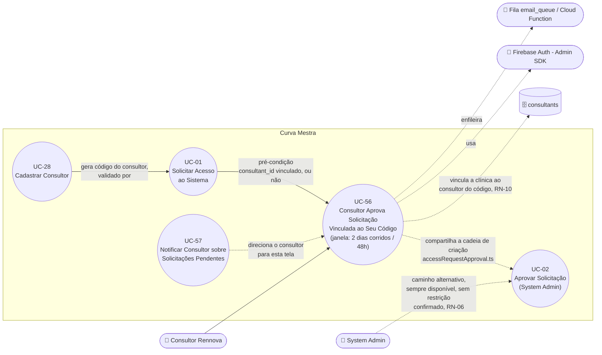

# UC-56: Consultor Aprova Solicitação de Acesso Vinculada ao Seu Código

**Projeto:** Curva Mestra
**Data de Criação:** 08/10/2026
**Autor:** Guilherme Scandelari (via uml-use-case-writer)
**Status:** Implementado
**Módulo/Contexto:** Autenticação / Aquisição de Clientes (Consultores)
**Versão:** 1.4

> **Implementado — release 1.13.0 (08/10/2026).** Tela `/consultant/access-requests` (menu "Solicitações de Acesso" do Portal do Consultor), listagem via `GET /api/consultants/me/pending-access-requests` e aprovação via `POST /api/access-requests/[id]/approve-consultant`, com a mesma cadeia de criação do System Admin (`src/lib/services/accessRequestApproval.ts`). A clínica criada fica vinculada ao **consultor do código** da solicitação, independentemente de quem aprovou (RN-10). Este documento especifica um novo caminho de aprovação de solicitação de acesso (UC-01): um **Consultor Rennova** (`role: "clinic_consultant"`, custom claim `is_consultant: true`) passa a poder aprovar diretamente uma solicitação que foi vinculada ao seu código (UC-01, RN-08), sem depender do System Admin (UC-02). A exclusividade dessa aprovação é temporária — **2 dias corridos (48h)** a partir da criação da solicitação (`created_at`), **sem nenhuma exclusão de fim de semana ou feriado** — e todo consultor ativo pode **ver** qualquer solicitação pendente, mesmo as que não pode (ainda) aprovar. **[v1.3, confirmado pelo PO]** Importante distinguir dois planos que usam números parecidos mas não são a mesma coisa: (1) o **texto exibido ao visitante** em `register/page.tsx` (UC-01) continua dizendo "avaliado em até 2 dias úteis" — essa é só a cópia da interface, não muda; (2) o **cálculo interno da janela de exclusividade** deste UC-56 é **2 dias corridos (48h)**, sem lógica de dia útil/feriado — essa é a regra de negócio real, aplicada em RN-02/RN-03. Os dois "2 dias" coincidem em valor numérico por coincidência de design (o prazo interno foi dimensionado para corresponder ao SLA comunicado), mas são conceitos diferentes: um é copy de UI, o outro é regra de cálculo. Quando a solicitação **não** tem código de consultor vinculado, qualquer consultor ativo já pode aprová-la desde o início, sem esperar nenhuma janela (confirmado pelo PO). O System Admin continua podendo aprovar qualquer solicitação, a qualquer momento (UC-02), **sem nenhuma restrição decorrente da janela de exclusividade deste UC** — confirmado pelo PO. Este UC existe como documento próprio, e não como extensão de UC-02, porque muda o **ator primário** e introduz regras de autorização inteiramente novas (mesmo padrão já adotado no projeto para UC-05, que separou a tentativa de aprovação pelo Clinic Admin de UC-02).

---

## 1. Diagrama UML (Mermaid)

---

## 2. Atores

### 2.1 Ator Primário
**Consultor Rennova** — usuário autenticado com custom claims `is_consultant: true`, `consultant_id` (id do documento em `consultants`) e `active: true` (ver UC-28). Busca aprovar uma solicitação de acesso, esteja ela vinculada ao seu código (UC-01, RN-08) ou sem nenhum vínculo de consultor, tornando o especialista solicitante um `clinic_admin` de um novo tenant.

### 2.2 Atores Secundários / Sistemas Externos
- **Firebase Auth (Admin SDK):** mesma função que em UC-02 — verificação do token do consultor autenticado, criação do usuário `clinic_admin`, definição de custom claims e geração do link de redefinição de senha.
- **Fila `email_queue` / Cloud Function:** mesma mecânica de UC-02 — recebe o e-mail de boas-vindas com o link de redefinição de senha.
- **System Admin** — continua podendo aprovar a mesma solicitação em paralelo, via UC-02, **sem nenhuma restrição decorrente da janela de exclusividade deste UC** — confirmado pelo PO (RN-06).
- **Consultant (coleção `consultants`)** — fonte de verdade de quem é um consultor ativo e de qual é o seu `code`; também recebe, em `authorized_tenants`, a clínica criada quando ela é vinculada ao consultor do código (RN-10).

---

## 3. Pré-condições
- Consultor autenticado, com claims `is_consultant === true`, `consultant_id` definido e `active === true` **e** com o documento `consultants/{consultant_id}` existente e com `status: "active"` — consultor suspenso não consegue aprovar nem listar, mesmo com claim desatualizado (ver RN-07).
- Existe uma solicitação em `access_requests` com `status: "pendente"` (criada via UC-01).
- **Elegibilidade para aprovar esta solicitação específica** depende de quatro cenários (ver RN-01 a RN-05, detalhados na seção 9):
  1. A solicitação tem `consultant_id` igual ao do consultor logado, e **menos de 2 dias corridos (48h)** se passaram desde `created_at` → pode aprovar.
  2. A solicitação tem `consultant_id` de **outro** consultor, e **menos de 2 dias corridos (48h)** se passaram desde `created_at` → **não** pode aprovar (ver Fluxo de Exceção 8a).
  3. Já se passaram **2 dias corridos (48h) ou mais** desde `created_at` de uma solicitação vinculada a outro consultor → qualquer consultor ativo pode aprovar (RN-03).
  4. A solicitação **não tem** `consultant_id` vinculado (campo deixado em branco em UC-01) → qualquer consultor ativo pode aprovar **desde o início**, sem esperar nenhuma janela de tempo (RN-05, confirmado pelo PO).
- **Visibilidade** (diferente de permissão de aprovar): qualquer consultor ativo pode **ver** todas as solicitações `"pendente"`, inclusive as vinculadas a outro consultor e ainda dentro da janela de exclusividade (RN-04) — a tela de listagem não é pré-condição restrita, apenas o botão/ação de aprovar.

---

## 4. Pós-condições

### 4.1 Sucesso (Garantias de Sucesso)
Idênticas, na essência, às de UC-02 (RN-09 — este UC reaproveita a mesma cadeia de criação, não duplica a lógica):
- 3 documentos criados: `tenant`, usuário no Firebase Auth (**sem senha**, `emailVerified: false` — a senha é definida só pelo link do e-mail de boas-vindas, UC-02/RN-03) e usuário no Firestore (`users`).
- Vínculo da clínica ao consultor do código (RN-10): se a solicitação tem `consultant_id` e esse consultor está ativo no momento da aprovação, o tenant nasce com `consultant_id`/`consultant_code`/`consultant_name` **desse** consultor (que pode não ser quem aprovou), o `tenant_id` entra em `consultants/{id}.authorized_tenants` no mesmo batch da aprovação e a claim `authorized_tenants` dele é sincronizada — a clínica aparece em "Minhas Clínicas" do consultor do código. Sem código, ou com consultor do código inativo/removido, a clínica nasce sem consultor — inclusive quando quem aprovou foi um consultor.
- Custom claims do novo usuário definidos: `tenant_id`, `role: "clinic_admin"`, `is_system_admin: false`, `active: true` — exatamente como em UC-02.
- Um link de redefinição de senha é gerado e incluído no e-mail de boas-vindas, enfileirado em `email_queue`.
- Solicitação atualizada para `status: "aprovada"`, com `tenant_id`, `user_id`, `approved_at`, `approved_by` (= uid do consultor que aprovou) e `approved_by_name` (= `name` do documento `consultants/{id}`, com fallback para `decodedToken.name`, `decodedToken.email` ou "Consultor Rennova") — o `audit_log`/campos existentes já são suficientes para essa auditoria, conforme confirmado pelo PO (não há necessidade de tela nova — ver seção 9, RN-08).
- Solicitação desaparece da listagem de pendentes (a tela lista todas as pendentes, elegíveis ou não — RN-04 —, e a aprovada deixa de ser pendente).

### 4.2 Falha (Garantias Mínimas)
- Se qualquer etapa da cadeia de criação até o commit do batch falhar, o `tenant` já criado é revertido (deletado) — mesmo padrão de UC-02/RN-04. Falha apenas na sincronização da claim `authorized_tenants` do consultor vinculado (posterior ao commit) não desfaz a aprovação (RN-10).
- A solicitação permanece com `status: "pendente"`.
- Se o consultor não for elegível para aprovar aquela solicitação específica (RN-01/RN-02), nenhuma operação é executada — nem o `tenant` chega a ser criado (ver Fluxo de Exceção 8a).

---

## 5. Gatilho (Trigger)
O Consultor Rennova acessa `/consultant/access-requests` (item de menu "Solicitações de Acesso" do Portal do Consultor, `ConsultantLayout.tsx`) — por iniciativa própria ou pelo botão "Ver Solicitações" do e-mail diário de UC-57 — e clica em "Aprovar" em uma linha elegível.

---

## 6. Fluxo Principal (Basic Flow)

1. Consultor acessa `/consultant/access-requests` (página "Solicitações de Acesso", `src/app/(consultant)/consultant/access-requests/page.tsx`).
2. Sistema chama `GET /api/consultants/me/pending-access-requests` com o Bearer token; a API (Admin SDK) valida o consultor ativo (mesma regra do passo 5) e devolve **todas** as solicitações com `status: "pendente"`, ordenadas por `created_at` decrescente (RN-04 — visibilidade universal), cada uma anotada com `linked_to_me`, `exclusivity_expires_at` (`created_at + 48h`, só quando há consultor vinculado), `eligible_now` (resultado de `canConsultantApprove`) e o nome do consultor vinculado. A tela exibe cada solicitação em um card (nome, e-mail, clínica ou região/carteira, conselho ou ID Rennova, data de recebimento) com um badge: "Sem consultor vinculado", "Vinculada a você", "Exclusiva de {consultor} até {data/hora}" (botão "Aprovar" desabilitado, com ícone de cadeado) ou "Exclusividade de {consultor} expirada".
3. Consultor clica em "Aprovar" em uma linha elegível (vinculada ao seu código, sem nenhum consultor vinculado, ou já fora da janela de 2 dias corridos de outro consultor); o sistema abre um `ConfirmDialog` "Aprovar solicitação?" informando que será criada a clínica "{business_name}" e que o solicitante receberá por e-mail o link para definir a senha (ação irreversível); o consultor confirma.
4. Sistema envia `POST /api/access-requests/{id}/approve-consultant` (rota própria, separada da rota do System Admin de UC-02), com o Bearer token do consultor autenticado.
5. API verifica o token (`verifyActiveConsultant`, `src/lib/services/accessRequestRouteHelpers.ts`): `adminAuth.verifyIdToken`, depois `decodedToken.is_consultant === true`, `consultant_id` presente e `decodedToken.active === true` **e** o documento `consultants/{consultant_id}` existente com `status: "active"` — o documento é conferido porque o claim pode estar desatualizado após uma suspensão (RN-07).
6. API busca a solicitação (404 se não existir) e valida que `status === "pendente"` (helper `loadPendingAccessRequest`, compartilhado com UC-02).
7. API verifica a elegibilidade do consultor para aprovar esta solicitação específica com a função pura `canConsultantApprove` (`src/lib/consultantAccessApproval.ts` — a mesma que anota `eligible_now` na listagem do passo 2): rejeita apenas se a solicitação tiver `consultant_id` definido, diferente do `consultant_id` do token, e o momento atual for anterior a `created_at + 48h` (`computeExclusivityExpiresAt`, dias corridos, sem desconto de fim de semana/feriado — ver Fluxo de Exceção 8a); em qualquer outro cenário (sem `consultant_id`, vinculada ao próprio consultor, ou janela já expirada), a API segue para a aprovação.
8. API executa a mesma cadeia de criação de UC-02 (`createTenantAndUserFromAccessRequest`, passos 8 a 14 daquele UC): resolve o consultor do código (RN-10), cria `tenant` (vinculado ao consultor do código, quando ativo), cria usuário Auth **sem senha**, define custom claims (`clinic_admin`), cria documento `user`, grava em um único batch a solicitação (`status: "aprovada"`, `approved_by`/`approved_by_name` = dados do consultor que aprovou) e o `authorized_tenants` do consultor do código, sincroniza a claim desse consultor, gera link de redefinição de senha e enfileira o e-mail `welcome_approval`.
9. API retorna sucesso com os mesmos dados de UC-02 (`{ success: true, message, data: { tenant_id, user_id, email, business_name } }`).
10. Sistema exibe o toast "Solicitação aprovada!" / "Clínica criada e e-mail de acesso enviado para {email}." e recarrega a lista de solicitações pendentes (a lista também é recarregada em caso de erro).
11. Caso de uso é concluído com sucesso.

---

## 7. Fluxos Alternativos

### 7a. Solicitação sem código de consultor vinculado (a partir do passo 2)
1. A solicitação não tem `consultant_id` preenchido — o campo "código do consultor" ficou em branco em UC-01 (campo opcional).
2. **[CONFIRMADO PELO PO]** Qualquer consultor ativo já pode aprovar essa solicitação desde o momento da sua criação, sem esperar os 2 dias corridos de RN-02/RN-03 — não há "o consultor" vinculado a esperar (RN-05). A tela exibe essa linha como elegível para qualquer consultor desde o primeiro acesso.
3. Retorna ao passo 3 do fluxo principal.

### 7b. Janela de exclusividade expirada (a partir do passo 7)
1. Já se passaram 2 dias corridos (48h) ou mais desde `created_at` da solicitação, e o `consultant_id` vinculado (de outro consultor) ainda não tomou nenhuma decisão.
2. Qualquer consultor ativo (não apenas o vinculado) passa a poder aprovar essa solicitação específica (RN-03).
3. Retorna ao passo 8 do fluxo principal.

---

## 8. Fluxos de Exceção

### 8a. Consultor tenta aprovar solicitação vinculada a outro consultor, dentro da janela de exclusividade (a partir do passo 7)
1. A solicitação tem `consultant_id` de um consultor diferente do que está fazendo a chamada, e `created_at` tem menos de 2 dias corridos (48h).
2. API retorna erro 403 (`{ error: "Esta solicitação está em período de exclusividade de outro consultor" }`); nenhuma operação de criação é executada.
3. Sistema exibe o erro retornado; a ação de aprovar permanece desabilitada para essa linha, conforme já indicado no passo 2 do fluxo principal. Este é o **único** cenário em que um consultor é bloqueado de aprovar — em todos os demais (sem vínculo, vínculo próprio, ou janela expirada), a aprovação é permitida.

### 8b. Token ausente, inválido, ou usuário não é consultor ativo (a partir do passo 5)
1. O header `Authorization: Bearer` está ausente/mal formado, o token é inválido, `decodedToken.is_consultant !== true`, `consultant_id` ausente no token, `decodedToken.active !== true`, ou o documento `consultants/{consultant_id}` não existe ou não está com `status: "active"` (consultor suspenso, ver UC-29 — mesmo com claim ainda desatualizado).
2. API retorna 401 (`{ error: "Não autorizado" }`) para header ausente/token inválido, ou 403 (`{ error: "Apenas consultores ativos podem aprovar solicitações" }`) para os demais casos. A listagem (`GET /api/consultants/me/pending-access-requests`) aplica a mesma checagem: 401 `"Token não fornecido"`/`"Não autorizado"` ou 403 `"Acesso restrito a consultores ativos"`.
3. Nenhuma operação de criação é executada; a solicitação permanece `"pendente"`.

### 8c. Solicitação já processada (a partir do passo 6)
1. A solicitação já foi aprovada (pelo próprio consultor, por outro consultor elegível, ou pelo System Admin via UC-02, que pode agir a qualquer momento — RN-06) ou rejeitada, em uma ação concorrente.
2. API retorna erro 400 (`{ error: "Solicitação já foi processada" }`); sistema exibe a mensagem em toast destructive e recarrega a lista.

### 8d. Email já existe no Firebase Auth / erro genérico durante a criação (a partir do passo 8)
1. Mesmos cenários de UC-02 (Fluxos de Exceção 8b/8d daquele UC) — ex.: e-mail já cadastrado no Auth. Inclui a **aprovação simultânea** da mesma solicitação por dois atores (dois consultores elegíveis, ou um consultor e o System Admin): ambos passam pela checagem de `"pendente"`, mas o segundo esbarra no e-mail que o primeiro acabou de criar no Auth.
2. API reverte (deleta) o `tenant` já criado e retorna o erro correspondente (400 "Este email já está em uso" no caso de e-mail existente) — na aprovação simultânea, o segundo ator recebe 400 e **nenhuma clínica duplicada** é criada; a solicitação fica com o estado gravado pelo primeiro ator (`"aprovada"`) ou permanece `"pendente"` nos demais casos.

---

## 9. Regras de Negócio Relacionadas

| ID | Regra | Justificativa |
|----|-------|----------------|
| RN-01 | O vínculo entre uma solicitação e um consultor é o campo `consultant_id`, gravado em UC-01 (RN-08) quando o visitante informa um código de consultor válido (6 dígitos, consultor ativo) durante o cadastro. O campo é opcional — uma solicitação pode não ter nenhum consultor vinculado (`consultant_id: null`, ver RN-05). | Base de toda a regra de exclusividade e elegibilidade deste UC, e também do vínculo da clínica criada (RN-10). |
| RN-02 | **[CORRIGIDO em v1.3 — confirmado pelo PO]** Durante os primeiros **2 dias corridos (48h) a partir de `created_at`** da solicitação (confirmado literalmente pelo PO: a contagem começa na criação da solicitação, não em outro evento), **apenas o consultor cujo `consultant_id` está vinculado àquela solicitação** pode aprová-la. Qualquer outro consultor que tentar aprovar recebe 403 (Fluxo de Exceção 8a) — mas continua podendo **ver** a solicitação (RN-04). Esta regra só se aplica quando a solicitação **tem** um `consultant_id` vinculado — ver RN-05 para o caso contrário. **Distinção explícita confirmada pelo PO (v1.3):** o cálculo são **2 dias corridos (48h)**, sem nenhuma exclusão de sábado/domingo/feriado — "dias úteis" é apenas o texto exibido ao visitante em `register/page.tsx` (UC-01: "cada pedido é avaliado em até 2 dias úteis"), que não muda e continua sendo só copy de interface; a regra de cálculo interna real deste UC-56 nunca foi "dias úteis" no sentido de descontar fim de semana — isso substitui a formulação anterior ("2 dias úteis") usada nas versões v1.1/v1.2 deste documento, que misturava os dois conceitos. | Preserva, durante um período razoável e numericamente alinhado ao SLA comunicado ao cliente na tela de registro, a relação comercial entre o consultor de referência e o especialista que o indicou, sem bloquear indefinidamente a entrada do especialista no sistema caso aquele consultor específico não responda. O cálculo em dias corridos (sem lógica de dia útil/feriado) evita a complexidade e a ambiguidade de definir "dia útil" (quais feriados contam?) para uma regra de autorização. |
| RN-03 | **[CORRIGIDO em v1.3 — confirmado pelo PO]** Após 2 dias corridos (48h) sem decisão (nem aprovação, nem rejeição) sobre uma solicitação vinculada a um consultor específico, **qualquer consultor ativo** passa a poder aprová-la, independentemente de qual consultor estava originalmente vinculado a ela. O cálculo é em dias corridos, sem exclusão de fim de semana/feriado — mesma distinção de RN-02. | Evita que uma solicitação vinculada fique bloqueada indefinidamente por inação de um único consultor; garante que o especialista eventualmente consiga acesso por outro caminho, sem depender exclusivamente do System Admin; cálculo simples e sem ambiguidade (dias corridos). |
| RN-04 | **Visibilidade é universal e independente de elegibilidade para aprovar.** Todo consultor ativo deve conseguir ver, em sua tela de solicitações pendentes, **todas** as solicitações com `status: "pendente"` — inclusive as vinculadas a outro consultor e ainda dentro da janela de exclusividade de RN-02. A ação de aprovar, não a visibilidade, é o que é restringido por RN-02/RN-03. | Confirmado explicitamente pelo PO: "TODOS os consultores Rennova devem conseguir VER todas as solicitações pendentes... eles só não podem aprovar as que não são suas dentro da janela [de exclusividade]." Implementado via API route com Admin SDK (`GET /api/consultants/me/pending-access-requests`), sem abrir a regra do Firestore de `access_requests` para consultores (RNF-02). |
| RN-05 | **[CONFIRMADO PELO PO]** Quando a solicitação **não tem** `consultant_id` vinculado (campo deixado em branco em UC-01), ela é aprovável por **qualquer consultor ativo desde o momento da sua criação** — sem esperar os 2 dias corridos de RN-02/RN-03, já que não existe "o consultor" vinculado a esperar. Foi uma **mudança de comportamento** introduzida por este UC: antes da release 1.13.0, toda aprovação passava exclusivamente pelo System Admin (UC-02); hoje, qualquer consultor ativo também pode aprovar esse mesmo tipo de solicitação (sem vínculo), em paralelo ao System Admin — e a clínica criada nasce sem consultor vinculado, pois não há consultor do código (RN-10) — os dois caminhos não são mutuamente exclusivos, sem conflito entre si (RN-06). | Confirmado pelo PO: "qualquer consultor pode aprovar desde o início." Evita que a ausência de um código de consultor informado pelo especialista vire um obstáculo — qualquer consultor ativo pode acolher esse caso. |
| RN-06 | **[CONFIRMADO PELO PO]** O System Admin (UC-02) continua podendo aprovar qualquer solicitação, a qualquer momento, **sem nenhuma checagem adicional vinda deste UC** — inclusive dentro da janela de exclusividade de 2 dias corridos de um consultor específico (RN-02). O código de UC-02 não precisa de nenhuma alteração: o comportamento confirmado já é exatamente o que a rota de aprovação do System Admin já faz hoje. | Confirmado pelo PO: "System Admin mantém poder de aprovar QUALQUER solicitação a qualquer momento, inclusive dentro da janela de exclusividade (...) não fica sujeito à janela de exclusividade." Ver também UC-02/RN-06, espelhada. |
| RN-07 | Um consultor com `status` diferente de `"active"` (ex.: suspenso, ver UC-29) não consegue aprovar nenhuma solicitação nem listar as pendentes. A checagem é dupla: custom claims (`is_consultant`, `consultant_id`, `active === true`) **e** documento `consultants/{consultant_id}` com `status: "active"` (`verifyActiveConsultant`) — o documento é conferido porque o claim pode estar desatualizado após uma suspensão. Falha em qualquer uma → 403 (Fluxo de Exceção 8b). | Um ator suspenso não deve reter capacidade de ação, mesmo com um token emitido antes da suspensão. |
| RN-08 | A auditoria desta aprovação não requer nenhuma tela nova: os campos já existentes `approved_by`/`approved_by_name` (gravados na própria solicitação, mesmo mecanismo de UC-02) já identificam corretamente se quem aprovou foi um System Admin ou um Consultor Rennova específico — confirmado como suficiente pelo PO. | Evita trabalho de documentação/implementação de uma funcionalidade de auditoria dedicada, desnecessária para este caso de uso. |
| RN-09 | Este UC reaproveita integralmente a cadeia de criação de tenant+usuário+claims+vínculo de consultor+e-mail de UC-02 — implementada uma única vez em `createTenantAndUserFromAccessRequest` (`src/lib/services/accessRequestApproval.ts`) e chamada pelas duas rotas. Este UC só acrescenta um segundo ponto de entrada, com ator e regra de elegibilidade próprios. | Evita duplicar/divergir a lógica crítica de criação de tenant em dois lugares (UC-02/RNF-04, RNF-03 deste UC — ambas resolvidas). |
| RN-10 | **[Nova em v1.4 — confirmada pelo PO; bug corrigido na PR #371]** **Vínculo da clínica criada ao consultor do código** — regra idêntica a UC-02/RN-07 (mesma implementação, `resolveLinkedConsultant` + `createTenantAndUserFromAccessRequest`). Se a solicitação tem `consultant_id`, o tenant nasce com `consultant_id`, `consultant_code` e `consultant_name` desse consultor; o `tenant_id` entra em `consultants/{id}.authorized_tenants` no **mesmo batch** que marca a solicitação como `aprovada`; depois do commit, a claim `authorized_tenants` do consultor é sincronizada (`syncConsultantAuthorizedTenants`), sem desfazer a aprovação se essa etapa falhar. O vínculo segue **sempre o consultor do código, independentemente de quem aprovou**: o próprio consultor, outro consultor depois das 48h (RN-03) ou o System Admin (UC-02). Sem código na solicitação → a clínica nasce **sem** consultor, mesmo que um consultor a tenha aprovado (RN-05). Consultor do código inativo ou removido no momento da aprovação → a clínica é criada **sem** vínculo (log de aviso) — o `clinic_admin` pode convidar um consultor depois (UC-54). | Aprovar não é o mesmo que atender: o código registra a relação comercial que o especialista indicou, e quem aprova (inclusive outro consultor após a janela) não herda a clínica. Não vincular a consultor inativo é decisão do PO. Sem essa regra (bug encontrado em dev), a clínica aprovada não aparecia em "Minhas Clínicas" de ninguém. |

---

## 10. Requisitos Especiais / Não Funcionais

| ID | Descrição | Categoria |
|----|-----------|-----------|
| RNF-01 | Multi-tenant: assim como em UC-02, este UC opera **antes** da existência de qualquer `tenant_id` para a solicitação em questão — o tenant só é criado na aprovação. O `tenant_id`/`authorized_tenants` do consultor que aprova não limita, nem precisa limitar, quais solicitações ele pode ver ou aprovar (a exclusividade é por `consultant_id`, não por tenant). A clínica criada só entra no `authorized_tenants` do consultor **do código** (RN-10), não necessariamente de quem aprovou. | Multi-tenant |
| RNF-02 | **[RESOLVIDO — release 1.13.0]** A regra do Firestore de `access_requests` (`allow read, update, delete: if isSystemAdmin();`) **não** foi aberta para consultores: a listagem é servida por `GET /api/consultants/me/pending-access-requests`, via Admin SDK, depois de validar o consultor ativo — para não expor PII de solicitantes (nome, e-mail, telefone, conselho) pelo client SDK. A rota usa o índice composto já existente de `access_requests` (`status` ASC, `created_at` DESC), o mesmo da tela do admin. | Segurança / Multi-tenant |
| RNF-03 | **[RESOLVIDO — release 1.13.0]** A cadeia de criação foi extraída para `src/lib/services/accessRequestApproval.ts`, e os passos comuns das rotas (verificação de Bearer token, verificação de consultor ativo, carga da solicitação pendente, tradução de erros em HTTP) para `src/lib/services/accessRequestRouteHelpers.ts` (`verifyBearerToken`, `verifyActiveConsultant`, `loadPendingAccessRequest`, `approveAccessRequestResponse`, `internalErrorResponse`) — ver UC-02/RNF-04. | Manutenibilidade |
| RNF-04 | **[RESOLVIDO em v1.3 — confirmado pelo PO; implementado em v1.4]** O cálculo da janela de exclusividade (RN-02/RN-03) é em **dias corridos (48h a partir de `created_at`)**, sem nenhuma exclusão de sábado, domingo ou feriado. "Dias úteis" é exclusivamente o texto exibido ao visitante na tela de registro (`register/page.tsx`, UC-01). Implementado como regra pura em `src/lib/consultantAccessApproval.ts` (`EXCLUSIVITY_WINDOW_HOURS = 48`, `computeExclusivityExpiresAt`, `canConsultantApprove`), sem nenhum import de Firestore em runtime, usada tanto pela rota de aprovação (decisão autoritativa) quanto pela listagem (anotação `eligible_now`), para que as duas nunca divirjam. | Precisão de implementação |

---

## 11. Frequência de Uso
Ocasional — acompanha o volume de solicitações de UC-01, tanto as que informam um código de consultor válido (RN-02/RN-03) quanto as que não informam nenhum código (RN-05, também elegíveis a qualquer consultor). Recém-implementado (release 1.13.0) — sem dados de uso real ainda.

---

## 12. Casos de Uso Relacionados
- **UC-01 (Solicitar Acesso ao Sistema)** — pré-condição direta: o `consultant_id` (quando informado) que este UC usa para decidir elegibilidade e o vínculo da clínica (RN-10) é gravado por aquele UC (RN-08). O texto "2 dias úteis" exibido em `register/page.tsx` é apenas a inspiração de copy para o valor numérico desta janela — o cálculo interno real de RN-02/RN-03 é em dias corridos (48h), não dias úteis (ver RN-02, RNF-04).
- **UC-02 (Aprovar Solicitação de Acesso)** — caminho alternativo, não mutuamente exclusivo, sobre a mesma solicitação: o System Admin pode aprovar em paralelo, a qualquer momento, **sem nenhuma restrição decorrente da janela de exclusividade deste UC** — confirmado pelo PO (RN-06, espelhada em UC-02/RN-06). Os dois caminhos executam a mesma cadeia de criação (RN-09) e a mesma regra de vínculo da clínica ao consultor do código (RN-10 aqui, UC-02/RN-07).
- **UC-28 (Cadastrar Consultor)** — fonte dos consultores ativos e de seus códigos; também fonte do `consultant_id` usado por este UC.
- **UC-29 (Editar, Suspender e Reativar Consultor)** — um consultor suspenso por aquele UC perde a capacidade de aprovar solicitações aqui (RN-07).
- **UC-48 (Consultar Clínicas Vinculadas e Estoque)** — "Minhas Clínicas" do consultor do código passa a listar a clínica criada por esta aprovação (RN-10).
- **UC-54 (Convidar Consultor para a Clínica)** — caminho pelo qual o `clinic_admin` de uma clínica criada sem vínculo (sem código, ou consultor do código inativo na aprovação — RN-10) pode convidar um consultor depois; se o consultor convidado continuar inativo, a tela informa "Consultor temporariamente inativo" (UC-54/RN-09).
- **UC-57 (Notificar Consultor sobre Solicitações Pendentes Vinculadas ao Seu Código)** — gatilho recorrente (e-mail diário, 08:00 `America/Sao_Paulo`) que direciona o consultor de volta a esta tela/ação; o e-mail continua sendo disparado mesmo após a janela de 2 dias corridos expirar, enquanto a solicitação permanecer pendente (confirmado — ver UC-57/RN-03).

---

## 13. Referências
- `src/app/(consultant)/consultant/access-requests/page.tsx` — tela "Solicitações de Acesso" do consultor (badges de vínculo/exclusividade, botão "Aprovar" habilitado por `eligible_now`, `ConfirmDialog`).
- `src/components/consultant/ConsultantLayout.tsx` — item de menu "Solicitações de Acesso" (`/consultant/access-requests`).
- `src/app/api/consultants/me/pending-access-requests/route.ts` — `GET`, listagem via Admin SDK com `eligible_now`, `linked_to_me`, `exclusivity_expires_at` (RN-04, RNF-02).
- `src/app/api/access-requests/[id]/approve-consultant/route.ts` — `POST`, aprovação pelo consultor (rota separada da do System Admin).
- `src/lib/consultantAccessApproval.ts` — regra pura da janela de 48h (`canConsultantApprove`, `computeExclusivityExpiresAt`, `EXCLUSIVITY_WINDOW_HOURS`).
- `src/lib/services/accessRequestApproval.ts` — cadeia de criação compartilhada com UC-02, incluindo `resolveLinkedConsultant` (RN-09, RN-10).
- `src/lib/services/accessRequestRouteHelpers.ts` — helpers de rota compartilhados (`verifyBearerToken`, `verifyActiveConsultant`, `loadPendingAccessRequest`, `approveAccessRequestResponse`, `internalErrorResponse`).
- `src/lib/services/consultantClaimsSync.ts` — `syncConsultantAuthorizedTenants` (RN-10).
- `tests/e2e/UC-56-consultor-aprova-solicitacao-vinculada-ao-codigo.spec.ts` — caderno E2E (fluxo principal, anotação de elegibilidade, 7a, 7b, 8a-8d, System Admin dentro da janela e os cenários de vínculo da RN-10).
- `src/app/api/access-requests/[id]/approve/route.ts` — rota do System Admin (UC-02), que chama a mesma cadeia compartilhada.
- `src/app/(auth)/register/page.tsx` — fonte literal do texto "até 2 dias úteis" (texto do card e mensagem de sucesso), que inspirou o valor numérico da janela de exclusividade, mas **não** é a fonte do cálculo em si — o cálculo real desta implementação é em dias corridos (48h), não dias úteis (RN-02, RNF-04).
- `src/types/index.ts` (interfaces `Consultant`, `AccessRequest` — com `consultant_code`/`consultant_id` —, `Tenant`).
- `firestore.rules` (`access_requests/{requestId}`) — mantida restrita a `isSystemAdmin()`; não foi estendida (RNF-02).
- `ONLY_FOR_DEVS/PO_BA_Docs/UC-28-cadastrar-consultor.md` — origem do código de consultor e dos custom claims (`is_consultant`, `consultant_id`, `active`).

---

## 14. Perguntas em Aberto / Decisões Pendentes

**[RESOLVIDO em v1.1 — confirmado pelo PO]** As três pendências de produto registradas na v1.0 foram respondidas:
- **(a)** O System Admin mantém poder de aprovar qualquer solicitação a qualquer momento, inclusive dentro da janela de exclusividade de um consultor específico — não fica sujeito a essa janela (RN-06).
- **(b)** Quando NÃO há código de consultor vinculado, qualquer consultor Rennova já pode aprovar desde o início, sem esperar nenhuma janela de tempo (RN-05) — isso representa uma mudança de comportamento real em relação a hoje (atualmente, toda aprovação passa exclusivamente pelo System Admin), decidida corretamente aqui em UC-56 (e não centralizada em UC-02, que continua descrevendo apenas o caminho do System Admin, inalterado) — sem contradição entre os dois documentos: ambos os caminhos coexistem livremente.
- **(c)** Já estava resolvido na v1.0: a contagem do prazo começa em `created_at` da solicitação.

**[RESOLVIDO em v1.2 — confirmado pelo PO]** O valor do prazo de exclusividade foi corrigido de **15 dias** para o valor usado na v1.2/v1.3 — ver item seguinte para a formulação final.

**[RESOLVIDO em v1.3 — confirmado pelo PO]** A pendência de engenharia registrada em v1.2 (RNF-04 — se "dias úteis" excluiria só fim de semana ou também feriados) foi respondida de forma definitiva: **a janela é de 2 dias corridos (48h) a partir de `created_at`, sem nenhuma exclusão de fim de semana ou feriado.** "Dias úteis" é apenas o texto já exibido ao visitante em `register/page.tsx` (copy de interface, inalterado) — não é, e nunca foi pretendido ser, a regra de cálculo interna. RN-02, RN-03 e RNF-04 reescritas para deixar essa distinção explícita (texto ao usuário vs. cálculo interno). Nenhuma contradição entre a formulação "2 dias úteis" (copy) e "2 dias corridos" (cálculo) permanece — ambas convivem no mesmo documento, cada uma no seu papel, claramente rotuladas.

Nenhuma pendência de produto permanece aberta nesta revisão.

**[RESOLVIDO em v1.4]** A dependência de implementação de UC-01/RN-08 (código do consultor validado e `consultant_id` gravado na solicitação) foi atendida na mesma entrega (release 1.13.0).

**[RESOLVIDO em v1.4 — decisões de engenharia implementadas]** (a) Tela: `/consultant/access-requests`, item de menu "Solicitações de Acesso", aprovação com `ConfirmDialog`. (b) Listagem: `GET /api/consultants/me/pending-access-requests` via Admin SDK, sem abrir a regra do Firestore de `access_requests` para consultores (RNF-02). (c) Aprovação: rota separada `POST /api/access-requests/[id]/approve-consultant` (não unificada com a do System Admin), com consultor ativo exigido pelo claim **e** pelo documento `consultants/{id}` (RN-07). (d) Janela de 48h como regra pura em `src/lib/consultantAccessApproval.ts`. (e) Helpers de rota em `src/lib/services/accessRequestRouteHelpers.ts`. (f) Aprovação simultânea: o segundo ator esbarra no e-mail já existente no Auth, o tenant dele é revertido e ele recebe 400 — sem clínica duplicada (Fluxo de Exceção 8d).

**[RESOLVIDO em v1.4 — decisão do PO, PR #371]** Nenhuma versão anterior deste UC definia o vínculo entre a clínica criada e o consultor do código — em dev, a clínica aprovada nascia sem consultor. Regra definida e implementada: RN-10 (espelhada em UC-02/RN-07).

---

## 15. Histórico de Versões

| Versão | Data | Autor | O que mudou |
|--------|------|-------|--------------|
| 1.0 | 08/10/2026 | Guilherme Scandelari (via uml-use-case-writer) | Versão inicial. Caso de uso novo, especificado a partir de decisões de produto confirmadas pelo PO (vínculo de solicitação a um código de consultor real, janela de exclusividade de 15 dias a partir da criação da solicitação, visibilidade universal de pendentes para todos os consultores, auditoria via campos já existentes) e de três pontos explicitamente registrados como pendentes de confirmação (seção 14, itens a/b). Documento criado como UC próprio (não como extensão de UC-02), por mudança de ator primário — mesmo padrão já adotado no projeto para UC-05. Nenhuma linha de código criada ou alterada nesta rodada — documentação pura, para orientar implementação futura via `dev-task-manager`. |
| 1.1 | 08/10/2026 | Guilherme Scandelari (via uml-use-case-writer) | **Pendências de produto resolvidas — confirmação do PO.** (a) Confirmado que o System Admin mantém poder de aprovar qualquer solicitação a qualquer momento, sem ficar sujeito à janela de exclusividade de 15 dias (RN-06 reescrita, de "pendente" para "confirmado"). (b) Confirmado que, quando não há código de consultor vinculado, qualquer consultor ativo pode aprovar desde o início (RN-05 reescrita, de "pendente" para "confirmado") — tratado como mudança de comportamento real em relação ao estado atual (hoje só o System Admin aprova), centralizada aqui em UC-56, sem contradição com UC-02 (que permanece descrevendo apenas o caminho do System Admin, inalterado). Pré-condições (novo cenário 4), Fluxo Alternativo 7a reescrito como regra confirmada, Fluxo de Exceção 8a/8c, RN-01 a RN-03 ajustadas para deixar explícito o escopo de aplicação (só quando há vínculo), nova RN-09 (reaproveitamento explícito da cadeia de UC-02), seções 11 e 12 atualizadas. Seção 14 com as três pendências marcadas como resolvidas. **Status alterado de "Rascunho" para "Aprovado"** — nenhuma pendência de produto permanece em aberto; a implementação de código em si continua pendente (`dev-task-manager`), o que não impede a aprovação da especificação. Referência ao horário do e-mail diário de UC-57 atualizada para 08:00 `America/Sao_Paulo` (confirmado naquele UC). |
| 1.2 | 08/10/2026 | Guilherme Scandelari (via uml-use-case-writer) | **Correção de valor confirmada pelo PO: a janela de exclusividade passa de 15 dias para 2 dias úteis**, para alinhar exatamente com o SLA já prometido ao visitante na tela de registro (UC-01, `register/page.tsx`: "cada pedido é avaliado em até 2 dias úteis" / "Nossa equipe responderá em até 2 dias úteis"). Resumo, diagrama (seção 1), Pré-condições (os quatro cenários), Fluxo Principal (passos 2, 3, 7), Fluxos Alternativos (7a, 7b), Fluxo de Exceção 8a, RN-02 e RN-03 (reescritas, com a justificativa do alinhamento de SLA), seções 12 e 13 (nova referência a `register/page.tsx`) atualizados — toda ocorrência de "15 dias" neste documento foi substituída por "2 dias úteis". Nova RNF-04 registra, como decisão de engenharia não bloqueante, que o cálculo exato de "dias úteis" (exclusão de feriados ou só fins de semana) não foi especificado em nenhuma fonte e precisa ser decidido na implementação — adicionado também à seção 14. Entradas anteriores do Histórico de Versões (v1.0/v1.1, acima) mantidas inalteradas como registro histórico do que foi decidido em cada momento. |
| 1.3 | 08/10/2026 | Guilherme Scandelari (via uml-use-case-writer) | **Distinção definitiva confirmada pelo PO entre texto de UI e regra de cálculo.** O cálculo interno da janela de exclusividade (RN-02/RN-03) é **2 dias corridos (48h) a partir de `created_at`, sem nenhuma exclusão de fim de semana/feriado** — "dias úteis" permanece apenas como o texto exibido ao usuário final em `register/page.tsx` (copy de interface, inalterada), não como lógica de cálculo. Encerra a pendência de engenharia aberta em v1.2 (RNF-04, agora **[RESOLVIDO]**). Resumo, diagrama (seção 1 — rótulo do nó UC-56), Pré-condições, Fluxo Principal (passos 2, 3, 7), Fluxos Alternativos (7a, 7b), Fluxo de Exceção 8a, RN-02/RN-03 (reescritas com a distinção explícita texto-vs-cálculo), RNF-04 (de pendência para resolvida, com sugestão de implementação `created_at + 48h`), seções 12 e 13 (nota explícita de que `register/page.tsx` é só inspiração de copy, não fonte do cálculo) e seção 14 (novo item resolvido) atualizados. Toda ocorrência de "2 dias úteis" referente ao **cálculo** foi substituída por "2 dias corridos (48h)"; ocorrências que se referem especificamente ao **texto exibido ao usuário** (copy de `register/page.tsx`) permanecem como "2 dias úteis", agora claramente rotuladas como tal — nenhuma contradição remanescente. Entradas anteriores do Histórico de Versões (v1.0 a v1.2, acima) mantidas inalteradas como registro histórico do que foi decidido em cada momento. |
| 1.4 | 08/10/2026 | Guilherme Scandelari (via uml-use-case-writer) | **Implementado (release 1.13.0) — documento atualizado para o comportamento as-is.** Removido o aviso de "caso de uso planejado" e todas as marcações de planejamento. Nova **RN-10** — vínculo da clínica criada ao consultor do código (PR #371), consistente com UC-02/RN-07: segue sempre o consultor do código, independente de quem aprova; sem código ou com consultor inativo/removido, a clínica nasce sem vínculo. Fechadas as decisões de engenharia da seção 14: tela `/consultant/access-requests` com `ConfirmDialog`; listagem `GET /api/consultants/me/pending-access-requests` via Admin SDK (RNF-02 resolvida sem abrir `firestore.rules`); rota separada `approve-consultant`; consultor ativo pelo claim e pelo documento (RN-07); regra pura em `consultantAccessApproval.ts` (RNF-04); helpers em `accessRequestRouteHelpers.ts` (RNF-03); aprovação simultânea sem clínica duplicada (8d). Pós-condição corrigida: usuário Auth criado **sem senha**. Resumo, diagrama, Atores, Pré/Pós-condições, Gatilho, Fluxo Principal (passos 1-10), Fluxos de Exceção 8a-8d, RN-01/RN-04/RN-07/RN-09, RNF-01 a RNF-04, seções 11, 12 (UC-48, UC-54), 13 e 14 atualizados. **Status alterado de "Aprovado" para "Implementado".** |

