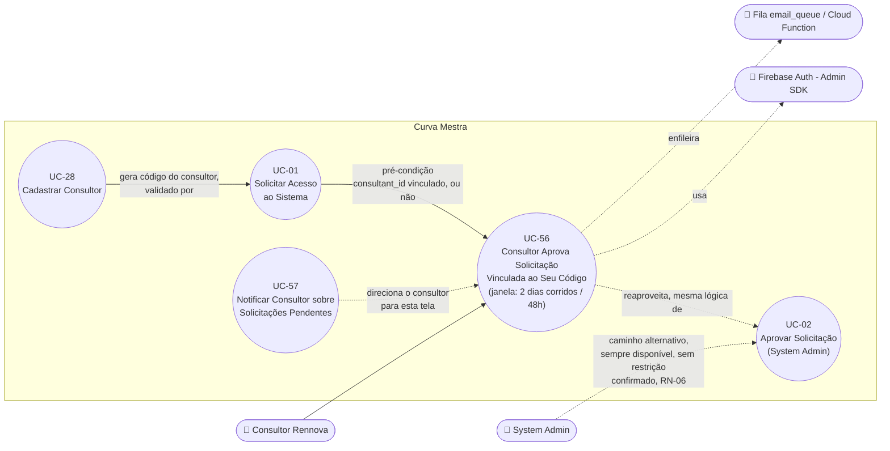

# UC-56: Consultor Aprova Solicitação de Acesso Vinculada ao Seu Código

**Projeto:** Curva Mestra
**Data de Criação:** 08/10/2026
**Autor:** Guilherme Scandelari (via uml-use-case-writer)
**Status:** Aprovado
**Módulo/Contexto:** Autenticação / Aquisição de Clientes (Consultores)
**Versão:** 1.3

> ⚠️ **Caso de uso planejado — ainda não implementado no código** (a implementação formal fica a cargo de `dev-task-manager`; este documento já não tem pendências de produto em aberto). Este documento especifica um novo caminho de aprovação de solicitação de acesso (UC-01): um **Consultor Rennova** (`role: "clinic_consultant"`, custom claim `is_consultant: true`) passa a poder aprovar diretamente uma solicitação que foi vinculada ao seu código (UC-01, RN-08, planejado), sem depender do System Admin (UC-02). A exclusividade dessa aprovação é temporária — **2 dias corridos (48h)** a partir da criação da solicitação (`created_at`), **sem nenhuma exclusão de fim de semana ou feriado** — e todo consultor ativo pode **ver** qualquer solicitação pendente, mesmo as que não pode (ainda) aprovar. **[v1.3, confirmado pelo PO]** Importante distinguir dois planos que usam números parecidos mas não são a mesma coisa: (1) o **texto exibido ao visitante** em `register/page.tsx` (UC-01) continua dizendo "avaliado em até 2 dias úteis" — essa é só a cópia da interface, não muda; (2) o **cálculo interno da janela de exclusividade** deste UC-56 é **2 dias corridos (48h)**, sem lógica de dia útil/feriado — essa é a regra de negócio real, aplicada em RN-02/RN-03. Os dois "2 dias" coincidem em valor numérico por coincidência de design (o prazo interno foi dimensionado para corresponder ao SLA comunicado), mas são conceitos diferentes: um é copy de UI, o outro é regra de cálculo. Quando a solicitação **não** tem código de consultor vinculado, qualquer consultor ativo já pode aprová-la desde o início, sem esperar nenhuma janela (confirmado pelo PO). O System Admin continua podendo aprovar qualquer solicitação, a qualquer momento (UC-02), **sem nenhuma restrição decorrente da janela de exclusividade deste UC** — confirmado pelo PO. Este UC existe como documento próprio, e não como extensão de UC-02, porque muda o **ator primário** e introduz regras de autorização inteiramente novas (mesmo padrão já adotado no projeto para UC-05, que separou a tentativa de aprovação pelo Clinic Admin de UC-02).

---

## 1. Diagrama UML (Mermaid)

---

## 2. Atores

### 2.1 Ator Primário
**Consultor Rennova** — usuário autenticado com custom claims `is_consultant: true`, `consultant_id` (id do documento em `consultants`) e `active: true` (ver UC-28). Busca aprovar uma solicitação de acesso, esteja ela vinculada ao seu código (UC-01, RN-08) ou sem nenhum vínculo de consultor, tornando o especialista solicitante um `clinic_admin` de um novo tenant.

### 2.2 Atores Secundários / Sistemas Externos
- **Firebase Auth (Admin SDK):** mesma função que em UC-02 — verificação do token do consultor autenticado, criação do usuário `clinic_admin`, definição de custom claims e geração do link de redefinição de senha.
- **Fila `email_queue` / Cloud Function:** mesma mecânica de UC-02 — recebe o e-mail de boas-vindas com o link de redefinição de senha.
- **System Admin** — continua podendo aprovar a mesma solicitação em paralelo, via UC-02, **sem nenhuma restrição decorrente da janela de exclusividade deste UC** — confirmado pelo PO (RN-06).
- **Consultant (coleção `consultants`)** — fonte de verdade de quem é um consultor ativo e de qual é o seu `code`.

---

## 3. Pré-condições
- Consultor autenticado, com claims `is_consultant === true`, `consultant_id` definido e `active === true` (consultor suspenso não deve conseguir aprovar — ver RN-07).
- Existe uma solicitação em `access_requests` com `status: "pendente"` (criada via UC-01).
- **Elegibilidade para aprovar esta solicitação específica** depende de quatro cenários (ver RN-01 a RN-05, detalhados na seção 9):
  1. A solicitação tem `consultant_id` igual ao do consultor logado, e **menos de 2 dias corridos (48h)** se passaram desde `created_at` → pode aprovar.
  2. A solicitação tem `consultant_id` de **outro** consultor, e **menos de 2 dias corridos (48h)** se passaram desde `created_at` → **não** pode aprovar (ver Fluxo de Exceção 8a).
  3. Já se passaram **2 dias corridos (48h) ou mais** desde `created_at` de uma solicitação vinculada a outro consultor → qualquer consultor ativo pode aprovar (RN-03).
  4. A solicitação **não tem** `consultant_id` vinculado (campo deixado em branco em UC-01) → qualquer consultor ativo pode aprovar **desde o início**, sem esperar nenhuma janela de tempo (RN-05, confirmado pelo PO).
- **Visibilidade** (diferente de permissão de aprovar): qualquer consultor ativo pode **ver** todas as solicitações `"pendente"`, inclusive as vinculadas a outro consultor e ainda dentro da janela de exclusividade (RN-04) — a tela de listagem não é pré-condição restrita, apenas o botão/ação de aprovar.

---

## 4. Pós-condições

### 4.1 Sucesso (Garantias de Sucesso)
Idênticas, na essência, às de UC-02 (RN-09 — este UC reaproveita a mesma cadeia de criação, não duplica a lógica):
- 3 documentos criados: `tenant`, usuário no Firebase Auth (senha temporária aleatória, `emailVerified: false`) e usuário no Firestore (`users`).
- Custom claims do novo usuário definidos: `tenant_id`, `role: "clinic_admin"`, `active: true` — exatamente como em UC-02.
- Um link de redefinição de senha é gerado e incluído no e-mail de boas-vindas, enfileirado em `email_queue`.
- Solicitação atualizada para `status: "aprovada"`, com `approved_by` e `approved_by_name` preenchidos com o **uid/nome do consultor** que aprovou (não do System Admin) — o `audit_log`/campos existentes já são suficientes para essa auditoria, conforme confirmado pelo PO (não há necessidade de tela nova — ver seção 9, RN-08).
- Solicitação desaparece da listagem de pendentes elegíveis para aprovação (mas, se a tela de listagem exibir também as não elegíveis — RN-04 —, ela passa a não aparecer em nenhuma das duas).

### 4.2 Falha (Garantias Mínimas)
- Se qualquer etapa da cadeia de criação falhar, o `tenant` já criado é revertido (deletado) — mesmo padrão de UC-02/RN-04.
- A solicitação permanece com `status: "pendente"`.
- Se o consultor não for elegível para aprovar aquela solicitação específica (RN-01/RN-02), nenhuma operação é executada — nem o `tenant` chega a ser criado (ver Fluxo de Exceção 8a).

---

## 5. Gatilho (Trigger)
O Consultor Rennova acessa uma tela de listagem de solicitações pendentes (a implementar — ex.: `/consultant/access-requests`) e clica em "Aprovar" em uma linha elegível, ou chega a essa tela a partir do e-mail diário de UC-57.

---

## 6. Fluxo Principal (Basic Flow)

1. Consultor acessa a tela de solicitações pendentes (a implementar).
2. Sistema lista todas as solicitações com `status: "pendente"` (RN-04 — visibilidade universal), indicando visualmente quais estão vinculadas ao próprio consultor (sempre elegível), quais não têm nenhum consultor vinculado (também sempre elegível, para qualquer consultor, RN-05), quais estão vinculadas a outro consultor dentro da janela de 2 dias corridos (ação de aprovar desabilitada), e quais já estão fora dessa janela (ação de aprovar habilitada para qualquer consultor).
3. Consultor clica em "Aprovar" em uma linha elegível (vinculada ao seu código, sem nenhum consultor vinculado, ou já fora da janela de 2 dias corridos de outro consultor).
4. Sistema envia `POST` para uma rota de API dedicada (a implementar — ex.: `/api/access-requests/{id}/approve-consultant`), com o Bearer token do consultor autenticado.
5. API verifica o token (`adminAuth.verifyIdToken`) e confirma `decodedToken.is_consultant === true` e `decodedToken.active === true` — mesmo padrão de verificação de UC-02/RN-01, adaptado para consultor.
6. API busca a solicitação e valida que `status === "pendente"`.
7. API verifica a elegibilidade do consultor para aprovar esta solicitação específica (RN-01 a RN-05): rejeita apenas se a solicitação tiver `consultant_id` definido, diferente do `consultant_id` do token, e `created_at` tiver menos de 2 dias corridos (48h, sem desconto de fim de semana/feriado — ver Fluxo de Exceção 8a); em qualquer outro cenário (sem `consultant_id`, vinculada ao próprio consultor, ou janela já expirada), a API segue para a aprovação.
8. API executa a mesma cadeia de criação de UC-02 (passos 8 a 14 daquele UC): cria `tenant`, cria usuário Auth com senha temporária, define custom claims (`clinic_admin`), cria documento `user`, atualiza a solicitação (`status: "aprovada"`, `approved_by`/`approved_by_name` = dados do consultor), gera link de redefinição de senha, enfileira e-mail de boas-vindas.
9. API retorna sucesso com os mesmos dados de UC-02 (`tenant_id`, `user_id`, `email`, `business_name`).
10. Sistema exibe mensagem de sucesso e recarrega a lista de solicitações pendentes.
11. Caso de uso é concluído com sucesso.

---

## 7. Fluxos Alternativos

### 7a. Solicitação sem código de consultor vinculado (a partir do passo 2)
1. A solicitação não tem `consultant_id` preenchido — o campo "código do consultor" ficou em branco em UC-01 (campo opcional).
2. **[CONFIRMADO PELO PO]** Qualquer consultor ativo já pode aprovar essa solicitação desde o momento da sua criação, sem esperar os 2 dias corridos de RN-02/RN-03 — não há "o consultor" vinculado a esperar (RN-05). A tela exibe essa linha como elegível para qualquer consultor desde o primeiro acesso.
3. Retorna ao passo 3 do fluxo principal.

### 7b. Janela de exclusividade expirada (a partir do passo 7)
1. Já se passaram 2 dias corridos (48h) ou mais desde `created_at` da solicitação, e o `consultant_id` vinculado (de outro consultor) ainda não tomou nenhuma decisão.
2. Qualquer consultor ativo (não apenas o vinculado) passa a poder aprovar essa solicitação específica (RN-03).
3. Retorna ao passo 8 do fluxo principal.

---

## 8. Fluxos de Exceção

### 8a. Consultor tenta aprovar solicitação vinculada a outro consultor, dentro da janela de exclusividade (a partir do passo 7)
1. A solicitação tem `consultant_id` de um consultor diferente do que está fazendo a chamada, e `created_at` tem menos de 2 dias corridos (48h).
2. API retorna erro 403 (ex.: `{ error: "Esta solicitação está em período de exclusividade de outro consultor" }`); nenhuma operação de criação é executada.
3. Sistema exibe o erro retornado; a ação de aprovar permanece desabilitada para essa linha, conforme já indicado no passo 2 do fluxo principal. Este é o **único** cenário em que um consultor é bloqueado de aprovar — em todos os demais (sem vínculo, vínculo próprio, ou janela expirada), a aprovação é permitida.

### 8b. Token ausente, inválido, ou usuário não é consultor ativo (a partir do passo 5)
1. O header `Authorization: Bearer` está ausente/mal formado, o token é inválido, `decodedToken.is_consultant !== true`, ou `decodedToken.active !== true` (consultor suspenso, ver UC-29).
2. API retorna 401 ou 403, conforme o caso — mesmo padrão de UC-02/RN-01.
3. Nenhuma operação de criação é executada; a solicitação permanece `"pendente"`.

### 8c. Solicitação já processada (a partir do passo 6)
1. A solicitação já foi aprovada (pelo próprio consultor, por outro consultor elegível, ou pelo System Admin via UC-02, que pode agir a qualquer momento — RN-06) ou rejeitada, em uma ação concorrente.
2. API retorna erro 400; sistema exibe mensagem de erro.

### 8d. Email já existe no Firebase Auth / erro genérico durante a criação (a partir do passo 8)
1. Mesmos cenários de UC-02 (Fluxos de Exceção 8b/8d daquele UC) — ex.: e-mail já cadastrado no Auth.
2. API reverte o `tenant` já criado e retorna o erro correspondente; a solicitação permanece `"pendente"`.

---

## 9. Regras de Negócio Relacionadas

| ID | Regra | Justificativa |
|----|-------|----------------|
| RN-01 | O vínculo entre uma solicitação e um consultor é o campo `consultant_id`, gravado em UC-01 (RN-08, planejado) quando o visitante informa um código de consultor válido durante o cadastro. O campo é opcional — uma solicitação pode não ter nenhum consultor vinculado (ver RN-05). | Base de toda a regra de exclusividade e elegibilidade deste UC — depende inteiramente da implementação de UC-01/RN-08. |
| RN-02 | **[CORRIGIDO em v1.3 — confirmado pelo PO]** Durante os primeiros **2 dias corridos (48h) a partir de `created_at`** da solicitação (confirmado literalmente pelo PO: a contagem começa na criação da solicitação, não em outro evento), **apenas o consultor cujo `consultant_id` está vinculado àquela solicitação** pode aprová-la. Qualquer outro consultor que tentar aprovar recebe 403 (Fluxo de Exceção 8a) — mas continua podendo **ver** a solicitação (RN-04). Esta regra só se aplica quando a solicitação **tem** um `consultant_id` vinculado — ver RN-05 para o caso contrário. **Distinção explícita confirmada pelo PO (v1.3):** o cálculo são **2 dias corridos (48h)**, sem nenhuma exclusão de sábado/domingo/feriado — "dias úteis" é apenas o texto exibido ao visitante em `register/page.tsx` (UC-01: "cada pedido é avaliado em até 2 dias úteis"), que não muda e continua sendo só copy de interface; a regra de cálculo interna real deste UC-56 nunca foi "dias úteis" no sentido de descontar fim de semana — isso substitui a formulação anterior ("2 dias úteis") usada nas versões v1.1/v1.2 deste documento, que misturava os dois conceitos. | Preserva, durante um período razoável e numericamente alinhado ao SLA comunicado ao cliente na tela de registro, a relação comercial entre o consultor de referência e o especialista que o indicou, sem bloquear indefinidamente a entrada do especialista no sistema caso aquele consultor específico não responda. O cálculo em dias corridos (sem lógica de dia útil/feriado) evita a complexidade e a ambiguidade de definir "dia útil" (quais feriados contam?) para uma regra de autorização. |
| RN-03 | **[CORRIGIDO em v1.3 — confirmado pelo PO]** Após 2 dias corridos (48h) sem decisão (nem aprovação, nem rejeição) sobre uma solicitação vinculada a um consultor específico, **qualquer consultor ativo** passa a poder aprová-la, independentemente de qual consultor estava originalmente vinculado a ela. O cálculo é em dias corridos, sem exclusão de fim de semana/feriado — mesma distinção de RN-02. | Evita que uma solicitação vinculada fique bloqueada indefinidamente por inação de um único consultor; garante que o especialista eventualmente consiga acesso por outro caminho, sem depender exclusivamente do System Admin; cálculo simples e sem ambiguidade (dias corridos). |
| RN-04 | **Visibilidade é universal e independente de elegibilidade para aprovar.** Todo consultor ativo deve conseguir ver, em sua tela de solicitações pendentes, **todas** as solicitações com `status: "pendente"` — inclusive as vinculadas a outro consultor e ainda dentro da janela de exclusividade de RN-02. A ação de aprovar, não a visibilidade, é o que é restringido por RN-02/RN-03. | Confirmado explicitamente pelo PO: "TODOS os consultores Rennova devem conseguir VER todas as solicitações pendentes... eles só não podem aprovar as que não são suas dentro da janela [de exclusividade]." Implica também uma mudança na regra do Firestore para `access_requests` (hoje restrita a `isSystemAdmin()`, ver `firestore.rules` linha 191) — ou, alternativamente, que a listagem seja servida por uma API route com Admin SDK, no mesmo padrão de outras rotas públicas/semi-públicas deste sistema (ver RNF-02). |
| RN-05 | **[CONFIRMADO PELO PO]** Quando a solicitação **não tem** `consultant_id` vinculado (campo deixado em branco em UC-01), ela é aprovável por **qualquer consultor ativo desde o momento da sua criação** — sem esperar os 2 dias corridos de RN-02/RN-03, já que não existe "o consultor" vinculado a esperar. Esta é uma **mudança de comportamento em relação a hoje**: atualmente (antes da implementação desta feature), toda aprovação passa exclusivamente pelo System Admin (UC-02); a partir da implementação deste UC, qualquer consultor ativo também poderá aprovar esse mesmo tipo de solicitação (sem vínculo), em paralelo ao System Admin — os dois caminhos não são mutuamente exclusivos, sem conflito entre si (RN-06). | Confirmado pelo PO: "qualquer consultor pode aprovar desde o início." Evita que a ausência de um código de consultor informado pelo especialista vire um obstáculo — qualquer consultor ativo pode acolher esse caso. |
| RN-06 | **[CONFIRMADO PELO PO]** O System Admin (UC-02) continua podendo aprovar qualquer solicitação, a qualquer momento, **sem nenhuma checagem adicional vinda deste UC** — inclusive dentro da janela de exclusividade de 2 dias corridos de um consultor específico (RN-02). O código de UC-02 não precisa de nenhuma alteração: o comportamento confirmado já é exatamente o que a rota de aprovação do System Admin já faz hoje. | Confirmado pelo PO: "System Admin mantém poder de aprovar QUALQUER solicitação a qualquer momento, inclusive dentro da janela de exclusividade (...) não fica sujeito à janela de exclusividade." Ver também UC-02/RN-06, espelhada. |
| RN-07 | Um consultor com `status` diferente de `"active"` (ex.: suspenso, ver UC-29) não deve conseguir aprovar nenhuma solicitação, mesmo que tecnicamente ainda possua um token válido com `consultant_id` preenchido — a checagem de `active` nos custom claims (Fluxo de Exceção 8b) é o mecanismo de bloqueio. | Mesmo padrão de controle de acesso já usado em UC-02 (`is_system_admin`) e em outras rotas administrativas do sistema — um ator suspenso não deve reter capacidade de ação. |
| RN-08 | A auditoria desta aprovação não requer nenhuma tela nova: os campos já existentes `approved_by`/`approved_by_name` (gravados na própria solicitação, mesmo mecanismo de UC-02) já identificam corretamente se quem aprovou foi um System Admin ou um Consultor Rennova específico — confirmado como suficiente pelo PO. | Evita trabalho de documentação/implementação de uma funcionalidade de auditoria dedicada, desnecessária para este caso de uso. |
| RN-09 | Este UC reaproveita integralmente a cadeia de criação de tenant+usuário+claims+e-mail já descrita e validada em UC-02 (RN-03 a RN-05 daquele UC) — não introduz nenhuma lógica de negócio nova nessa parte, apenas um segundo ponto de entrada (ator e regra de elegibilidade diferentes) para a mesma cadeia. | Evita duplicar/divergir a lógica crítica de criação de tenant em dois lugares; recomendação de extração para função compartilhada registrada em RNF-03/UC-02-RNF-04. |

---

## 10. Requisitos Especiais / Não Funcionais

| ID | Descrição | Categoria |
|----|-----------|-----------|
| RNF-01 | Multi-tenant: assim como em UC-02, este UC opera **antes** da existência de qualquer `tenant_id` para a solicitação em questão — o tenant só é criado na aprovação. O `tenant_id`/`authorized_tenants` do consultor que aprova não limita, nem precisa limitar, quais solicitações ele pode ver ou aprovar (a exclusividade é por `consultant_id`, não por tenant). | Multi-tenant |
| RNF-02 | A regra atual do Firestore para `access_requests` (`allow read, update, delete: if isSystemAdmin();`) precisará ser estendida para contemplar leitura por `isConsultant()` (helper já existente, usado em `consultants/{consultantId}`, `firestore.rules` linha 382) — ou a listagem de solicitações pendentes para consultores deverá ser servida por uma API route dedicada com Admin SDK, no mesmo padrão já usado em `POST /api/access-requests` (bypass de regra para rota que precisa ler a coleção sem ser `system_admin`). Decisão de implementação a ser tomada na construção da feature — registrada aqui como requisito, não como solução fechada. | Segurança / Multi-tenant |
| RNF-03 | Recomenda-se extrair a cadeia de criação de tenant+usuário+claims+e-mail (hoje duplicada entre `approve/route.ts` de UC-02 e a nova rota deste UC, caso implementada separadamente) para uma função compartilhada — ver UC-02/RNF-04. | Manutenibilidade |
| RNF-04 | **[RESOLVIDO em v1.3 — confirmado pelo PO]** O cálculo da janela de exclusividade (RN-02/RN-03) é em **dias corridos (48h a partir de `created_at`)**, sem nenhuma exclusão de sábado, domingo ou feriado. "Dias úteis" é exclusivamente o texto exibido ao visitante na tela de registro (`register/page.tsx`, UC-01) — uma decisão de copy de interface, que não precisa (e não deve) ser replicada como lógica de cálculo de data na implementação deste UC. Implementação sugerida: `created_at + 48h` (ex.: `Timestamp` + `2 * 24 * 60 * 60 * 1000` ms), sem biblioteca de cálculo de dia útil/feriado. | Precisão de implementação — pendência de engenharia anterior (v1.2) encerrada; nenhuma ambiguidade de cálculo permanece. |

---

## 11. Frequência de Uso
Ocasional — acompanha o volume de solicitações de UC-01, tanto as que informam um código de consultor válido (RN-02/RN-03) quanto as que não informam nenhum código (RN-05, agora também elegíveis a qualquer consultor). Não é possível estimar com precisão antes da implementação e de dados reais de uso.

---

## 12. Casos de Uso Relacionados
- **UC-01 (Solicitar Acesso ao Sistema)** — pré-condição direta: o `consultant_id` (quando informado) que este UC usa para decidir elegibilidade é gravado por aquele UC (RN-08, planejado). O texto "2 dias úteis" exibido em `register/page.tsx` é apenas a inspiração de copy para o valor numérico desta janela — o cálculo interno real de RN-02/RN-03 é em dias corridos (48h), não dias úteis (ver RN-02, RNF-04).
- **UC-02 (Aprovar Solicitação de Acesso)** — caminho alternativo, não mutuamente exclusivo, sobre a mesma solicitação: o System Admin pode aprovar em paralelo, a qualquer momento, **sem nenhuma restrição decorrente da janela de exclusividade deste UC** — confirmado pelo PO (RN-06, espelhada em UC-02/RN-06). Este UC reaproveita a mesma lógica de criação de tenant/usuário (RN-09/RNF-03).
- **UC-28 (Cadastrar Consultor)** — fonte dos consultores ativos e de seus códigos; também fonte do `consultant_id` usado por este UC.
- **UC-29 (Editar, Suspender e Reativar Consultor)** — um consultor suspenso por aquele UC perde a capacidade de aprovar solicitações aqui (RN-07).
- **UC-57 (Notificar Consultor sobre Solicitações Pendentes Vinculadas ao Seu Código)** — gatilho recorrente (e-mail diário, 08:00 `America/Sao_Paulo`) que direciona o consultor de volta a esta tela/ação; o e-mail continua sendo disparado mesmo após a janela de 2 dias corridos expirar, enquanto a solicitação permanecer pendente (confirmado — ver UC-57/RN-03).

---

## 13. Referências
Nenhum arquivo de código existe ainda para esta feature — os itens abaixo são referências de padrão (código já implementado para um fluxo análogo, UC-02) e sugestões de nomenclatura para a implementação futura, não decisões fechadas:
- `src/app/api/access-requests/[id]/approve/route.ts` — padrão de implementação a replicar/compartilhar (ver RNF-03) para a nova rota de aprovação pelo consultor (nome sugerido: `src/app/api/access-requests/[id]/approve-consultant/route.ts` ou unificação em uma única rota com verificação de ator — decisão de engenharia).
- `src/app/(auth)/register/page.tsx` — fonte literal do texto "até 2 dias úteis" (texto do card e mensagem de sucesso), que inspirou o valor numérico da janela de exclusividade, mas **não** é a fonte do cálculo em si — o cálculo real desta implementação é em dias corridos (48h), não dias úteis (RN-02, RNF-04).
- `src/app/api/consultants/route.ts` e `src/types/index.ts` (interface `Consultant`) — modelo de dados do consultor já existente, usado para validar elegibilidade.
- `firestore.rules` (`access_requests/{requestId}`, linhas 186-192; `consultants/{consultantId}`, linhas 377-386, incluindo o helper `isConsultant()`) — regras a estender (RNF-02).
- `ONLY_FOR_DEVS/PO_BA_Docs/UC-28-cadastrar-consultor.md` — origem do código de consultor e dos custom claims (`is_consultant`, `consultant_id`, `active`).

---

## 14. Perguntas em Aberto / Decisões Pendentes

**[RESOLVIDO em v1.1 — confirmado pelo PO]** As três pendências de produto registradas na v1.0 foram respondidas:
- **(a)** O System Admin mantém poder de aprovar qualquer solicitação a qualquer momento, inclusive dentro da janela de exclusividade de um consultor específico — não fica sujeito a essa janela (RN-06).
- **(b)** Quando NÃO há código de consultor vinculado, qualquer consultor Rennova já pode aprovar desde o início, sem esperar nenhuma janela de tempo (RN-05) — isso representa uma mudança de comportamento real em relação a hoje (atualmente, toda aprovação passa exclusivamente pelo System Admin), decidida corretamente aqui em UC-56 (e não centralizada em UC-02, que continua descrevendo apenas o caminho do System Admin, inalterado) — sem contradição entre os dois documentos: ambos os caminhos coexistem livremente.
- **(c)** Já estava resolvido na v1.0: a contagem do prazo começa em `created_at` da solicitação.

**[RESOLVIDO em v1.2 — confirmado pelo PO]** O valor do prazo de exclusividade foi corrigido de **15 dias** para o valor usado na v1.2/v1.3 — ver item seguinte para a formulação final.

**[RESOLVIDO em v1.3 — confirmado pelo PO]** A pendência de engenharia registrada em v1.2 (RNF-04 — se "dias úteis" excluiria só fim de semana ou também feriados) foi respondida de forma definitiva: **a janela é de 2 dias corridos (48h) a partir de `created_at`, sem nenhuma exclusão de fim de semana ou feriado.** "Dias úteis" é apenas o texto já exibido ao visitante em `register/page.tsx` (copy de interface, inalterado) — não é, e nunca foi pretendido ser, a regra de cálculo interna. RN-02, RN-03 e RNF-04 reescritas para deixar essa distinção explícita (texto ao usuário vs. cálculo interno). Nenhuma contradição entre a formulação "2 dias úteis" (copy) e "2 dias corridos" (cálculo) permanece — ambas convivem no mesmo documento, cada uma no seu papel, claramente rotuladas.

Nenhuma pendência de produto permanece aberta nesta revisão.

**[Dependência bloqueante de implementação]** Este UC depende da implementação prévia (ou simultânea) de UC-01/RN-08 (código do consultor validado e `consultant_id` gravado na solicitação) — sem isso, não há dado algum para este UC operar sobre. Isso não bloqueia o Status "Aprovado" deste documento (a especificação está completa e sem ambiguidade de produto), apenas a ordem de implementação.

**[Decisão de engenharia, não de produto]** Nome da nova rota de API, nome da nova tela de listagem para consultores, e se a verificação de elegibilidade (RN-02/RN-03/RN-05) deve ser feita na mesma rota de UC-02 (com um parâmetro de ator) ou em uma rota nova e separada — nenhuma dessas opções foi decidida aqui; ficam para a fase de implementação (`dev-task-manager`).

---

## 15. Histórico de Versões

| Versão | Data | Autor | O que mudou |
|--------|------|-------|--------------|
| 1.0 | 08/10/2026 | Guilherme Scandelari (via uml-use-case-writer) | Versão inicial. Caso de uso novo, especificado a partir de decisões de produto confirmadas pelo PO (vínculo de solicitação a um código de consultor real, janela de exclusividade de 15 dias a partir da criação da solicitação, visibilidade universal de pendentes para todos os consultores, auditoria via campos já existentes) e de três pontos explicitamente registrados como pendentes de confirmação (seção 14, itens a/b). Documento criado como UC próprio (não como extensão de UC-02), por mudança de ator primário — mesmo padrão já adotado no projeto para UC-05. Nenhuma linha de código criada ou alterada nesta rodada — documentação pura, para orientar implementação futura via `dev-task-manager`. |
| 1.1 | 08/10/2026 | Guilherme Scandelari (via uml-use-case-writer) | **Pendências de produto resolvidas — confirmação do PO.** (a) Confirmado que o System Admin mantém poder de aprovar qualquer solicitação a qualquer momento, sem ficar sujeito à janela de exclusividade de 15 dias (RN-06 reescrita, de "pendente" para "confirmado"). (b) Confirmado que, quando não há código de consultor vinculado, qualquer consultor ativo pode aprovar desde o início (RN-05 reescrita, de "pendente" para "confirmado") — tratado como mudança de comportamento real em relação ao estado atual (hoje só o System Admin aprova), centralizada aqui em UC-56, sem contradição com UC-02 (que permanece descrevendo apenas o caminho do System Admin, inalterado). Pré-condições (novo cenário 4), Fluxo Alternativo 7a reescrito como regra confirmada, Fluxo de Exceção 8a/8c, RN-01 a RN-03 ajustadas para deixar explícito o escopo de aplicação (só quando há vínculo), nova RN-09 (reaproveitamento explícito da cadeia de UC-02), seções 11 e 12 atualizadas. Seção 14 com as três pendências marcadas como resolvidas. **Status alterado de "Rascunho" para "Aprovado"** — nenhuma pendência de produto permanece em aberto; a implementação de código em si continua pendente (`dev-task-manager`), o que não impede a aprovação da especificação. Referência ao horário do e-mail diário de UC-57 atualizada para 08:00 `America/Sao_Paulo` (confirmado naquele UC). |
| 1.2 | 08/10/2026 | Guilherme Scandelari (via uml-use-case-writer) | **Correção de valor confirmada pelo PO: a janela de exclusividade passa de 15 dias para 2 dias úteis**, para alinhar exatamente com o SLA já prometido ao visitante na tela de registro (UC-01, `register/page.tsx`: "cada pedido é avaliado em até 2 dias úteis" / "Nossa equipe responderá em até 2 dias úteis"). Resumo, diagrama (seção 1), Pré-condições (os quatro cenários), Fluxo Principal (passos 2, 3, 7), Fluxos Alternativos (7a, 7b), Fluxo de Exceção 8a, RN-02 e RN-03 (reescritas, com a justificativa do alinhamento de SLA), seções 12 e 13 (nova referência a `register/page.tsx`) atualizados — toda ocorrência de "15 dias" neste documento foi substituída por "2 dias úteis". Nova RNF-04 registra, como decisão de engenharia não bloqueante, que o cálculo exato de "dias úteis" (exclusão de feriados ou só fins de semana) não foi especificado em nenhuma fonte e precisa ser decidido na implementação — adicionado também à seção 14. Entradas anteriores do Histórico de Versões (v1.0/v1.1, acima) mantidas inalteradas como registro histórico do que foi decidido em cada momento. |
| 1.3 | 08/10/2026 | Guilherme Scandelari (via uml-use-case-writer) | **Distinção definitiva confirmada pelo PO entre texto de UI e regra de cálculo.** O cálculo interno da janela de exclusividade (RN-02/RN-03) é **2 dias corridos (48h) a partir de `created_at`, sem nenhuma exclusão de fim de semana/feriado** — "dias úteis" permanece apenas como o texto exibido ao usuário final em `register/page.tsx` (copy de interface, inalterada), não como lógica de cálculo. Encerra a pendência de engenharia aberta em v1.2 (RNF-04, agora **[RESOLVIDO]**). Resumo, diagrama (seção 1 — rótulo do nó UC-56), Pré-condições, Fluxo Principal (passos 2, 3, 7), Fluxos Alternativos (7a, 7b), Fluxo de Exceção 8a, RN-02/RN-03 (reescritas com a distinção explícita texto-vs-cálculo), RNF-04 (de pendência para resolvida, com sugestão de implementação `created_at + 48h`), seções 12 e 13 (nota explícita de que `register/page.tsx` é só inspiração de copy, não fonte do cálculo) e seção 14 (novo item resolvido) atualizados. Toda ocorrência de "2 dias úteis" referente ao **cálculo** foi substituída por "2 dias corridos (48h)"; ocorrências que se referem especificamente ao **texto exibido ao usuário** (copy de `register/page.tsx`) permanecem como "2 dias úteis", agora claramente rotuladas como tal — nenhuma contradição remanescente. Entradas anteriores do Histórico de Versões (v1.0 a v1.2, acima) mantidas inalteradas como registro histórico do que foi decidido em cada momento. |

