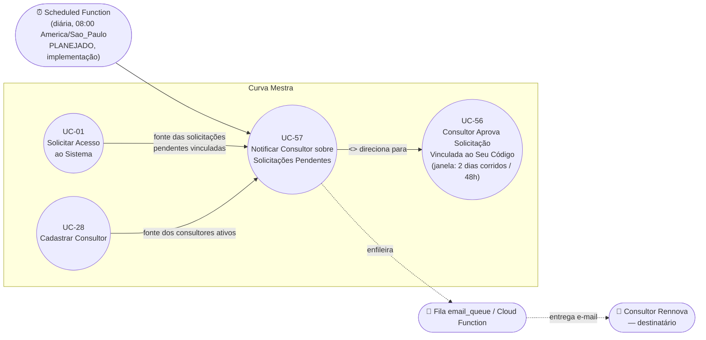

# UC-57: Notificar Consultor sobre Solicitações Pendentes Vinculadas ao Seu Código

**Projeto:** Curva Mestra
**Data de Criação:** 08/10/2026
**Autor:** Guilherme Scandelari (via uml-use-case-writer)
**Status:** Aprovado
**Módulo/Contexto:** Autenticação / Aquisição de Clientes (Consultores) — Notificações
**Versão:** 1.3

> ⚠️ **Caso de uso planejado — ainda não implementado no código** (implementação de código fica a cargo de `dev-task-manager`; a especificação em si já não tem pendências de produto). Uma Scheduled Function diária, agendada para as **08:00 (`America/Sao_Paulo`)** — confirmado pelo PO —, verifica, para cada Consultor Rennova ativo, se existem solicitações de acesso (UC-01) com `status: "pendente"` vinculadas ao seu `consultant_id`, e envia um único e-mail consolidando todas essas pendências (não um e-mail por solicitação). O critério de disparo é unicamente **"existe uma solicitação pendente vinculada ao `consultant_id` do consultor"** — independentemente de a janela de exclusividade de aprovação de UC-56 (**2 dias corridos/48h**) ainda estar valendo ou já ter expirado (RN-03, confirmado pelo PO). Consultores sem nenhuma solicitação pendente vinculada não recebem e-mail naquele dia. Este caso de uso é documentado separadamente de UC-42/UC-56 porque tem **ator primário, gatilho e objetivo diferentes de ambos**: o ator primário aqui é o próprio sistema (disparo automático, sem ação humana), o gatilho é um cron diário (não uma ação de usuário), e o objetivo é **avisar** o consultor — não aprovar nada nem verificar alertas de estoque/vencimento. A arquitetura segue o mesmo padrão já aprovado no projeto para Scheduled Functions (`checkAlertsScheduled` às 06:00, `checkClaimsIntegrityScheduled` às 07:00, ambas em `functions/src/`), sem reaproveitar a lógica de negócio delas — o horário de 08:00 continua essa sequência de offsets de 1h, evitando concorrência de recursos entre as três functions agendadas.

---

## 1. Diagrama UML (Mermaid)

---

## 2. Atores

### 2.1 Ator Primário
**Sistema (Scheduled Function)** — não há ator humano que inicie este caso de uso; o disparo é automático, via Cloud Scheduler, uma vez por dia, às 08:00 (`America/Sao_Paulo`).

### 2.2 Atores Secundários / Sistemas Externos
- **Consultor Rennova** — destinatário do e-mail; não inicia nem participa ativamente da execução deste caso de uso, apenas recebe o resultado.
- **Fila `email_queue` / Cloud Function** — mesmo mecanismo assíncrono de envio já usado em UC-02/UC-28/UC-54.
- **Firestore (`access_requests`, `consultants`)** — fontes de dados lidas pela function, via Admin SDK.

---

## 3. Pré-condições
- Existe ao menos um documento em `consultants` com `status: "active"`.
- Existe ao menos uma solicitação em `access_requests` com `status: "pendente"` e `consultant_id` preenchido (campo planejado em UC-01/RN-08) apontando para um consultor ativo.
- Depende, para existir dado algum, da implementação prévia de UC-01/RN-08 (vínculo `consultant_id`) — sem isso, a function sempre encontraria zero solicitações vinculadas a qualquer consultor.

---

## 4. Pós-condições

### 4.1 Sucesso (Garantias de Sucesso)
- Para cada consultor ativo com uma ou mais solicitações `"pendente"` vinculadas ao seu `consultant_id`, exatamente **um** e-mail é enfileirado em `email_queue` naquele dia, listando todas essas solicitações (ex.: nome do solicitante, nome da clínica/região, data de criação).
- Consultores ativos sem nenhuma solicitação pendente vinculada **não** recebem e-mail naquele dia — este caso de uso não envia e-mails vazios/de confirmação de "nada pendente".
- Nenhuma alteração é feita em `access_requests` nem em `consultants` — este caso de uso é somente leitura sobre esses dados; a única escrita é o enfileiramento do e-mail.
- Falha ao processar um consultor específico (ex.: erro ao montar/enfileirar o e-mail dele) não impede o processamento dos demais consultores — mesmo padrão de isolamento por item já usado em `runChecksForAllTenants` (UC-42).

### 4.2 Falha (Garantias Mínimas)
- Se a function inteira falhar antes de processar qualquer consultor (ex.: erro ao listar `consultants`), nenhum e-mail é enviado naquele dia; a próxima execução agendada (dia seguinte, 08:00) tentará novamente, sem nenhum mecanismo de recuperação retroativa do dia perdido.
- Erros são registrados em log estruturado (Google Cloud Logging), sem necessidade de nenhuma UI própria.

---

## 5. Gatilho (Trigger)
O Cloud Scheduler invoca a Scheduled Function automaticamente, uma vez por dia, às **08:00 (`America/Sao_Paulo`)** — horário **confirmado pelo PO**, na sequência de `checkAlertsScheduled` (06:00) e `checkClaimsIntegrityScheduled` (07:00), mantendo o mesmo padrão de offset de 1h entre Scheduled Functions diárias do projeto para evitar concorrência de recursos.

---

## 6. Fluxo Principal (Basic Flow)

1. Cloud Scheduler invoca a Scheduled Function, agendada com `schedule: '0 8 * * *'` e `timeZone: 'America/Sao_Paulo'` (nome da function sugerido, não confirmado: `checkConsultantPendingAccessRequestsScheduled` ou similar).
2. Function inicializa o Admin SDK, seguindo o mesmo guard defensivo já usado em `checkAlertsScheduled`/`checkClaimsIntegrityScheduled`/`processEmailQueue` (`if (!admin.apps.length) { admin.initializeApp(); }`), para evitar o mesmo bug histórico documentado em UC-42/RN-11.
3. Function lista todos os documentos de `consultants` com `status: "active"`.
4. Para cada consultor ativo, function consulta `access_requests` filtrando **apenas** por `consultant_id == <id do consultor>` e `status == "pendente"` — sem considerar, em nenhum momento, se a janela de exclusividade de UC-56 (2 dias corridos/48h) ainda está valendo ou já expirou (RN-03, confirmado pelo PO).
5. Se a lista para aquele consultor estiver vazia, function não faz nada para ele e passa ao próximo (sem e-mail).
6. Se a lista não estiver vazia, function monta um único e-mail consolidando todas as solicitações pendentes daquele consultor (nome do solicitante, clínica/região, data de criação de cada uma) e o enfileira em `email_queue`, endereçado ao e-mail do consultor.
7. Function repete os passos 4-6 para todos os consultores ativos, isolando falhas por consultor (uma falha individual não interrompe o processamento dos demais).
8. Function registra em log a contagem de consultores processados e de e-mails enfileirados.
9. Caso de uso é concluído com sucesso, sem nenhuma interação humana.

---

## 7. Fluxos Alternativos
Nenhum identificado — a execução é linear e idêntica todos os dias, variando apenas os dados lidos.

---

## 8. Fluxos de Exceção

### 8a. Nenhum consultor ativo com solicitações pendentes vinculadas (a partir do passo 3)
1. Nenhum consultor ativo tem solicitações `"pendente"` vinculadas ao seu `consultant_id` naquele dia.
2. Nenhum e-mail é enfileirado; function registra em log "0 e-mails enviados" e termina normalmente.

### 8b. Falha ao processar um consultor específico (a partir do passo 6)
1. A consulta a `access_requests` para um consultor específico, ou o enfileiramento do e-mail dele, falha (ex.: erro de rede/Firestore).
2. Erro é capturado e registrado em log para aquele consultor; function continua processando os demais consultores normalmente.

### 8c. Falha geral da function (antes do passo 3)
1. A listagem inicial de `consultants` falha, ou a própria inicialização do Admin SDK falha.
2. Nenhum e-mail é enviado nesse dia; erro é registrado em log; a próxima execução agendada (dia seguinte, 08:00) é a única forma de recuperação — não há reprocessamento automático do dia perdido.

---

## 9. Regras de Negócio Relacionadas

| ID | Regra | Justificativa |
|----|-------|----------------|
| RN-01 | Um único e-mail por consultor por dia, consolidando **todas** as solicitações pendentes vinculadas a ele — nunca um e-mail por solicitação individual. | Confirmado pelo texto do PO: "um e-mail por consultor, cobrindo todas as pendências dele". Evita spam de e-mail para consultores com muitas solicitações pendentes simultâneas. |
| RN-02 | O e-mail cobre exclusivamente as solicitações **vinculadas ao `consultant_id` daquele consultor específico** — não é um resumo de todas as solicitações pendentes do sistema (isso é a visibilidade da tela de UC-56, não o escopo deste e-mail). | Confirmado literalmente pelo texto do PO: "disparado sempre que houver solicitação de acesso pendente vinculada ao código daquele consultor específico". |
| RN-03 | **[CONFIRMADO PELO PO — não dedução]** O e-mail inclui a solicitação vinculada **independentemente de a janela de exclusividade de UC-56 (2 dias corridos/48h) ainda estar valendo ou já ter expirado** — o critério de disparo é unicamente "existe uma solicitação pendente vinculada ao `consultant_id` do consultor", não a validade da exclusividade. Mesmo depois que a janela expira e outros consultores também passam a poder aprovar (UC-56/RN-03), o consultor originalmente vinculado continua recebendo o lembrete diário **enquanto a solicitação permanecer `"pendente"`** (não aprovada nem rejeitada por ninguém). | Confirmado explicitamente pelo PO: "o e-mail diário deve continuar sendo disparado para o consultor originalmente vinculado mesmo depois que a janela [de exclusividade] expirar, desde que a solicitação ainda esteja pendente." |
| RN-04 | Falha ao processar/notificar um consultor específico não interrompe o processamento dos demais — mesmo padrão de isolamento por item já usado em `runChecksForAllTenants` (UC-42/RN-04 equivalente). | Garante que um problema isolado (ex.: e-mail inválido de um único consultor) não impeça todos os outros consultores de receberem seus lembretes no mesmo dia. |
| RN-05 | A arquitetura (Scheduled Function `onSchedule`, Firebase Functions 2nd gen, Admin SDK) segue o mesmo padrão já aprovado e em produção para `checkAlertsScheduled` e `checkClaimsIntegrityScheduled` — incluindo o guard de inicialização do Admin SDK (`admin.apps.length`), que evitou um bug de produção documentado em UC-42/RN-11. Esta RN não copia a lógica de negócio daquelas functions (que é de domínios totalmente diferentes — alertas de estoque e integridade de claims), apenas o padrão arquitetural de agendamento. | Reaproveita um padrão já validado em produção, reduzindo o risco de repetir bugs já conhecidos (ex.: ausência de `admin.initializeApp()`, UC-42/RN-11). |
| RN-06 | **[CONFIRMADO PELO PO]** O cron diário é agendado para as **08:00 (`America/Sao_Paulo`)** — na sequência de `checkAlertsScheduled` (06:00) e `checkClaimsIntegrityScheduled` (07:00), mantendo o padrão de offset de 1h entre as três Scheduled Functions diárias do projeto, sem conflito de horário entre elas. | Confirmado pelo PO, seguindo a recomendação de manter o espaçamento de 1h já usado entre as Scheduled Functions existentes. |

---

## 10. Requisitos Especiais / Não Funcionais

| ID | Descrição | Categoria |
|----|-----------|-----------|
| RNF-01 | **[RESOLVIDO — confirmado pelo PO]** Horário do cron diário: 08:00 (`America/Sao_Paulo`) — ver RN-06. | Não funcional |
| RNF-02 | Falha de envio de e-mail (fila `email_queue` indisponível, ou erro na própria function) não deve derrubar o processamento dos demais consultores — mesmo padrão de tolerância a falha já usado em UC-42/UC-28. | Confiabilidade |
| RNF-03 | Multi-tenant: este caso de uso opera sobre dados pré-tenant (`access_requests` não têm `tenant_id` até a aprovação) e sobre a coleção `consultants` (sem escopo de tenant) — não há isolamento por `tenant_id` a aplicar aqui. | Multi-tenant |
| RNF-04 | A consulta `access_requests` filtrada por `consultant_id` + `status` para cada consultor, repetida para todos os consultores ativos, pode exigir um índice composto dedicado em `firestore.indexes.json` dependendo do volume de consultores e solicitações — a definir na implementação. | Performance |

---

## 11. Frequência de Uso
Diária, por definição (Scheduled Function, 08:00 `America/Sao_Paulo`) — mas o **efeito observável** (e-mail de fato enviado) só ocorre nos dias em que existir ao menos uma solicitação pendente vinculada a algum consultor; não é possível estimar o volume de e-mails reais antes da implementação de UC-01/RN-08 e de dados de uso real.

---

## 12. Casos de Uso Relacionados
- **UC-01 (Solicitar Acesso ao Sistema)** — fonte das solicitações pendentes vinculadas a um consultor (`consultant_id`, RN-08, planejado); pré-condição direta.
- **UC-28 (Cadastrar Consultor)** — fonte dos consultores ativos e de seus e-mails de contato.
- **UC-56 (Consultor Aprova Solicitação de Acesso Vinculada ao Seu Código)** — **relação `<<extend>>`**: este caso de uso existe para direcionar o consultor de volta à ação de UC-56; não realiza nenhuma aprovação por si só. A regra confirmada de UC-56/RN-05 (qualquer consultor pode aprovar, desde o início, solicitações sem vínculo) não altera o escopo deste e-mail (RN-02 — continua sendo só sobre solicitações efetivamente vinculadas ao `consultant_id` daquele consultor). A janela de exclusividade de UC-56 (2 dias corridos/48h, cálculo interno — ver UC-56/RNF-04 para a distinção em relação ao texto "2 dias úteis" exibido ao usuário em UC-01) também não altera o critério de disparo deste e-mail (RN-03, confirmado) — o e-mail continua enquanto a solicitação estiver pendente, dentro ou fora da janela.
- **UC-42 (Executar Verificações de Alertas Manualmente)** — **não é o mesmo mecanismo nem o mesmo domínio**: UC-42/RN-05 documenta uma automação diária (06:00) para alertas de estoque/vencimento; este UC-57 é uma automação diária distinta (08:00), para um domínio diferente (solicitações de acesso pendentes). A única coisa reaproveitada é o padrão arquitetural de Scheduled Function (RN-05 deste documento).

---

## 13. Referências
Nenhum arquivo de código existe ainda para esta feature. Referências de padrão arquitetural a seguir na implementação:
- `functions/src/checkAlertsScheduled.ts` — padrão de `onSchedule`, cron diário (06:00), guard de inicialização do Admin SDK.
- `functions/src/checkClaimsIntegrityScheduled.ts` — segundo exemplo do mesmo padrão arquitetural (07:00), citado explicitamente pelo PO como referência; também a referência de offset de 1h usada para confirmar o horário deste UC (08:00).
- `src/lib/services/emailTemplateAdmin.ts` / `enqueueTemplatedEmail` — mecanismo de fila de e-mail já usado em UC-02, provável ponto de reaproveitamento para o novo template de lembrete diário.
- `src/types/index.ts` (interface `Consultant`, `AccessRequest`) — modelos de dados já existentes, estendido por UC-01/RN-08 com `consultant_id`.
- `ONLY_FOR_DEVS/PO_BA_Docs/UC-56-consultor-aprova-solicitacao-vinculada-ao-codigo.md` — origem da janela de exclusividade de 2 dias corridos/48h (RN-02/RN-03 daquele UC; ver também RNF-04 daquele UC para a distinção entre o cálculo real — dias corridos — e o texto "2 dias úteis" exibido ao usuário), referenciada mas não aplicada como filtro por este e-mail (RN-03 deste documento).
- `ONLY_FOR_DEVS/PO_BA_Docs/UC-42-executar-verificacoes-de-alertas-manualmente.md` (seção 9, RN-05/RN-11) — exemplo documentado de automação diária similar, incluindo um bug histórico (ausência de `admin.initializeApp()`) a evitar desde o início nesta nova function.

---

## 14. Perguntas em Aberto / Decisões Pendentes

**[RESOLVIDO em v1.1 — confirmado pelo PO]** Horário exato do cron diário: **08:00 (`America/Sao_Paulo`)**, confirmado explicitamente pelo PO, seguindo a recomendação registrada na v1.0 de manter o offset de 1h em relação a `checkAlertsScheduled` (06:00) e `checkClaimsIntegrityScheduled` (07:00), sem conflito entre as três (RN-06).

**[RESOLVIDO em v1.2 — confirmado pelo PO]** A ressalva anterior sobre RN-03 (até então registrada como "dedução lógica não confirmada literalmente") foi confirmada pelo PO como regra definitiva: o e-mail diário deve continuar sendo disparado para o consultor originalmente vinculado mesmo depois que a janela de exclusividade de UC-56 expirar, desde que a solicitação ainda esteja pendente. O critério de disparo é só "existe pendência vinculada ao código dele" — independente de a exclusividade ainda valer ou não. RN-03 reescrita como regra confirmada, não mais dedução.

**[RESOLVIDO em v1.3 — confirmado pelo PO]** O valor da janela de exclusividade de UC-56, referenciada por este documento, é **2 dias corridos (48h)**, sem exclusão de fim de semana/feriado — "2 dias úteis" é só o texto exibido ao usuário em UC-01, não o cálculo. Todas as referências a essa janela neste documento (resumo, diagrama, Fluxo Principal passo 4, seção 12, Referências) foram corrigidas de acordo. Nenhuma pendência de produto permanece aberta nesta revisão.

**[Decisão de engenharia, não de produto — não bloqueante]** Nome da Scheduled Function e do template de e-mail (sugeridos nesta revisão apenas como placeholders de design, não como decisão fechada).

**[Dependência bloqueante de implementação — não de produto]** Este UC depende da implementação prévia (ou simultânea) de UC-01/RN-08 (`consultant_id` gravado na solicitação) e de UC-28 (consultores cadastrados com e-mail válido) — sem ambos, não há dado algum para processar. Não impede a aprovação desta especificação, apenas define a ordem de implementação.

---

## 15. Histórico de Versões

| Versão | Data | Autor | O que mudou |
|--------|------|-------|--------------|
| 1.0 | 08/10/2026 | Guilherme Scandelari (via uml-use-case-writer) | Versão inicial. Caso de uso novo, especificado a partir da decisão de produto confirmada pelo PO (e-mail diário consolidado por consultor, cobrindo solicitações pendentes vinculadas ao seu código) e da referência arquitetural explícita a `checkAlertsScheduled`/`checkClaimsIntegrityScheduled`. Documentado como UC próprio, distinto de UC-42 (domínio, ator primário e gatilho diferentes, por instrução explícita) e de UC-56 (que trata da ação de aprovar, não do aviso). Nenhuma linha de código criada ou alterada nesta rodada — documentação pura, para orientar implementação futura via `dev-task-manager`. Horário exato do cron e nomes de função/template registrados como pendências de engenharia (seção 14), não assumidos como decisão fechada. |
| 1.1 | 08/10/2026 | Guilherme Scandelari (via uml-use-case-writer) | **Horário do cron confirmado pelo PO: 08:00 (`America/Sao_Paulo`)** — na sequência de `checkAlertsScheduled` (06:00) e `checkClaimsIntegrityScheduled` (07:00). Nova RN-06 registra a confirmação; RNF-01 marcada como resolvida. Resumo, diagrama (seção 1), Gatilho (seção 5), Fluxo Principal (passo 1), Fluxos de Exceção (8c), seções 11, 12, 13 e 14 atualizados de acordo. **Status alterado de "Rascunho" para "Aprovado"** — a decisão de produto de fundo (e-mail diário consolidado, escopo por `consultant_id`, horário) está inteiramente confirmada; a ressalva sobre RN-03 (dedução lógica não confirmada literalmente, fora do escopo das três pendências resolvidas nesta rodada) permanece registrada na seção 14 como item não bloqueante, para revisão pontual antes da implementação. |
| 1.2 | 08/10/2026 | Guilherme Scandelari (via uml-use-case-writer) | **Duas correções confirmadas pelo PO.** (1) Toda referência à janela de exclusividade de UC-56 foi corrigida de "15 dias" para "2 dias úteis" (resumo, diagrama, Fluxo Principal passo 4, RN-03, seção 12, Referências), acompanhando a correção feita naquele UC. (2) A ressalva registrada na seção 14 sobre RN-03 ("dedução não confirmada literalmente") foi removida — o PO confirmou explicitamente que o e-mail diário deve continuar sendo disparado para o consultor vinculado mesmo após a janela de exclusividade expirar, enquanto a solicitação permanecer pendente; RN-03 reescrita como regra definitiva confirmada, não mais dedução. Nenhuma pendência de produto permanece aberta. |
| 1.3 | 08/10/2026 | Guilherme Scandelari (via uml-use-case-writer) | **Correção final de precisão — confirmada pelo PO.** O valor da janela de exclusividade de UC-56, referenciado por este documento, é de fato **2 dias corridos (48h)**, sem exclusão de fim de semana/feriado — "2 dias úteis" é apenas o texto exibido ao usuário final em UC-01 (copy de interface), não o cálculo real. Toda referência a essa janela neste documento (resumo, diagrama — rótulo do nó UC-56, Fluxo Principal passo 4, RN-03, seção 12, Referências) corrigida de "2 dias úteis" para "2 dias corridos (48h)", espelhando a correção equivalente feita em UC-56 (v1.3) e UC-02 (v2.3.2) na mesma rodada. Nenhuma mudança na regra de negócio em si (RN-03 continua definitiva, não dedução) — apenas precisão terminológica, eliminando a última contradição textual entre os três documentos. |

