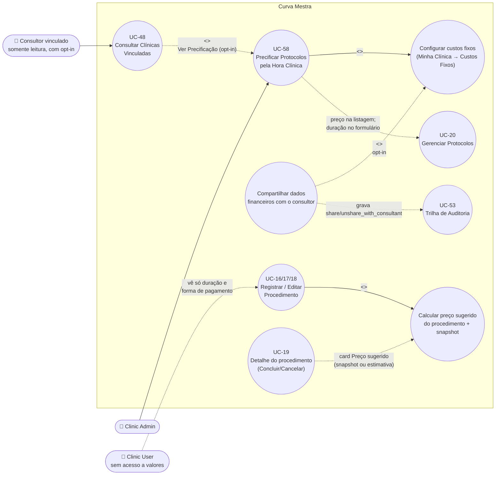

# UC-58: Precificar Protocolos pela Hora Clínica

**Projeto:** Curva Mestra
**Data de Criação:** 10/10/2026
**Autor:** Guilherme Scandelari (via uml-use-case-writer)
**Status:** Implementado
**Módulo/Contexto:** Financeiro / Precificação (Minha Clínica, Protocolos, Procedimentos, Portal do Consultor)
**Versão:** 1.1

> **Implementado — branch `feature/precificacao-hora-clinica`, PRs #382, #383 e #384 (mergeados em `gscandelari_setup`, validação manual em `dev-gscandelari.web.app`).** O Clinic Admin cadastra os custos fixos mensais da clínica (12 itens base, custos personalizados e financiamentos de equipamento — "Boletos Tec"), a disponibilidade semanal, a capacidade simultânea (salas × profissionais) e os percentuais de markup (imposto, taxa de débito, taxa de crédito, comissão e margem). O sistema calcula o **custo da hora clínica** do mês e, somando o custo de material, o **custo real** e o **preço sugerido** (markup divisor) de cada protocolo e de cada procedimento, nas três formas de pagamento (Pix/Dinheiro, Débito, Crédito). É um valor de **norte** para precificação, não um cálculo contábil. Os dados financeiros são restritos ao `clinic_admin`; o consultor vinculado só os vê, em modo somente leitura, quando o `clinic_admin` ativa explicitamente o compartilhamento — ação registrada na Trilha de Auditoria (UC-53). Ao confirmar um procedimento, o sistema grava um **snapshot** da precificação, que não muda quando os custos fixos mudam depois. Spec de implementação: `ONLY_FOR_DEVS/TASK_COMPLETED/FEAT-precificacao-hora-clinica.md` (v1.7, Concluído) — decisões D1–D16 tomadas pelo usuário (Guilherme Stanke Scandelari) em 09–10/10/2026.

---

## 1. Diagrama UML (Mermaid)

**Decisão de modelagem — um único UC (não dividido).** Foi avaliada a divisão em dois UCs ("Configurar custos fixos e precificar protocolos" x "Precificar procedimento"). Mantido um único UC-58, de nível **resumo** (Cockburn, "kite level"), porque: (1) o objetivo de negócio do ator é um só — chegar a um preço de norte com base em tempo + material —, e configurar custos, ver o preço do protocolo e ver o preço do procedimento são etapas desse mesmo objetivo, sem valor isolado (o preço do procedimento não existe sem a configuração); (2) no procedimento, o objetivo do ator continua sendo **registrar o procedimento** (UC-16/17/18) — o preço sugerido é uma subfunção incluída (`<<include>>`) nesses UCs, e não um objetivo próprio; documentá-la como UC separado criaria um UC sem gatilho próprio; (3) as fórmulas, o isolamento por role e o snapshot são regras **únicas** compartilhadas entre listagem de protocolos, cadastro, detalhe, tabela de procedimentos e visão do consultor — concentrá-las aqui evita duplicar a mesma regra em 4 UCs (UC-16 a UC-19 apenas referenciam este UC); (4) a spec (STEP 5) e o caderno E2E planejado (`tests/e2e/UC-58-precificar-protocolos-pela-hora-clinica.spec.ts`, roteiros A–M do STEP 4) foram desenhados para um único UC, com esse slug. O nome do UC mantém o slug previsto na spec, embora o escopo inclua também o procedimento.

---

## 2. Atores

### 2.1 Ator Primário
**Clinic Admin** (`clinic_admin`) — único papel que vê e edita a aba "Custos Fixos" (`/clinic/my-clinic?tab=fixed_costs`), único que vê valores de precificação nas telas de protocolos e de procedimentos, e único que lê/grava `tenants/{tenantId}/financeiro/custo_hora` e `tenants/{tenantId}/precificacao_procedimentos/{solicitacaoId}` (regras dedicadas em `firestore.rules`, não só UI).

### 2.2 Atores Secundários / Sistemas Externos
- **Consultor vinculado** (`is_consultant`, `consultant_id`, `authorized_tenants`) — vê, somente leitura, a tela `/consultant/clinics/{tenantId}/pricing` (resumo do custo/hora, custos fixos, markup e precificação dos protocolos) **apenas** quando o `clinic_admin` ativou o compartilhamento **para o seu `consultant_id`**. Nunca vê snapshots de procedimentos.
- **Clinic User** (`clinic_user`) — não vê a aba "Custos Fixos" nem nenhum valor derivado dos custos fixos; nas telas de procedimentos vê apenas **duração** e **forma de pagamento** (dados não sensíveis). As telas nem tentam ler `financeiro`/`precificacao_procedimentos` para ele.
- **Firestore Security Rules** — impõem o isolamento por `tenant_id` e por role (RN-14 a RN-17).

---

## 3. Pré-condições
- Usuário autenticado com role `clinic_admin` e `tenant_id` definido nas custom claims (todas as leituras/escritas usam `tenants/{tenantId}/...` com o `tenantId` das claims — nunca de input livre).
- Para preço de protocolos: existir ao menos um protocolo ativo (UC-20) e lotes no inventário do tenant com `valor_unitario` (para o custo médio de material).
- Para custo/hora calculável: ao menos um dia ativo com período na disponibilidade semanal (senão o custo/hora fica indefinido — RN-07).
- Para o compartilhamento: existir um consultor vinculado à clínica (UC-23/UC-24/UC-46); sem consultor, o switch fica desabilitado.
- Para a visão do consultor: o `tenantId` constar em `authorized_tenants` do consultor **e** o documento `financeiro/custo_hora` ter `compartilhar_com_consultor == true` e `compartilhado_com_consultant_id == consultant_id` do token.

---

## 4. Pós-condições

### 4.1 Sucesso (Garantias de Sucesso)
- **Configuração salva:** o documento `tenants/{tenantId}/financeiro/custo_hora` é gravado por inteiro (`setDoc` sem merge) com `tenant_id`, `custos_fixos_base` (12 chaves), `custos_fixos_personalizados`, `boletos_tec` (com `mes_referencia` redefinido para o mês corrente nos boletos novos ou com `parcelas_pagas` editado), `disponibilidade` (7 dias), `quantidade_salas`, `quantidade_profissionais`, `markup` (`imposto_pct`, `debito_pct`, `credito_pct`, `comissao_pct`, `margem_pct` — sem `cartao_pct`), `compartilhar_com_consultor`, `compartilhado_com_consultant_id`, `created_at` (preservado), `updated_at`, `updated_by`.
- **Compartilhamento alterado** (ligado → desligado, desligado → ligado ou troca do consultor destinatário): uma entrada em `audit_log` com `entity_type: 'financial_config'` e `action: 'share_with_consultant'` ou `'unshare_with_consultant'` (RN-13). Nenhuma outra alteração da configuração é auditada.
- **Valores calculados não são persistidos** (custo/hora, preço de protocolo) — sempre recalculados na leitura. **Exceção:** ao confirmar um procedimento (UC-16/17/18) com a configuração existente, o snapshot `tenants/{tenantId}/precificacao_procedimentos/{solicitacaoId}` é gravado (ou sobrescrito, na edição) com os três divisores e os três preços.
- A solicitação (`tenants/{tenantId}/solicitacoes/{id}`) recebe apenas `duracao_minutos` (só quando o campo foi preenchido) e `forma_pagamento` — **nenhum** valor derivado dos custos fixos.

### 4.2 Falha (Garantias Mínimas)
- Configuração com erro de validação nunca é gravada (botão "Salvar" desabilitado).
- Falha ao salvar: nada é alterado; toast "Erro ao salvar" com a mensagem traduzida (`translateFirestoreError`).
- Falha ao gravar a auditoria do compartilhamento **não** desfaz nem bloqueia o salvamento (best-effort; erro só no console).
- Falha ao gravar o snapshot **não** desfaz nem bloqueia a gravação do procedimento (best-effort): o procedimento continua salvo e o usuário vê o toast "Procedimento salvo, mas a precificação não foi registrada".
- `clinic_user` e consultor sem opt-in recebem `permission-denied` ao ler `financeiro`; `clinic_user` e consultor (com ou sem opt-in) recebem `permission-denied` ao ler `precificacao_procedimentos`.

---

## 5. Gatilho (Trigger)
Clinic Admin abre **Minha Clínica → aba "Custos Fixos"** (`/clinic/my-clinic?tab=fixed_costs`, ícone de calculadora), preenche a configuração e clica em "Salvar". Gatilhos secundários (consumo dos valores): abrir `/clinic/protocolos`; cadastrar/editar procedimento em `/clinic/requests/new`; abrir `/clinic/requests` ou `/clinic/requests/{id}`; o consultor clicar em "Ver Precificação" em `/consultant/clinics/{tenantId}`.

---

## 6. Fluxo Principal (Basic Flow) — Configurar custos e ver o preço dos protocolos

1. Clinic Admin acessa `/clinic/my-clinic` e clica na aba **"Custos Fixos"** (abas do admin: Clínica | Usuários | Limite de Estoque | Custos Fixos | Consultor). A URL passa a ter `?tab=fixed_costs`.
2. Sistema lê `tenants/{tenantId}/financeiro/custo_hora` (`getCustoHoraConfig`). Se o documento não existe, o formulário abre com os valores padrão: todos os custos = 0, listas vazias, todos os dias inativos, 1 sala, 1 profissional, markup todo 0, compartilhamento desligado. Se o documento tem markup no formato antigo (`cartao_pct`), ele é normalizado na leitura (Fluxo Alternativo 7k).
3. Sistema exibe no topo o card **"Custo da Hora Clínica"** — "Referência: {mês/ano corrente, fuso America/Sao_Paulo}", aviso "Estimativa de referência para precificação — não substitui a contabilidade. Ocupação considerada: 100%; feriados não descontados." — com: Custo da hora clínica (ou "—" + "Configure a disponibilidade semanal para calcular."), Custos fixos do mês (Base · Personalizados · Boletos Tec), Horas planejadas no mês + Capacidade simultânea, e Divisores de markup (Pix/Dinheiro, Débito, Crédito; "—" quando inválidos).
4. Clinic Admin preenche, em cards:
   - **Custos fixos mensais**: os 12 itens base (Aluguel, Condomínio, IPTU, Pró-Labore, Energia, Salários, Tarifas Bancárias, Marketing, Contabilidade, Manutenção e Limpeza, Telefone, Sistema de Agenda e Prontuário) em R$, e "Outros custos fixos" (nome até 60 caracteres + valor; botão "Adicionar custo"; lixeira para remover).
   - **Boleto Tec** ("Financiamento de equipamento/tecnologia"): para cada boleto, Descrição, Valor da parcela, Total de parcelas e Parcelas já pagas; badge "Compõe o custo · {n} restantes" ou "Quitado"; botões "Adicionar Boleto Tec" e lixeira.
   - **Disponibilidade semanal**: Domingo a Sábado, cada um com switch ativo (ao ativar, pré-preenche 08:00–12:00), períodos `início`/`fim` (`type="time"`), botão "+ Período" (adiciona 13:00–17:00) e total de horas do dia.
   - **Capacidade**: Salas e Profissionais simultâneos ("Atendimentos simultâneos = o menor valor entre salas e profissionais").
   - **Markup**: Imposto (%), Taxa de débito (%), Taxa de crédito (%), Comissão (%), Margem desejada (%), com o texto "Preço sugerido = custo real ÷ (1 − soma dos percentuais). Pix/Dinheiro não paga taxa de cartão; débito e crédito usam a taxa da maquininha. Soma (forma mais cara): {x}%".
5. A cada alteração, sistema recalcula o card de resumo **sem salvar** (funções puras de `src/lib/precificacao.ts`) e valida o formulário; erros aparecem inline no próprio card (Fluxo de Exceção 8a) e o botão "Salvar" fica desabilitado enquanto houver qualquer erro.
6. Clinic Admin clica em **"Salvar"**.
7. Sistema chama `saveCustoHoraConfig`: redefine `mes_referencia` para o mês corrente nos Boletos Tec novos ou com "Parcelas já pagas" editado (RN-02), grava o documento por inteiro (`setDoc` sem merge), com `updated_by = uid` e `updated_at = agora`, preservando `created_at`. Se o estado do compartilhamento mudou, grava a entrada de auditoria (Fluxos Alternativos 7b–7d).
8. Sistema exibe o toast **"Custos salvos com sucesso"** e recarrega o formulário com o que foi gravado.
9. Clinic Admin acessa `/clinic/protocolos`. Sistema carrega, em paralelo e uma única vez por carregamento, `financeiro/custo_hora` e o inventário do tenant (`listInventoryForCosting`, todos os lotes, inclusive inativos/zerados), calcula o resumo do **mês corrente** e o custo médio por produto (RN-09).
10. Cada card de protocolo exibe, abaixo dos itens, o bloco de precificação: **Duração** · **Material** · **Hora clínica** · **Custo real** · **Preço Pix/Dinheiro** · **Preço Crédito** (Débito não aparece na listagem). Avisos: "Custo de material incompleto: sem valor para {nomes}" quando algum produto do protocolo não tem lote com `valor_unitario` válido; "Duração não informada — considerada 1 hora" quando o protocolo não tem duração (Fluxo Alternativo 7a). Rodapé: "Valores com base nos custos de {mês/ano} — estimativa de referência, não substitui a contabilidade."
11. Caso de uso é concluído com sucesso.

---

## 7. Fluxos Alternativos

### 7a. Protocolo sem duração (a partir do passo 10)
1. O protocolo não tem `duracao_minutos` (legado ou cadastrado sem duração em UC-20).
2. Sistema precifica com **60 minutos** (`DURACAO_PADRAO_MINUTOS`): exibe "Duração: 60 min (padrão)" e o aviso "Duração não informada — considerada 1 hora"; os preços aparecem normalmente. Mesmo comportamento na visão do consultor (7f).

### 7b. Ativar o compartilhamento com o consultor (a partir do passo 4)
1. No card "Compartilhamento com o consultor", com consultor vinculado, o texto mostra "Consultor vinculado: {nome}. Esta ação fica registrada na trilha de auditoria."
2. Clinic Admin liga o switch **"Compartilhar dados financeiros com o consultor"** — o formulário passa a ter `compartilhado_com_consultant_id = id do consultor vinculado`; o texto vira "Compartilhado com {nome}. …".
3. Clinic Admin clica em "Salvar" (passos 6–8).
4. Sistema grava `compartilhar_com_consultor: true` e `compartilhado_com_consultant_id: {consultant_id}` e registra em `audit_log`: `tenant_id`, `entity_type: 'financial_config'`, `entity_id: tenantId`, `action: 'share_with_consultant'`, `descricao: "Dados financeiros compartilhados com o consultor {nome}"`, `actor_role: 'clinic_admin'`, `metadata.consultant_id`. A entrada aparece em `/clinic/audit-log` e `/admin/audit-log` como "Dados Financeiros" / "Compartilhar com Consultor" (UC-53).
5. Salvar de novo sem mudar o switch **não** gera nova entrada de auditoria.

### 7c. Revogar o compartilhamento (a partir do passo 4)
1. Clinic Admin desliga o switch e salva.
2. Sistema grava `compartilhar_com_consultor: false` e `compartilhado_com_consultant_id: null` e registra `action: 'unshare_with_consultant'` ("Compartilhamento de dados financeiros com o consultor revogado"), `metadata.consultant_id` = consultor que tinha o acesso. O consultor deixa de ler `financeiro` imediatamente.

### 7d. Compartilhamento anterior era de outro consultor (troca de consultor — ao abrir a aba)
1. O documento tem `compartilhar_com_consultor == true`, mas `compartilhado_com_consultant_id` ≠ id do consultor vinculado atual (ou não há consultor vinculado). Se a busca do consultor vinculado falhou, a verificação não é feita.
2. Sistema exibe o switch **desligado** e o alerta "O compartilhamento anterior não vale para o consultor atual. Salve para registrar a revogação ou ative novamente para compartilhar com o novo consultor."
3. Ao salvar (sem religar), sistema grava `false`/`null` e registra `unshare_with_consultant` com `metadata.motivo: 'troca_de_consultor'`. Se o admin religar para o novo consultor e salvar, registra `share_with_consultant` com o novo `consultant_id`.
4. Independentemente do salvamento, o consultor anterior já não lê os dados (a rule exige o `consultant_id` do token igual ao gravado e o tenant em `authorized_tenants`).

### 7e. Clínica sem consultor vinculado (a partir do passo 4)
1. O switch de compartilhamento fica desabilitado, com o texto "Nenhum consultor vinculado."

### 7f. Consultor consulta a precificação compartilhada (UC-48 → este UC)
1. Consultor abre `/consultant/clinics/{tenantId}` (UC-48). Sistema tenta ler `financeiro/custo_hora`; o botão **"Ver Precificação"** só aparece se a leitura retornar um documento (opt-in ativo para este consultor). Qualquer erro (inclusive `permission-denied`) esconde o botão.
2. Consultor clica em "Ver Precificação" → `/consultant/clinics/{tenantId}/pricing`. A tela redireciona para `/consultant/clinics` se o `tenantId` não estiver em `authorized_tenants`.
3. Sistema lê `financeiro/custo_hora`, depois `protocolos` e o inventário do tenant; exibe `ReadOnlyBanner`, o card "Custo da Hora Clínica" (mês corrente), "Custos fixos mensais" (itens base com valor > 0, custos personalizados com nome, Boletos Tec com parcelas restantes no mês, Total), "Markup" (Imposto, Taxa de débito, Taxa de crédito, Comissão, Margem desejada) e "Protocolos" com Duração · Material · Hora clínica · Custo real · Preço Pix/Dinheiro · Preço Crédito.
4. No detalhe de material de cada protocolo, apenas itens **Rennova** aparecem com nome e subtotal; os demais são agregados numa linha "Outros materiais ({n})" com subtotal, sem nome nem código. Totais (material, hora, custo real, preços) são sempre completos. Aviso de custo incompleto: nomeia só itens Rennova; para os demais, "Outros materiais: custo incompleto" (RN-12).
5. Nenhum campo é editável; nenhum dado é gravado.

### 7g. Preço sugerido ao cadastrar um procedimento (subfunção incluída em UC-16 e UC-17)
1. Em `/clinic/requests/new` (só `clinic_admin`), sistema lê `financeiro/custo_hora` em paralelo com o inventário.
2. No card "Dados do Procedimento", após "Data do Procedimento": campo **"Duração (min)"** (inteiro 1..1440, placeholder "Ex: 60", ajuda "Usada para calcular o custo da hora clínica. Em branco, considera 1 hora.") e **"Forma de pagamento"** com três botões — **Pix/Dinheiro** (padrão), **Débito**, **Crédito** — e a ajuda "Informativa: o preço sugerido mostra as três formas."
3. Ao aplicar um protocolo **com** duração, o campo "Duração (min)" é preenchido com a duração do protocolo **somente se estiver vazio**. Ao aplicar um protocolo **sem** duração, ver 7h. O botão "X" (limpar protocolo) não altera a duração.
4. Com ao menos um produto na lista, abaixo da tabela de produtos aparece o card **"Preço sugerido"** ("Custo dos materiais + hora clínica, com as taxas de cada forma de pagamento"): Duração (com "(padrão)" quando aplicável) · Material · Hora clínica · Custo real e **sempre os três preços** — "Pix/Dinheiro (sem taxa de cartão)", "Débito (taxa {débito}%)", "Crédito (taxa {crédito}%)" —, com a forma escolhida em destaque e o selo "Forma escolhida". Rodapé: "Estimativa com base nos custos de {mês/ano do procedimento} — não substitui a contabilidade. A forma de pagamento é apenas informativa."
5. O card é recalculado a cada mudança de produtos, duração, data ou forma de pagamento, sem salvar. Trocar a forma de pagamento **não altera** nenhum valor — só o destaque. O mês de referência é o da **data do procedimento** (RN-20); sem data ainda, usa o mês corrente e mostra "Informe a data para calcular com os custos do mês do procedimento."
6. "Revisar Procedimento": se a duração for inválida, toast "Informe uma duração entre 1 e 1440 minutos" e não avança (8h). Na revisão, o card "Dados do Procedimento" mostra **Duração** ("{n} min", com "(padrão — duração não informada)" quando for o caso) e **Forma de pagamento**; após "Produtos a Consumir", o mesmo card "Preço sugerido".
7. Ao confirmar, a solicitação é gravada pelo fluxo normal de UC-16/UC-17 com `duracao_minutos` (só se o campo estiver preenchido) e `forma_pagamento`. **Depois** do sucesso da transação, fora dela, se a configuração foi lida com sucesso e existe, sistema grava o snapshot em `precificacao_procedimentos/{solicitacaoId}` (`origem: 'criacao'`) usando os produtos efetivamente gravados pela transação (RN-22). Sem configuração, nenhum snapshot é gravado (8c).

### 7h. Aplicar protocolo sem duração no cadastro do procedimento (a partir de 7g, passo 3)
1. Sistema abre o diálogo **"Protocolo sem duração"** — "O protocolo "{nome}" não tem duração cadastrada. Será considerada 1 hora de procedimento, a menos que você informe a duração neste procedimento." — com o botão único **"Entendi"**.
2. O campo "Duração (min)" **não** é preenchido; o card de preço passa a mostrar "Duração: 60 min (padrão)" e o aviso "Duração não informada — considerada 1 hora", mesmo que outros produtos sejam adicionados depois.
3. Se o admin digitar uma duração, ela prevalece; se apagar, volta à hora padrão com o aviso. O mesmo padrão de 60 min vale para procedimento **sem protocolo** e sem duração informada (sem diálogo).

### 7i. Edição de procedimento agendado (subfunção incluída em UC-18)
1. A edição reabre `/clinic/requests/new?edit={id}` com "Duração (min)" e "Forma de pagamento" pré-preenchidos a partir da solicitação (campo de duração vazio se a solicitação não tinha `duracao_minutos`). O seletor de protocolo continua oculto na edição.
2. O card "Preço sugerido" é recalculado com a configuração de custos **atual**, para o mês da data do procedimento.
3. Ao confirmar, `duracao_minutos` é atualizado (removido com `deleteField()` se o campo ficou vazio) e `forma_pagamento` regravada; o snapshot é **sobrescrito** com `origem: 'edicao'` (sem histórico de versões).

### 7j. Consultar o preço no detalhe e na lista de procedimentos (detalhe = tela de UC-19)
1. **Detalhe `/clinic/requests/{id}`:** para os dois roles, o card "Detalhes do Procedimento" mostra **Duração** ("{n} min" ou "—") e **Forma de pagamento** (rótulo ou "—"). Só para `clinic_admin`, após o card "Resumo", o card **"Preço sugerido"**:
   - **Com snapshot:** selo "Registrado"; descrição "Registrado em {dd/mm/aaaa HH:mm} com os custos de {mês/ano}. Mudanças posteriores nos custos fixos não alteram este registro."; valores gravados, os três preços de `precos_sugeridos` com as taxas do `markup` gravado e a forma registrada em destaque com o selo "Forma registrada".
   - **Sem snapshot, com configuração:** selo **"Estimativa atual"**; "Este procedimento não tem precificação registrada. Valores calculados agora com a configuração de custos atual, para {mês/ano do procedimento}."; duração da solicitação (ou 60 min padrão, com aviso), forma registrada (legado sem forma = Pix/Dinheiro) e material de `produtos_solicitados`. Abrir a tela não grava snapshot.
   - **Sem snapshot e sem configuração:** o alerta "Configure seus custos fixos para ver o preço sugerido. Material: R$ {x}" (material = Σ `quantidade × valor_unitario` de `produtos_solicitados`, `calcularCustoMaterialSolicitacao`) com o botão "Configurar custos fixos" (`/clinic/my-clinic?tab=fixed_costs`). **[Corrigido em v1.1 — commit `9dba044`]** Antes o card mostrava só o alerta, sem o material.
   - Status `cancelada`/`reprovada`: linha extra "Procedimento {cancelado|reprovado} — valores mantidos apenas como referência." Concluir, cancelar ou reprovar não recalculam nem apagam o snapshot.
2. **Lista `/clinic/requests`:** a coluna "Valor Total" passou a se chamar **"Material"** (para os dois roles). Só para `clinic_admin`, duas colunas novas: **"Custo real"** e **"Preço sugerido"**, este acompanhado do rótulo da forma de pagamento registrada e, quando não há snapshot, do sufixo "· estimado". Fonte: snapshot (`listPrecificacoesProcedimentos`, uma leitura da subcoleção) ou, sem snapshot, a mesma estimativa atual do detalhe (`estimarPrecificacaoProcedimento`); sem snapshot e sem configuração, "—". O preço exibido é o da forma registrada (legado: Pix/Dinheiro). "Custo real" não é valor cobrado — não existe campo de valor cobrado nesta versão.

### 7k. Configuração gravada no formato antigo (taxa única de cartão)
1. O documento tem `markup.cartao_pct` e não tem `debito_pct`/`credito_pct`.
2. Na leitura, Taxa de débito = Taxa de crédito = `cartao_pct` (campos ausentes/inválidos viram 0); no próximo "Salvar", o documento passa a ter só os cinco campos novos (o `cartao_pct` some, efeito do `setDoc` sem merge).

### 7l. Clinic User acessa as mesmas telas
1. `/clinic/my-clinic?tab=fixed_costs`: a aba "Custos Fixos" não existe para ele; depois que as claims carregam, a aba ativa volta para "Clínica".
2. `/clinic/protocolos`: cards sem bloco de precificação e sem CTA.
3. `/clinic/requests` e `/clinic/requests/{id}`: sem as colunas "Custo real"/"Preço sugerido" e sem o card "Preço sugerido"; vê Duração e Forma de pagamento no detalhe. `/clinic/requests/new` continua redirecionando para `/clinic/requests` (UC-16).

---

## 8. Fluxos de Exceção

### 8a. Erro de validação na configuração (a partir do passo 5)
1. Sistema exibe a mensagem no próprio card e desabilita "Salvar" ("Corrija os campos destacados para salvar."):
   - Dia ativo: "Dia ativo sem períodos", "Horário inválido", "O fim deve ser posterior ao início", "Períodos sobrepostos".
   - Outros custos fixos: "Informe um nome (até 60 caracteres)", "O valor não pode ser negativo". Custos base: "Os valores não podem ser negativos".
   - Boleto Tec: "Informe a descrição", "Informe o valor da parcela" (> 0), "Total de parcelas deve ser um inteiro ≥ 1", "Parcelas pagas deve estar entre 0 e o total".
   - Capacidade: "Salas e profissionais devem ser inteiros ≥ 1".
   - Markup: "Informe percentuais válidos", "Percentuais não podem ser negativos", "A soma dos percentuais deve ser menor que 100%" (soma calculada na forma mais cara — RN-06); os divisores do resumo aparecem como "—".
2. Nada é gravado até todos os erros serem corrigidos.

### 8b. Erro ao carregar ou salvar a configuração (a partir dos passos 2 ou 7)
1. Leitura ou gravação de `financeiro/custo_hora` falha.
2. Sistema exibe toast destrutivo "Erro ao carregar" ou "Erro ao salvar" com a mensagem de `translateFirestoreError`. Nada é alterado.

### 8c. Custos fixos não configurados ou custo/hora indefinido (listagem de protocolos, cadastro e detalhe do procedimento)
1. O documento não existe, ou a disponibilidade não permite calcular o custo/hora (horas do mês × capacidade = 0), ou (na listagem) o divisor Pix/Dinheiro é inválido.
2. **Listagem de protocolos:** alerta "Configure seus custos fixos para ver o preço sugerido dos protocolos" com o botão "Configurar custos fixos" → `/clinic/my-clinic?tab=fixed_costs`; cada card continua mostrando o material, com hora/custo real/preços em "—".
3. **Cadastro do procedimento:** o card mostra "Configure seus custos fixos para ver o preço sugerido. Material: R$ {x}" com o mesmo botão. Ao confirmar sem documento de configuração, **nenhum snapshot** é gravado e nenhum aviso é exibido.
4. **Detalhe:** ver 7j (sem snapshot e sem configuração).

### 8d. Falha ao carregar os custos fixos no cadastro do procedimento (a partir de 7g, passo 1)
1. A leitura de `financeiro/custo_hora` lança erro.
2. O card mostra "Não foi possível carregar os custos fixos. Material: R$ {x}" (sem toast). Ao confirmar, o procedimento é gravado normalmente, **sem snapshot**.

### 8e. Falha ao gravar o snapshot (a partir de 7g passo 7 ou 7i passo 3)
1. A gravação de `precificacao_procedimentos/{id}` falha depois de a solicitação já ter sido gravada (rede, rule).
2. Sistema registra o erro no console e exibe o toast "Procedimento salvo, mas a precificação não foi registrada" — "O detalhe mostrará uma estimativa com os custos atuais."; a navegação para o detalhe continua. O detalhe passa a mostrar a estimativa atual (7j); se o procedimento estiver agendado, editar e confirmar grava o snapshot de novo.

### 8f. Falha ao gravar a auditoria do compartilhamento (a partir de 7b–7d)
1. `writeAuditLog` falha depois do `setDoc` bem-sucedido.
2. O compartilhamento fica salvo sem entrada na trilha; erro só no console (best-effort, mesmo critério de UC-53).

### 8g. Consultor sem opt-in (ou de opt-in de outro consultor) acessa a tela de precificação (a partir de 7f)
1. Acesso direto a `/consultant/clinics/{tenantId}/pricing` com `tenantId` autorizado, mas sem compartilhamento ativo para o seu `consultant_id`.
2. A leitura de `financeiro` é negada (ou o documento não existe); sistema exibe "Esta clínica não compartilhou dados financeiros com você." e não carrega protocolos nem inventário.

### 8h. Duração inválida (protocolo ou procedimento)
1. Valor preenchido que não é inteiro entre 1 e 1440 (ex.: 0).
2. Toast "Informe uma duração entre 1 e 1440 minutos"; não salva o protocolo (UC-20) / não avança para a revisão do procedimento.

### 8i. Erro ao carregar a precificação no detalhe (a partir de 7j)
1. Leitura do snapshot ou da configuração falha.
2. O card "Preço sugerido" mostra "Não foi possível carregar a precificação." sem afetar o restante da página. Na lista `/clinic/requests`, a falha só é registrada no console e as colunas ficam em "—".

---

## 9. Regras de Negócio Relacionadas

| ID | Regra | Justificativa |
|----|-------|----------------|
| RN-01 | `custo_fixo_mensal = Σ custos base + Σ custos personalizados + Σ valor_parcela dos Boletos Tec que compõem o mês`. | Fórmula definida pelo usuário (spec RN-01). |
| RN-02 | Boleto Tec — avanço automático: `parcelas_restantes(mês) = max(0, total_parcelas − parcelas_pagas − max(0, meses entre mes_referencia e o mês))`; o boleto compõe o custo do mês **se e somente se** restam parcelas. Boleto novo ou com "Parcelas já pagas" editado tem `mes_referencia` redefinido para o mês corrente ao salvar. O campo "Parcelas já pagas" exibe o número já avançado para o mês corrente. Ex.: 24 parcelas, 22 pagas em 10/2026 → compõe em out e nov/2026, sai em dez/2026. | Decisão D1. |
| RN-03 | `horas_mes = Σ (ocorrências do dia da semana no mês × horas do dia)` para os dias ativos; horas do dia = Σ (fim − início) dos períodos. Feriados **não** são descontados; taxa de ocupação fixa em 100% (sem campo). | Decisões D2 e do briefing (valor de norte). |
| RN-04 | Mês de referência do resumo, da listagem de protocolos e da visão do consultor = mês corrente pelo relógio do cliente, fuso `America/Sao_Paulo`. | Spec RN-04. |
| RN-05 | `capacidade_simultanea = min(quantidade_salas, quantidade_profissionais)`; `custo_hora = custo_fixo_mensal / (horas_mes × capacidade)`; se `horas_mes × capacidade = 0`, custo/hora é indefinido e a UI pede para configurar a disponibilidade. | Decisão D3; evita divisão por zero. |
| RN-06 | Markup por forma de pagamento: `divisor(pix_dinheiro) = 1 − (imposto + comissão + margem)/100`; `divisor(debito)` e `divisor(credito)` somam também a taxa de débito/crédito. Cada percentual ∈ [0, 100) e `imposto + max(débito, crédito) + comissão + margem < 100` (garante divisor > 0 nas três formas). | Decisão D8 (spec RN-19/RN-20). |
| RN-07 | **Margem única** sobre o custo real inteiro (material + hora clínica): impostos, comissão e margem incidem também sobre os produtos. Margem separada para material e serviço foi avaliada e descartada. | Decisão D15 (modelo praticado pelo mercado, stakeholder de acordo). |
| RN-08 | Configuração legada com `cartao_pct` é normalizada na leitura (débito = crédito = `cartao_pct`; campos inválidos = 0); o próximo "Salvar" grava só os cinco campos novos. | Compatibilidade sem migração (spec RN-21). |
| RN-09 | Custo médio de material de um produto (protocolos): (a) média de `valor_unitario` ponderada por `quantidade_disponivel` entre lotes ativos com saldo e valor válido; (b) senão, ponderada por `quantidade_inicial` entre **todos** os lotes com valor válido; (c) senão, "sem custo". `valor_unitario` válido = número finito ≥ 0. `custo_material = Σ quantidade_sugerida × custo médio`; itens sem custo geram o aviso "Custo de material incompleto". | Spec RN-09/RN-10. |
| RN-10 | Preço: `custo_hora_aplicado = custo_hora × duração / 60`; `custo_real = custo_hora_aplicado + custo_material`; `preço(forma) = custo_real / divisor(forma)`. Sem custo/hora → hora, custo real e preços indefinidos ("—"); sem divisor → preços indefinidos. | Fórmulas do usuário (spec RN-11/RN-23). |
| RN-11 | Duração: em protocolo, opcional, inteiro 1..1440. Protocolo sem duração é precificado com **60 min** e o aviso "Duração não informada — considerada 1 hora". No procedimento, a duração efetiva é: (a) a do campo, se preenchida e válida (sempre prevalece); (b) senão, a do protocolo aplicado; (c) senão, 60 min (`padrao`) — inclusive sem protocolo e mesmo que outros produtos sejam adicionados. O campo nunca é pré-preenchido com 60. A solicitação grava `duracao_minutos` só quando o campo está preenchido; o snapshot grava a duração efetiva e `duracao_origem` (`'informada' \| 'protocolo' \| 'padrao'`). | Decisões D9, D11 e respostas à I-1 (v1.5). |
| RN-12 | Visão do consultor: totais sempre completos; detalhe de material só de produtos Rennova (algum lote do produto no tenant com marca `Rennova` após `normalizeBrand`); os demais aparecem só agregados em "Outros materiais", sem nome nem código, inclusive no aviso de custo incompleto. | Decisão D5. |
| RN-13 | Auditoria: **somente** a mudança do compartilhamento com o consultor gera entrada em `audit_log` (`entity_type: 'financial_config'`, `entity_id: tenantId`, ações `share_with_consultant` / `unshare_with_consultant`; `metadata.consultant_id`, `metadata.consultant_anterior_id` na troca direta de destinatário, `metadata.motivo: 'troca_de_consultor'` na revogação automática). Valores de custos, Boletos Tec, disponibilidade, capacidade e markup **não** são auditados (só `updated_by`/`updated_at` do último salvamento). Best-effort. | Decisão D4 (amplia pontualmente o UC-53, RN-10). |
| RN-14 | `financeiro/custo_hora`: leitura e escrita só `clinic_admin` do tenant (`system_admin` pelo bloco genérico); escrita exige `tenant_id == tenantId` e `compartilhar_com_consultor` booleano. `clinic_user` nunca lê. A subcoleção fica fora do fallback genérico de leitura (helper `isRestrictedTenantCollection`: `nf_imports`, `financeiro`, `precificacao_procedimentos`). | Dados financeiros internos (spec RN-12). |
| RN-15 | Consultor lê `financeiro/custo_hora` somente se o tenant está em `authorized_tenants` **e** `compartilhar_com_consultor == true` **e** `compartilhado_com_consultant_id == consultant_id` do token. A flag fica no próprio documento financeiro (não no documento raiz do tenant, que `clinic_user` pode atualizar). Troca de consultor não herda o acesso. | Decisão D5 (spec RN-13). |
| RN-16 | Leitura de `protocolos` pelo consultor: há regra dedicada exigindo o opt-in financeiro para este consultor (`consultantHasFinancialOptIn`, `get()` em `financeiro/custo_hora`). **Estado atual (as-is):** o bloco genérico de leitura do consultor ainda é uma blocklist (`!isRestrictedTenantCollection`), que concede leitura de `protocolos` sem opt-in pela semântica OR das rules — a restrição só passa a valer quando o `BUGFIX-consultor-allowlist-subcolecoes` (UC-48-RN-06) trocar a linha do consultor por allowlist. A UI do consultor não mostra protocolos fora da tela de precificação. | Decisão D6; convivência descrita na spec, Seção 5.4.1. Verificado em `firestore.rules` nesta revisão. |
| RN-17 | Snapshot `precificacao_procedimentos/{solicitacaoId}`: leitura/escrita só `clinic_admin` (`system_admin` pelo genérico); `clinic_user` e consultor (com ou sem opt-in) recebem `permission-denied`. Escrita exige `tenant_id == tenantId`, `solicitacao_id == {solicitacaoId}`, `forma_pagamento` válida e a solicitação existente (`exists()`). Delete só via `system_admin`. | Spec RN-28. |
| RN-18 | Nenhum valor derivado dos custos fixos (custo/hora, custo real, divisores, preços, percentuais) é gravado em `solicitacoes` (legível por `clinic_user` e pelo consultor); só `duracao_minutos` e `forma_pagamento`, dados não sensíveis. | Spec RNF-08 / P1. |
| RN-19 | Snapshot gravado ao confirmar (criação programada/efetuada e edição de agendada) quando a configuração foi lida com sucesso **e existe** — mesmo com duração padrão ou custo/hora/divisor indefinidos (campos `null`). Contém mês de referência, custo/hora, duração e origem, hora aplicada, material e flag de incompleto, custo real, cópia normalizada do markup, forma de pagamento, os três divisores, os três preços, `origem` (`criacao`/`edicao`), `gravado_em`, `gravado_por`. A edição sobrescreve (sem histórico); concluir/cancelar/reprovar não alteram. Gravação **depois** da transação, fora dela, best-effort. | Decisões D10, D13; spec RN-26, RN-27, RN-29. |
| RN-20 | Mês de referência do procedimento (cadastro, snapshot e estimativa atual) = mês da **data do procedimento**, com a configuração vigente no momento do cálculo. Lido da string `YYYY-MM-DD` do formulário ou, do `Timestamp` gravado, pela função pura `dataCalendarioDoProcedimento` (`src/lib/precificacao.ts`): data gravada **exatamente à meia-noite UTC** (cadastro/edição — `new Date('YYYY-MM-DD')`) é lida em UTC; qualquer outro horário (ex.: `Timestamp.now()` gravado na conclusão antecipada, UC-19 RN-07) é lido no fuso `America/Sao_Paulo`. Assim, a data escolhida no cadastro não cai no mês anterior (meia-noite UTC = 21:00 do dia anterior em Brasília) e a conclusão antecipada não pula para o dia/mês seguinte. A mesma regra vale para a **exibição** da data (`formatarDataProcedimento`) na lista `/clinic/requests`, no detalhe e no relatório de histórico de lote (UC-51). **[Corrigido em v1.1 — commit `50a8a69`]** Antes, o `Timestamp` era sempre lido em UTC. | Decisão D12 (spec RN-31); correção confirmada por leitura de `dataCalendarioDoProcedimento`, `formatarDataProcedimento` e `mesReferenciaDoProcedimento`. |
| RN-21 | Forma de pagamento (`pix_dinheiro` padrão, `debito`, `credito`) é **apenas informativa**: registrada na solicitação e no snapshot e usada só para destacar um dos três preços (e para escolher o preço exibido na lista de procedimentos). Solicitação legada sem forma = Pix/Dinheiro. | Decisão D13 (spec RN-25). |
| RN-22 | Material do procedimento = Σ `quantidade × valor_unitario` dos `produtos_solicitados` efetivamente gravados (lotes FEFO no programado, lote escolhido no efetuado) — **não** o custo médio do protocolo. `valor_unitario` inválido conta 0 e marca o material como incompleto ("Custo de material incompleto: há produto sem valor unitário"). | Spec RN-22 (P6). |
| RN-23 | No detalhe e na lista de procedimentos, o snapshot **sempre** prevalece; sem snapshot, estimativa atual sinalizada ("Estimativa atual" / "· estimado"), sem gravar nada. | Spec RN-30, D16. |

---

## 10. Requisitos Especiais / Não Funcionais

| ID | Descrição | Categoria |
|----|-----------|-----------|
| RNF-01 | Isolamento multi-tenant e por role garantido em `firestore.rules` (não só na UI): todas as leituras/escritas em `tenants/{tenantId}/...` com o `tenantId` das claims (clinic) ou de `authorized_tenants` (consultor). | Multi-tenant / Segurança |
| RNF-02 | Todos os cálculos são funções puras sem Firebase em `src/lib/precificacao.ts`, cobertas por `src/__tests__/precificacao.test.ts`; a decisão de auditoria em `determineFinancialShareAuditAction` (`src/lib/auditLogPayload.ts`), coberta por `auditLogPayload.test.ts`; as rules de `financeiro`, `protocolos` (consultor) e `precificacao_procedimentos` por `tests/rules/firestore-tenant-subcollections.test.ts`. | Manutenibilidade |
| RNF-03 | Precisão: ponto flutuante sem arredondamento intermediário; arredondamento só na exibição (`formatCurrency`, 2 casas). | Usabilidade |
| RNF-04 | Performance: listagem de protocolos = 1 leitura de `financeiro/custo_hora` + 1 leitura de `inventory` por carregamento (sem N+1); cadastro do procedimento = +1 leitura (`financeiro`); detalhe = até 2 (snapshot; configuração só se não houver snapshot); lista de procedimentos (admin) = +1 leitura da subcoleção de snapshots + 1 de `financeiro`; gravar o snapshot = 1 `setDoc` (+1 `exists()` avaliado pela rule). | Performance |
| RNF-05 | Textos de UI deixam claro que os valores são estimativa de norte, não cálculo contábil (resumo, listagem de protocolos, card do procedimento). | Usabilidade |
| RNF-06 | Escrita via client SDK (sem API route) — a validação de quem pode escrever está nas rules; validações de negócio rodam na UI como funções puras. | Arquitetura |
| RNF-07 | Caderno E2E (CLAUDE.md, regra 8): previsto em `tests/e2e/UC-58-precificar-protocolos-pela-hora-clinica.spec.ts`, a ser gerado pelo `qa-agent` a partir do STEP 4 da spec (roteiros A–M), com revisão humana obrigatória antes de virar gate de CI. **Ainda não gerado** nesta data. A falha do snapshot (8e) não é reproduzível de forma determinística no emulador e fica fora do caderno. | Qualidade |

---

## 11. Frequência de Uso
- **Configuração de custos fixos:** baixa — tipicamente na implantação e a cada mudança relevante de custos (mensal ou eventual).
- **Consulta do preço de protocolos:** ocasional.
- **Preço sugerido no procedimento:** alta — aparece em todo cadastro/edição de procedimento feito por `clinic_admin` (UC-16/17/18) e em todo acesso ao detalhe/lista de procedimentos.
- **Visão do consultor:** ocasional, em planos estratégicos com a clínica, apenas quando houver opt-in.

---

## 12. Casos de Uso Relacionados
- **UC-16 / UC-17 (Registrar Procedimento Programado / Efetuado)** e **UC-18 (Editar Procedimento Agendado)** — `<<include>>` a subfunção "Calcular preço sugerido do procedimento + snapshot" (Fluxos Alternativos 7g, 7h, 7i); campos novos duração e forma de pagamento.
- **UC-19 (Concluir ou Cancelar Procedimento Agendado)** — a tela de detalhe exibe o card "Preço sugerido" (7j); concluir/cancelar não altera o snapshot.
- **UC-20 (Gerenciar Protocolos)** — campo "Duração (minutos)" no formulário; preço na listagem (passos 9–10).
- **UC-48 (Consultar Clínicas Vinculadas e Estoque)** — `<<extend>>` "Ver Precificação" (7f), condicionado ao opt-in.
- **UC-53 (Consultar e Exportar Trilha de Auditoria)** — recebe as entradas `financial_config` / `share_with_consultant` / `unshare_with_consultant` (7b–7d).
- **UC-23 / UC-24 / UC-25–27 / UC-46 (vínculo e troca de consultor)** — determinam o consultor vinculado ao qual o compartilhamento é amarrado; a troca de consultor dispara 7d.
- **UC-15 (Configurar Limite de Estoque Baixo por Produto)** — aba irmã em Minha Clínica, mesmo padrão de restrição a `clinic_admin`.
- **UC-51 (Relatórios Gerenciais e Custeio por Procedimento)** — **não** integrado nesta versão: o custeio histórico continua só com material consumido; o snapshot fica disponível para a Fase 3 (`FEAT-relatorio-custo-por-procedimento.md`).

---

## 13. Referências
- Spec: `ONLY_FOR_DEVS/TASK_COMPLETED/FEAT-precificacao-hora-clinica.md` (v1.7, Concluído — D1–D16, RF-01–RF-34, RN-01–RN-31, STEP 4 roteiros A–M).
- `src/lib/precificacao.ts` (funções puras: resumo, custo médio, protocolo, procedimento, snapshot, estimativa, normalização, visão do consultor).
- `src/lib/services/custoHoraService.ts` (`getCustoHoraConfig`, `saveCustoHoraConfig`, `listInventoryForCosting`).
- `src/lib/services/precificacaoProcedimentoService.ts` (`getPrecificacaoProcedimento`, `listPrecificacoesProcedimentos`, `salvarPrecificacaoProcedimento`).
- `src/lib/auditLogPayload.ts` (`determineFinancialShareAuditAction`); `src/lib/services/auditLogService.ts` (rótulos "Dados Financeiros", "Compartilhar com Consultor", "Revogar Compartilhamento").
- `src/components/clinic/FixedCostsTab.tsx`; `src/app/(clinic)/clinic/my-clinic/page.tsx` (aba `fixed_costs`, `ADMIN_ONLY_TABS`).
- `src/components/pricing/CustoHoraResumo.tsx`, `ProtocoloPrecificacao.tsx`, `ProcedimentoPrecificacao.tsx`, `ProcedimentoPrecoSugeridoCard.tsx`, `FormaPagamentoSelector.tsx`.
- `src/app/(clinic)/clinic/protocolos/page.tsx`; `src/components/protocolos/ProtocoloForm.tsx`.
- `src/app/(clinic)/clinic/requests/new/page.tsx`, `requests/[id]/page.tsx`, `requests/[id]/edit/page.tsx`, `requests/page.tsx`; `src/lib/services/solicitacaoService.ts`.
- `src/app/(consultant)/consultant/clinics/[tenantId]/page.tsx` (botão "Ver Precificação"), `.../[tenantId]/pricing/page.tsx`.
- `src/types/index.ts` (`CustoHoraConfig`, `BoletoTec`, `ParametrosMarkup`, `FormaPagamento`, `PrecificacaoProcedimento`, `Protocolo.duracao_minutos`, `Solicitacao.duracao_minutos`/`forma_pagamento`, `AuditEntityType`, `AuditAction`).
- `firestore.rules` (`isRestrictedTenantCollection`, `consultantHasFinancialOptIn`, blocos `financeiro/{docId}`, `protocolos/{protocoloId}`, `precificacao_procedimentos/{solicitacaoId}`).
- Testes: `src/__tests__/precificacao.test.ts`, `src/__tests__/auditLogPayload.test.ts`, `tests/rules/firestore-tenant-subcollections.test.ts`.
- PRs #382, #383, #384 (mergeados em `gscandelari_setup`).
- `ONLY_FOR_DEVS/TO_DO/BUGFIX-consultor-allowlist-subcolecoes.md` (UC-48-RN-06 — condição para a RN-16 valer de fato).

---

## 14. Perguntas em Aberto / Decisões Pendentes

⚠️ As regras de negócio deste UC foram todas decididas pelo usuário (D1–D16 da spec). Os itens abaixo são divergências ou situações encontradas na leitura do código que nem a spec nem o código resolvem — não foram decididos por este documento.

1. ~~**[Divergência spec x código]** Detalhe sem snapshot e sem configuração de custos mostrava só o alerta, sem o material.~~ **[RESOLVIDO — commit `9dba044`]** Código alinhado à spec: o alerta exibe "Configure seus custos fixos para ver o preço sugerido. Material: R$ {x}" (7j).
2. ~~**[Situação de borda]** Procedimento concluído antes da data, entre 21:00 e 23:59 (Brasília), aparecia com o dia seguinte e podia usar o mês seguinte na estimativa.~~ **[RESOLVIDO — commit `50a8a69`, tratado como bug]** `dataCalendarioDoProcedimento` lê em UTC só a data gravada exatamente à meia-noite UTC e lê qualquer outro horário em `America/Sao_Paulo` (RN-20).
3. **[Observação, não bloqueante — já prevista na spec]** RN-16: a leitura de `protocolos` pelo consultor só passa a exigir o opt-in quando o `BUGFIX-consultor-allowlist-subcolecoes` (UC-48-RN-06, **Aberto** no mapa) entrar; até lá, as rules ainda concedem essa leitura pelo bloco genérico. O mesmo vale para o inventário de todas as marcas (filtro Rennova só de UI).
4. **[Pendência de qualidade — CLAUDE.md regra 8]** O caderno E2E `tests/e2e/UC-58-precificar-protocolos-pela-hora-clinica.spec.ts` ainda não foi gerado pelo `qa-agent` (pendência registrada na v1.7 da spec, antes do PR `gscandelari_setup` → `develop`).

---

## 15. Histórico de Versões

| Versão | Data | Autor | O que mudou |
|--------|------|-------|--------------|
| 1.0 | 10/10/2026 | Guilherme Scandelari (via uml-use-case-writer) | Versão inicial, as-is, a partir da spec `FEAT-precificacao-hora-clinica.md` (v1.7, D1–D16 confirmadas pelo usuário) e da leitura do código da branch `feature/precificacao-hora-clinica` (PRs #382/#383/#384). Avaliada a divisão em dois UCs (configurar custos x precificar procedimento); mantido um único UC de nível resumo, com o preço do procedimento como subfunção incluída em UC-16/17/18 (justificativa na Seção 1). Status "Implementado". Seção 14 registra duas questões encontradas no código e não resolvidas pela spec (card do detalhe sem configuração; data após conclusão antecipada) e duas observações (RN-16 dependente do bugfix UC-48-RN-06; caderno E2E pendente). |
| 1.1 | 10/10/2026 | Guilherme Scandelari (via uml-use-case-writer) | **Duas questões da Seção 14 resolvidas no código (as-is).** (1) Commit `9dba044`: o card "Preço sugerido" sem snapshot e sem configuração passou a mostrar "Configure seus custos fixos para ver o preço sugerido. Material: R$ {x}", alinhado à spec — 7j atualizado, item 1 marcado `[RESOLVIDO]`. (2) Commit `50a8a69`: tratado como bug — nova função pura `dataCalendarioDoProcedimento` (meia-noite UTC exata → UTC; outro horário → `America/Sao_Paulo`), usada na exibição (`formatarDataProcedimento`: lista, detalhe, relatório de histórico de lote) e no mês de referência (`mesReferenciaDoProcedimento`) — RN-20 reescrita, item 2 marcado `[RESOLVIDO]`. |
