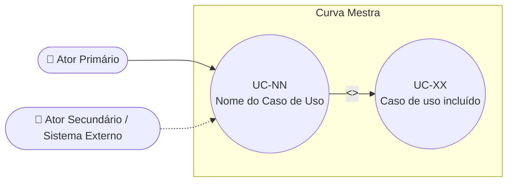

# UC-[NN]: [Nome do Caso de Uso]

**Projeto:** Curva Mestra
**Data de Criação:** [data de criação — nunca alterar depois]
**Autor:** [Nome do PO/BA] (via uml-use-case-writer)
**Status:** Rascunho | Em Revisão | Aprovado | Implementado | Obsoleto
**Módulo/Contexto:** [ex: Estoque, Admin, Autenticação, Solicitações]
**Versão:** 1.0

> Resumo em 1-2 linhas: o que o ator consegue realizar com este caso de uso e por quê isso importa para o negócio.

---

## 1. Diagrama UML (Mermaid)

Mermaid não possui um tipo nativo "use case diagram" — a convenção deste projeto é aproximar com `flowchart`, usando nós em formato de estádio/círculo para representar atores e casos de uso, e arestas rotuladas para `<<include>>` / `<<extend>>`.

Adapte os nós, rótulos e relações (`<<include>>`, `<<extend>>`, generalização) à realidade do caso de uso mapeado.

---

## 2. Atores

### 2.1 Ator Primário
Quem inicia o caso de uso e qual objetivo busca alcançar.

### 2.2 Atores Secundários / Sistemas Externos
Outros atores humanos ou sistemas externos envolvidos (ex: SEFAZ, Firebase Auth, Vertex AI).

---

## 3. Pré-condições
O que precisa ser verdade no sistema **antes** do caso de uso começar.

---

## 4. Pós-condições

### 4.1 Sucesso (Garantias de Sucesso)
Estado do sistema garantido após a execução bem-sucedida do caso de uso.

### 4.2 Falha (Garantias Mínimas)
Estado mínimo garantido mesmo que o caso de uso falhe ou seja abortado.

---

## 5. Gatilho (Trigger)
O evento específico que dá início ao caso de uso.

---

## 6. Fluxo Principal (Basic Flow)

1. [Ator] faz ...
2. [Sistema] faz ...
3. ...
N. Caso de uso é concluído com sucesso.

---

## 7. Fluxos Alternativos

### 7a. [Nome do fluxo alternativo] (a partir do passo N)
1. ...
2. Retorna ao fluxo principal no passo N, ou encerra o caso de uso.

---

## 8. Fluxos de Exceção

### 8a. [Nome da exceção] (a partir do passo N)
1. ...
2. Caso de uso é encerrado com falha / sistema notifica o ator.

---

## 9. Regras de Negócio Relacionadas

| ID | Regra | Justificativa |
|----|-------|----------------|
| RN-01 | ... | ... |

---

## 10. Requisitos Especiais / Não Funcionais

| ID | Descrição | Categoria |
|----|-----------|-----------|
| RNF-01 | ... | Performance / Segurança / Usabilidade / Multi-tenant |

---

## 11. Frequência de Uso
Estimativa de quantas vezes esse caso de uso ocorre (por dia/semana/mês) e em que contexto.

---

## 12. Casos de Uso Relacionados
Liste relações `<<include>>`, `<<extend>>` ou generalização com outros UC-NN já documentados em `ONLY_FOR_DEVS/PO_BA_Docs/`.

---

## 13. Referências
Arquivos de código, telas, specs (`FEAT`/`CR`/`ADR` em `ONLY_FOR_DEVS/TO_DO/` ou `TASK_COMPLETED/`) relacionados a este caso de uso.

---

## 14. Perguntas em Aberto / Decisões Pendentes

⚠️ Liste aqui qualquer ponto que ainda precisa ser confirmado com o usuário antes deste documento ser considerado "Aprovado". Nunca preencha esta seção com suposições — apenas com perguntas reais feitas e ainda não respondidas.

---

## 15. Histórico de Versões

| Versão | Data | Autor | O que mudou |
|--------|------|-------|--------------|
| 1.0 | [data de criação] | [Nome do PO/BA] | Versão inicial |
