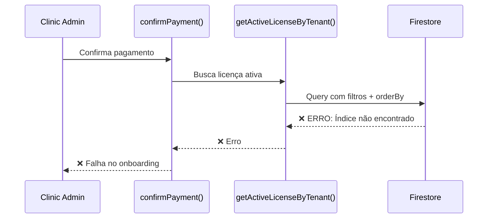
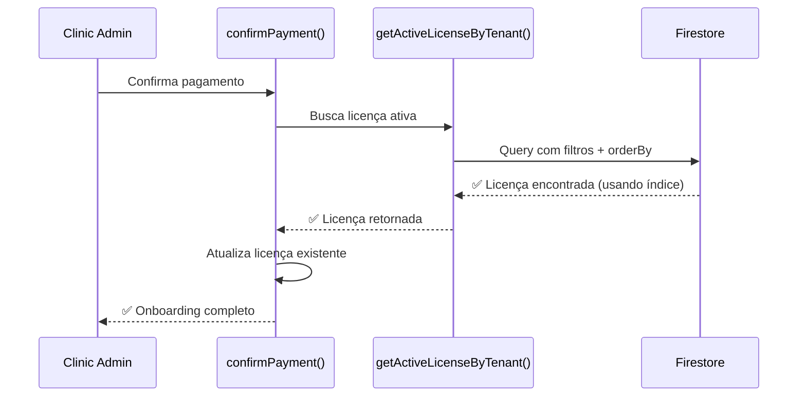

# 🐛 Problema: Índice Faltando para Busca de Licença

## 📋 Descrição do Problema

Ao efetuar o pagamento no onboarding, o clinic_admin recebia erro ao tentar buscar a licença ativa. O erro ocorria porque faltava um índice composto no Firestore para a query de licenças.

## 🔍 Causa Raiz

### Query Executada

**Arquivo:** `src/lib/services/licenseService.ts`  
**Função:** `getActiveLicenseByTenant()`  
**Linha:** ~100

```typescript
const q = query(
  collection(db, "licenses"),
  where("tenant_id", "==", tenantId),      // Filtro 1
  where("status", "==", "ativa"),          // Filtro 2
  orderBy("end_date", "desc")              // Ordenação
);
```

### Problema

Esta query usa:
1. **Filtro por `tenant_id`**
2. **Filtro por `status`**
3. **Ordenação por `end_date`**

**Firestore requer um índice composto** para queries que combinam múltiplos filtros `where()` com `orderBy()`.

### Erro no Console

```
Error: The query requires an index. You can create it here: 
https://console.firebase.google.com/project/curva-mestra/firestore/indexes?create_composite=...
```

## ✅ Solução Implementada

### Índice Adicionado

**Arquivo:** `firestore.indexes.json`

```json
{
  "collectionGroup": "licenses",
  "queryScope": "COLLECTION",
  "fields": [
    {
      "fieldPath": "tenant_id",
      "order": "ASCENDING"
    },
    {
      "fieldPath": "status",
      "order": "ASCENDING"
    },
    {
      "fieldPath": "end_date",
      "order": "DESCENDING"
    }
  ]
}
```

### Explicação do Índice

| Campo | Ordem | Propósito |
|-------|-------|-----------|
| `tenant_id` | ASCENDING | Filtrar licenças do tenant específico |
| `status` | ASCENDING | Filtrar apenas licenças ativas |
| `end_date` | DESCENDING | Ordenar da mais recente para mais antiga |

## 🎯 Fluxo Corrigido

### Antes (Com Erro)



### Depois (Funcionando)



## 📊 Impacto

### Antes da Correção
- ❌ Onboarding falhava ao confirmar pagamento
- ❌ Licença não era encontrada
- ❌ Tenant não era ativado
- ❌ Clinic_admin ficava preso no onboarding

### Depois da Correção
- ✅ Onboarding completa com sucesso
- ✅ Licença é encontrada e atualizada
- ✅ Tenant é ativado
- ✅ Clinic_admin pode acessar o sistema

## 🔧 Deploy Necessário

Para aplicar a correção, é necessário fazer deploy dos índices:

```bash
# Deploy apenas dos índices
firebase deploy --only firestore:indexes

# Ou deploy completo
firebase deploy --only firestore
```

### Tempo de Criação do Índice

⚠️ **Importante:** Após o deploy, o Firestore pode levar alguns minutos para criar o índice, especialmente se já houver dados na coleção `licenses`.

**Status do índice:**
- 🟡 **Building** - Índice sendo criado (aguarde)
- 🟢 **Enabled** - Índice pronto para uso

Você pode verificar o status em:
https://console.firebase.google.com/project/curva-mestra/firestore/indexes

## 🧪 Como Testar

### 1. Criar Nova Clínica
```
1. System admin cria nova clínica
2. Licença é criada automaticamente
3. Status: "ativa"
```

### 2. Fazer Onboarding
```
1. Clinic_admin faz login
2. Completa configuração inicial
3. Seleciona plano
4. Confirma pagamento ✅
```

### 3. Verificar Resultado
```
1. Licença deve ser atualizada (não duplicada)
2. Tenant deve ser ativado
3. Clinic_admin deve acessar dashboard
```

## 📝 Logs Esperados

### Console do Navegador

```
📝 Atualizando licença existente: abc123xyz
✅ Licença atualizada com sucesso
```

### Firestore

```
Collection: licenses
Document: abc123xyz
Fields:
  - tenant_id: "def456"
  - status: "ativa"
  - plan_id: "semestral" ou "anual"
  - auto_renew: true
  - features: [...]
  - updated_at: [timestamp atual]
```

## 🔍 Outros Índices Necessários

Verifique se há outras queries que podem precisar de índices:

### Query de Licenças por Tenant (Todas)
```typescript
// Se usado em algum lugar
query(
  collection(db, "licenses"),
  where("tenant_id", "==", tenantId),
  orderBy("created_at", "desc")
)
```

**Índice necessário:**
- `tenant_id` (ASCENDING)
- `created_at` (DESCENDING)

### Query de Licenças Expirando
```typescript
// Usado em checkLicenseExpiration Cloud Function
query(
  collection(db, "licenses"),
  where("status", "==", "ativa"),
  where("end_date", "<=", fifteenDaysFromNow)
)
```

**Índice necessário:**
- `status` (ASCENDING)
- `end_date` (ASCENDING)

## ⚠️ Prevenção

Para evitar problemas similares no futuro:

1. **Sempre teste queries complexas** com dados reais
2. **Adicione índices antes do deploy** quando criar novas queries
3. **Monitore logs do Firestore** para erros de índice
4. **Use o Firebase Emulator** para testar localmente

## 📚 Referências

- [Firestore Composite Indexes](https://firebase.google.com/docs/firestore/query-data/indexing)
- [Query Limitations](https://firebase.google.com/docs/firestore/query-data/queries#query_limitations)
- [Index Management](https://firebase.google.com/docs/firestore/query-data/index-overview)

---

**Status:** ✅ Corrigido  
**Data:** 29/11/2025  
**Arquivo Modificado:** `firestore.indexes.json`  
**Deploy Necessário:** Sim (firestore:indexes)
