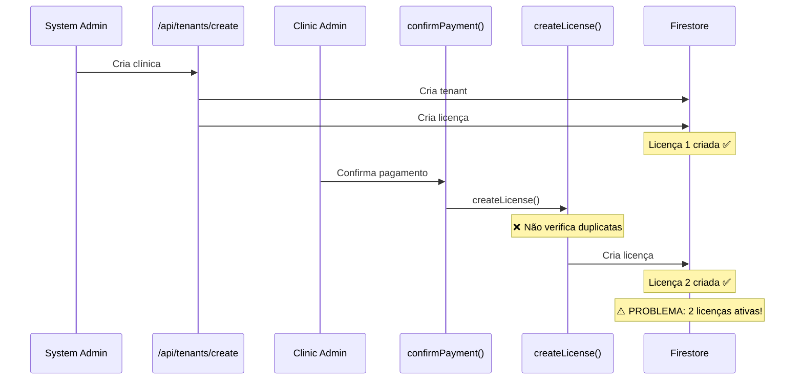

# 🐛 Problema: Licença Duplicada no Onboarding

## 📋 Descrição do Problema

Quando uma clínica é criada, uma licença é criada automaticamente. Porém, quando o `clinic_admin` passa pelo processo de onboarding, **uma segunda licença é criada** ao invés de atualizar a licença existente.

**Resultado:** O tenant fica com **2 licenças ativas** ao invés de 1.

## 🔍 Causa Raiz

### 1️⃣ Primeira Licença Criada

**Arquivo:** `src/app/api/tenants/create/route.ts`  
**Linhas:** 130-152  
**Momento:** Quando o system_admin cria a clínica

```typescript
// 5. Criar licença inicial (baseada no plano)
try {
  const startDate = new Date();
  const endDate = new Date(startDate);

  // Plano semestral = 6 meses, anual = 12 meses
  const monthsToAdd = data.plan_id === "semestral" ? 6 : 12;
  endDate.setMonth(endDate.getMonth() + monthsToAdd);

  await db.collection("licenses").add({
    tenant_id: tenantId,
    plan_id: data.plan_id,
    max_users: data.max_users,
    status: "ativa",
    auto_renew: false,  // ⚠️ Nota: auto_renew = false
    start_date: startDate,
    end_date: endDate,
    created_at: new Date(),
    updated_at: new Date(),
  });

  console.log(`✅ Licença criada para tenant ${tenantId}`);
} catch (licenseError: any) {
  console.error("❌ Erro ao criar licença:", licenseError);
  // Não falhar a criação por isso
}
```

**Características da Licença 1:**
- ✅ Criada com base no plano selecionado pelo admin
- ✅ Status: "ativa"
- ⚠️ `auto_renew: false`
- ⚠️ Sem campo `features`

### 2️⃣ Segunda Licença Criada

**Arquivo:** `src/lib/services/tenantOnboardingService.ts`  
**Função:** `confirmPayment()`  
**Linhas:** 217-230  
**Momento:** Quando o clinic_admin confirma o pagamento no onboarding

```typescript
// Cria licença automaticamente
const startDate = new Date();
const endDate = new Date();
endDate.setMonth(
  endDate.getMonth() + (onboarding.selected_plan_id === "anual" ? 12 : 6)
);

const licenseId = await createLicense({
  tenant_id: tenantId,
  plan_id: onboarding.selected_plan_id,
  start_date: startDate,
  end_date: endDate,
  max_users: plan.maxUsers,
  features: plan.features,
  auto_renew: true, // ⚠️ Nota: auto_renew = true
});
```

**Características da Licença 2:**
- ✅ Criada com base no plano selecionado no onboarding
- ✅ Status: "ativa"
- ✅ `auto_renew: true`
- ✅ Inclui campo `features`

### 3️⃣ Função `createLicense()` Não Verifica Duplicatas

**Arquivo:** `src/lib/services/licenseService.ts`  
**Função:** `createLicense()`  
**Linhas:** 30-50

```typescript
export async function createLicense(licenseData: {
  tenant_id: string;
  plan_id: string;
  max_users: number;
  features: string[];
  start_date: Date;
  end_date: Date;
  auto_renew?: boolean;
}): Promise<string> {
  try {
    // ⚠️ PROBLEMA: Não verifica se já existe licença ativa
    const licenseRef = await addDoc(collection(db, "licenses"), {
      ...licenseData,
      status: "ativa" as LicenseStatus,
      start_date: Timestamp.fromDate(licenseData.start_date),
      end_date: Timestamp.fromDate(licenseData.end_date),
      auto_renew: licenseData.auto_renew ?? false,
      created_at: serverTimestamp(),
      updated_at: serverTimestamp(),
    });

    return licenseRef.id;
  } catch (error) {
    console.error("Erro ao criar licença:", error);
    throw new Error("Falha ao criar licença");
  }
}
```

**❌ ERRO:** A função `createLicense()` **sempre cria uma nova licença** sem verificar se já existe uma licença ativa para o tenant.

## 🎯 Localização Exata do Erro

### Erro Principal

**Arquivo:** `src/lib/services/tenantOnboardingService.ts`  
**Função:** `confirmPayment()`  
**Linha:** ~221

```typescript
// ❌ ERRO: Cria nova licença sem verificar se já existe
const licenseId = await createLicense({
  tenant_id: tenantId,
  plan_id: onboarding.selected_plan_id,
  start_date: startDate,
  end_date: endDate,
  max_users: plan.maxUsers,
  features: plan.features,
  auto_renew: true,
});
```

### Erro Secundário

**Arquivo:** `src/lib/services/licenseService.ts`  
**Função:** `createLicense()`  
**Linha:** ~40

```typescript
// ❌ ERRO: Não verifica duplicatas antes de criar
const licenseRef = await addDoc(collection(db, "licenses"), {
  ...licenseData,
  status: "ativa" as LicenseStatus,
  // ...
});
```

## 📊 Fluxo do Problema



## 🔍 Evidências

### Função que Verifica Licença Ativa Existe

**Arquivo:** `src/lib/services/licenseService.ts`  
**Função:** `getActiveLicenseByTenant()`  
**Linhas:** 56-78

```typescript
export async function getActiveLicenseByTenant(
  tenantId: string
): Promise<License | null> {
  try {
    const q = query(
      collection(db, "licenses"),
      where("tenant_id", "==", tenantId),
      where("status", "==", "ativa"),
      orderBy("end_date", "desc")
    );

    const snapshot = await getDocs(q);

    if (snapshot.empty) {
      return null;
    }

    const doc = snapshot.docs[0];
    return {
      id: doc.id,
      ...doc.data(),
    } as License;
  } catch (error) {
    console.error("Erro ao buscar licença ativa:", error);
    throw new Error("Falha ao buscar licença ativa");
  }
}
```

**✅ Esta função existe mas NÃO é usada** antes de criar a nova licença!

## 💡 Resumo da Causa Raiz

### Problema 1: Criação Dupla
- **Local:** `src/app/api/tenants/create/route.ts` (linha ~130)
- **Ação:** Cria licença inicial ao criar tenant
- **Problema:** Licença criada mesmo que o tenant ainda não tenha completado onboarding

### Problema 2: Falta de Verificação
- **Local:** `src/lib/services/tenantOnboardingService.ts` (linha ~221)
- **Ação:** Cria nova licença no `confirmPayment()`
- **Problema:** Não verifica se já existe licença ativa antes de criar

### Problema 3: Função Sem Validação
- **Local:** `src/lib/services/licenseService.ts` (linha ~40)
- **Ação:** `createLicense()` sempre cria nova licença
- **Problema:** Não tem lógica para verificar duplicatas ou atualizar existente

## 🎯 Soluções Possíveis (Não Implementadas)

### Opção 1: Não Criar Licença na API Route
Remover a criação de licença em `/api/tenants/create` e deixar apenas no onboarding.

### Opção 2: Verificar e Atualizar no Onboarding
No `confirmPayment()`, verificar se já existe licença ativa e atualizar ao invés de criar nova.

### Opção 3: Adicionar Validação em `createLicense()`
Modificar `createLicense()` para verificar duplicatas antes de criar.

### Opção 4: Criar Licença Inativa Inicialmente
Na API route, criar licença com `status: "pendente"` e ativar no onboarding.

## 📝 Notas Adicionais

### Diferenças entre as Licenças

| Campo | Licença 1 (API) | Licença 2 (Onboarding) |
|-------|-----------------|------------------------|
| `auto_renew` | `false` | `true` |
| `features` | ❌ Não tem | ✅ Tem |
| `status` | "ativa" | "ativa" |
| Momento | Criação do tenant | Confirmação pagamento |

### Impacto

- ✅ Ambas as licenças são válidas
- ⚠️ Tenant tem 2 licenças ativas simultaneamente
- ⚠️ Pode causar confusão em relatórios
- ⚠️ Cloud Function `checkLicenseExpiration` pode processar ambas
- ⚠️ Renovação automática pode criar mais duplicatas

---

**Conclusão:** O erro está em **dois lugares**:

1. **`src/lib/services/tenantOnboardingService.ts` (linha ~221)** - Cria licença sem verificar se já existe
2. **`src/lib/services/licenseService.ts` (linha ~40)** - Função `createLicense()` não valida duplicatas

A solução ideal seria implementar uma das opções sugeridas acima.
