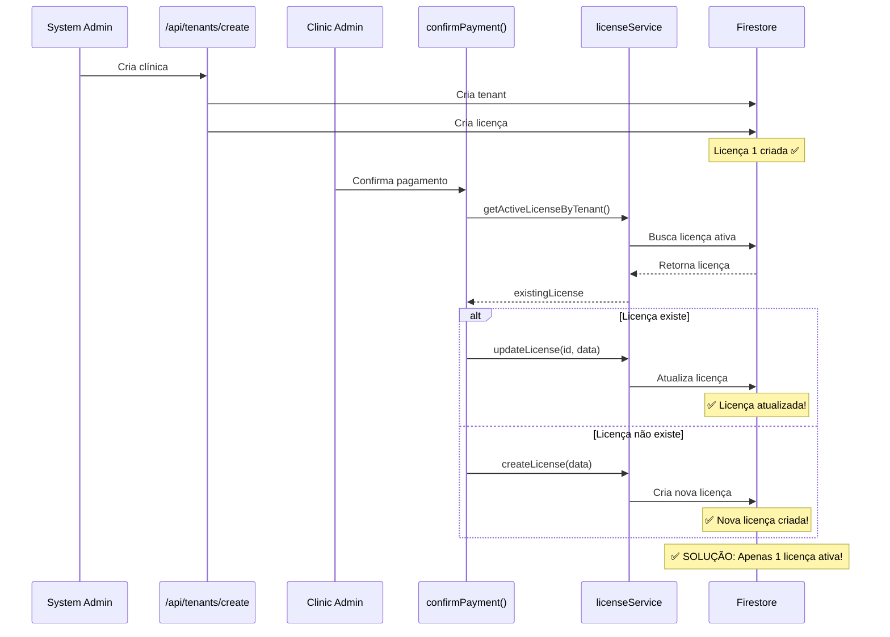

# ✅ Solução: Problema de Licença Duplicada

## 📋 Problema Resolvido

Quando uma clínica era criada, uma licença era criada automaticamente. Porém, quando o `clinic_admin` passava pelo processo de onboarding, uma **segunda licença era criada** ao invés de atualizar a existente.

**Resultado anterior:** Tenant com 2 licenças ativas  
**Resultado agora:** Tenant com 1 licença ativa (atualizada)

## 🔧 Alterações Realizadas

### 1️⃣ Nova Função: `updateLicense()`

**Arquivo:** `src/lib/services/licenseService.ts`  
**Linha:** ~58

Criada nova função para atualizar licenças existentes:

```typescript
/**
 * Atualizar licença existente
 */
export async function updateLicense(
  licenseId: string,
  updateData: {
    plan_id?: string;
    max_users?: number;
    features?: string[];
    start_date?: Date;
    end_date?: Date;
    auto_renew?: boolean;
    status?: LicenseStatus;
  }
): Promise<void> {
  try {
    const licenseRef = doc(db, "licenses", licenseId);
    
    const dataToUpdate: any = {
      ...updateData,
      updated_at: serverTimestamp(),
    };

    // Converter datas para Timestamp se fornecidas
    if (updateData.start_date) {
      dataToUpdate.start_date = Timestamp.fromDate(updateData.start_date);
    }
    if (updateData.end_date) {
      dataToUpdate.end_date = Timestamp.fromDate(updateData.end_date);
    }

    await updateDoc(licenseRef, dataToUpdate);
  } catch (error) {
    console.error("Erro ao atualizar licença:", error);
    throw new Error("Falha ao atualizar licença");
  }
}
```

### 2️⃣ Atualização dos Imports

**Arquivo:** `src/lib/services/tenantOnboardingService.ts`  
**Linha:** ~22

Adicionados imports necessários:

```typescript
import { 
  createLicense, 
  getActiveLicenseByTenant,  // ✅ Adicionado
  updateLicense              // ✅ Adicionado
} from "./licenseService";
```

### 3️⃣ Lógica de Verificação no `confirmPayment()`

**Arquivo:** `src/lib/services/tenantOnboardingService.ts`  
**Função:** `confirmPayment()`  
**Linha:** ~217

Modificada a lógica para verificar e atualizar licença existente:

```typescript
// Verifica se já existe licença ativa
const existingLicense = await getActiveLicenseByTenant(tenantId);

let licenseId: string;

if (existingLicense) {
  // ✅ ATUALIZA licença existente com dados do onboarding
  console.log(`📝 Atualizando licença existente: ${existingLicense.id}`);
  
  const startDate = new Date();
  const endDate = new Date();
  endDate.setMonth(
    endDate.getMonth() + (onboarding.selected_plan_id === "anual" ? 12 : 6)
  );

  await updateLicense(existingLicense.id, {
    plan_id: onboarding.selected_plan_id,
    start_date: startDate,
    end_date: endDate,
    max_users: plan.maxUsers,
    features: plan.features,
    auto_renew: true, // Habilita renovação automática
    status: "ativa",
  });

  licenseId = existingLicense.id;
  console.log(`✅ Licença atualizada com sucesso`);
} else {
  // ✅ CRIA nova licença se não existir
  console.log(`📝 Criando nova licença para tenant ${tenantId}`);
  
  const startDate = new Date();
  const endDate = new Date();
  endDate.setMonth(
    endDate.getMonth() + (onboarding.selected_plan_id === "anual" ? 12 : 6)
  );

  licenseId = await createLicense({
    tenant_id: tenantId,
    plan_id: onboarding.selected_plan_id,
    start_date: startDate,
    end_date: endDate,
    max_users: plan.maxUsers,
    features: plan.features,
    auto_renew: true,
  });

  console.log(`✅ Nova licença criada: ${licenseId}`);
}
```

## 🎯 Como Funciona Agora

### Fluxo Atualizado



## 📊 Comparação: Antes vs Depois

### Antes da Correção

| Momento | Ação | Resultado |
|---------|------|-----------|
| Criação da clínica | Cria licença #1 | `auto_renew: false`, sem `features` |
| Confirmação pagamento | Cria licença #2 | `auto_renew: true`, com `features` |
| **Total** | **2 licenças ativas** | ❌ Duplicação |

### Depois da Correção

| Momento | Ação | Resultado |
|---------|------|-----------|
| Criação da clínica | Cria licença #1 | `auto_renew: false`, sem `features` |
| Confirmação pagamento | **Atualiza licença #1** | `auto_renew: true`, com `features` |
| **Total** | **1 licença ativa** | ✅ Sem duplicação |

## 🔍 Campos Atualizados na Licença

Quando a licença existente é atualizada, os seguintes campos são modificados:

```typescript
{
  plan_id: "semestral" ou "anual",     // Atualizado com plano do onboarding
  start_date: new Date(),               // Atualizado para data atual
  end_date: +6 ou +12 meses,           // Recalculado baseado no plano
  max_users: 3 ou 5,                   // Atualizado conforme plano
  features: [...],                      // Adicionado (antes não tinha)
  auto_renew: true,                     // Mudado de false para true
  status: "ativa",                      // Mantém ativa
  updated_at: serverTimestamp()         // Atualizado
}
```

## ✅ Benefícios da Solução

1. **Sem Duplicação:** Apenas 1 licença ativa por tenant
2. **Dados Completos:** Licença atualizada com `features` e `auto_renew`
3. **Flexível:** Se não existir licença, cria uma nova
4. **Logs Claros:** Console mostra se atualizou ou criou
5. **Retrocompatível:** Funciona com tenants novos e existentes

## 🧪 Cenários de Teste

### Cenário 1: Tenant Novo (Criado pelo Admin)
1. ✅ Admin cria clínica → Licença #1 criada
2. ✅ Clinic_admin faz onboarding → Licença #1 atualizada
3. ✅ Resultado: 1 licença ativa

### Cenário 2: Tenant Sem Licença Prévia
1. ✅ Tenant criado sem licença (caso raro)
2. ✅ Clinic_admin faz onboarding → Nova licença criada
3. ✅ Resultado: 1 licença ativa

### Cenário 3: Tenant com Licença Expirada
1. ✅ Tenant tem licença expirada
2. ✅ Clinic_admin faz onboarding → Nova licença criada
3. ✅ Resultado: 1 licença ativa (nova)

## 📝 Logs de Console

### Quando Atualiza Licença Existente
```
📝 Atualizando licença existente: abc123xyz
✅ Licença atualizada com sucesso
```

### Quando Cria Nova Licença
```
📝 Criando nova licença para tenant def456uvw
✅ Nova licença criada: ghi789rst
```

## 🔐 Segurança

A solução mantém as mesmas regras de segurança do Firestore:

```javascript
// Firestore Rules
match /licenses/{licenseId} {
  // Permite clinic_admin criar/atualizar licença do próprio tenant
  allow create, update: if isSystemAdmin() 
    || (isClinicAdmin() && request.resource.data.tenant_id == request.auth.token.tenant_id);
}
```

## 🚀 Deploy

Para aplicar a correção em produção:

```bash
# 1. Build
npm run build

# 2. Deploy
firebase deploy --only hosting
```

## 📊 Impacto em Tenants Existentes

### Tenants com 2 Licenças (Antes da Correção)
- ✅ Continuarão funcionando normalmente
- ⚠️ Terão 2 licenças ativas até que façam um novo onboarding
- 💡 Recomendação: Script de limpeza para remover licenças duplicadas

### Tenants Novos (Após a Correção)
- ✅ Terão apenas 1 licença ativa
- ✅ Licença será atualizada no onboarding
- ✅ Sem duplicação

## 🔧 Script de Limpeza (Opcional)

Para limpar licenças duplicadas de tenants existentes:

```typescript
// Script para remover licenças duplicadas
async function cleanupDuplicateLicenses() {
  const tenantsSnapshot = await getDocs(collection(db, "tenants"));
  
  for (const tenantDoc of tenantsSnapshot.docs) {
    const tenantId = tenantDoc.id;
    
    // Buscar todas as licenças ativas do tenant
    const licensesQuery = query(
      collection(db, "licenses"),
      where("tenant_id", "==", tenantId),
      where("status", "==", "ativa"),
      orderBy("created_at", "desc")
    );
    
    const licensesSnapshot = await getDocs(licensesQuery);
    
    if (licensesSnapshot.size > 1) {
      console.log(`⚠️ Tenant ${tenantId} tem ${licensesSnapshot.size} licenças`);
      
      // Manter apenas a mais recente
      const licenses = licensesSnapshot.docs;
      const [newest, ...older] = licenses;
      
      // Desativar licenças antigas
      for (const oldLicense of older) {
        await updateDoc(oldLicense.ref, {
          status: "cancelada",
          updated_at: serverTimestamp(),
        });
        console.log(`✅ Licença ${oldLicense.id} desativada`);
      }
    }
  }
}
```

## 📚 Arquivos Modificados

1. ✅ `src/lib/services/licenseService.ts` - Adicionada função `updateLicense()`
2. ✅ `src/lib/services/tenantOnboardingService.ts` - Modificada lógica de `confirmPayment()`

## 🎯 Conclusão

A solução implementada:
- ✅ Resolve o problema de duplicação de licenças
- ✅ Mantém compatibilidade com código existente
- ✅ Adiciona logs para facilitar debug
- ✅ É flexível para diferentes cenários
- ✅ Não quebra funcionalidades existentes

---

**Status:** ✅ Problema Resolvido  
**Data:** 29/11/2025  
**Arquivos Modificados:** 2  
**Testes:** Pendente
