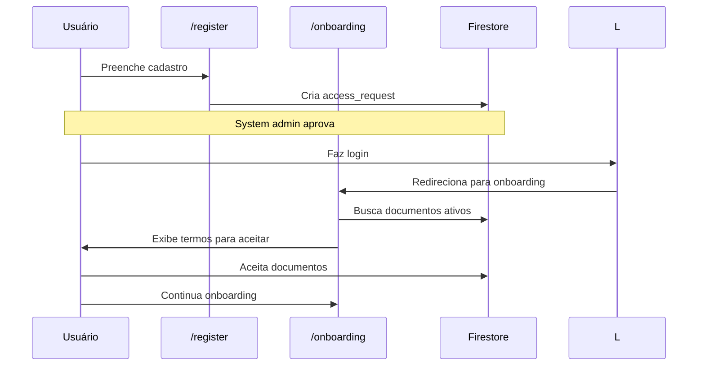
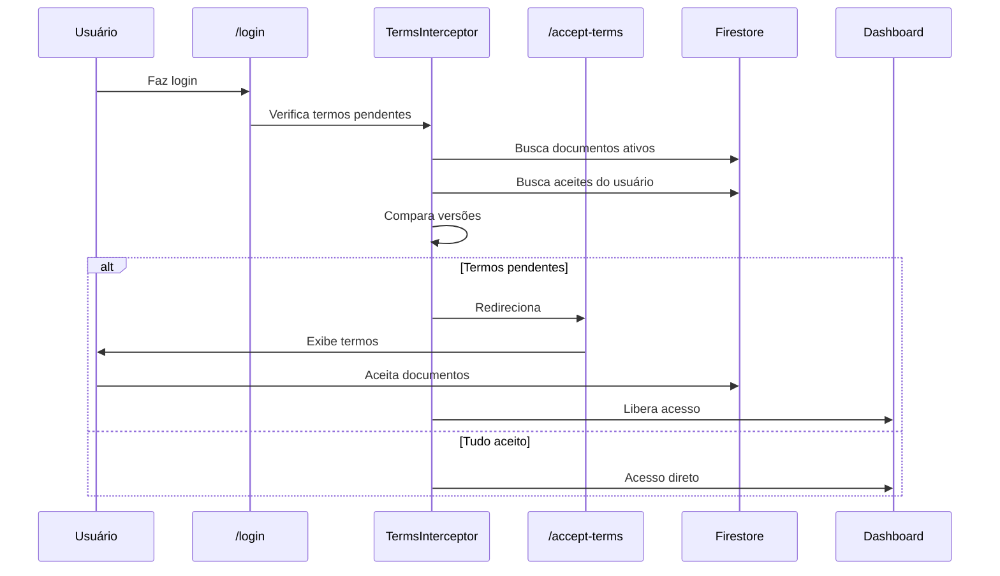
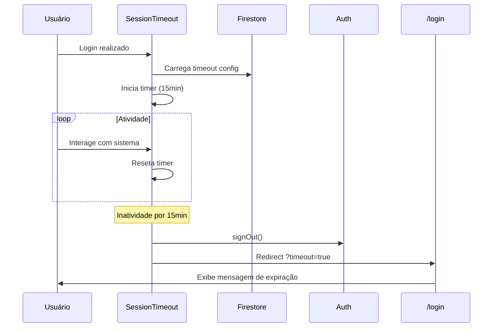

# TASK MVP 003 - Implementação Completa

**Data**: 05/12/2024
**Status**: ✅ CONCLUÍDO

## Resumo das Tarefas

Esta tarefa implementou três funcionalidades essenciais para o MVP:

1. **Atualização do modelo de pagamento** na homepage
2. **Sistema de documentos legais** com aceite obrigatório
3. **Configuração de timeout de sessão**

---

## A. Modelo de Pagamento Mensal

### Descrição
Atualização da homepage para refletir que o modelo de pagamento é **mensal**, mesmo para planos semestrais e anuais. O usuário assina um pagamento recorrente mensal no PagSeguro.

### Alterações Realizadas

#### 1. Homepage (`src/app/page.tsx`)

**Antes:**
```tsx
<p className="text-white/60 text-sm">
  Total: R$ 359,40 a cada 6 meses
</p>
```

**Depois:**
```tsx
<p className="text-white/60 text-sm">
  Pagamento mensal da licença
</p>
<p className="text-white/50 text-xs mt-1">
  (6 meses de compromisso)
</p>
```

### Resultado
- ✅ Usuários entendem que o pagamento é **mensal**
- ✅ Ficou claro o período de compromisso (6 ou 12 meses)
- ✅ Informação alinhada com o modelo PagSeguro

---

## B. Sistema de Documentos Legais

### Descrição
Sistema completo para gerenciar documentos legais (Termos de Uso, Política de Privacidade, LGPD, etc.) que usuários devem aceitar obrigatoriamente.

### Arquitetura

```
┌─────────────────────────────────────────────────────┐
│              SYSTEM ADMIN                            │
│  /admin/legal-documents (CRUD completo)             │
│  /admin/settings (Configurações gerais)             │
└──────────────────┬──────────────────────────────────┘
                   │
                   ▼
┌─────────────────────────────────────────────────────┐
│         FIRESTORE COLLECTIONS                        │
│  • legal_documents (documentos ativos)              │
│  • user_document_acceptances (aceites)              │
│  • system_settings (configurações)                  │
└──────────────────┬──────────────────────────────────┘
                   │
                   ▼
┌─────────────────────────────────────────────────────┐
│          USUÁRIOS (Interceptor)                      │
│  • Verifica termos pendentes no login               │
│  • Redireciona para /accept-terms                   │
│  • Bloqueia acesso até aceitar                      │
└─────────────────────────────────────────────────────┘
```

### Implementações

#### 1. Types (`src/types/index.ts`)

```typescript
export type DocumentStatus = "ativo" | "inativo" | "rascunho";

export interface LegalDocument {
  id: string;
  title: string;
  slug: string;
  content: string; // Markdown
  version: string;
  status: DocumentStatus;
  required_for_registration: boolean;
  required_for_existing_users: boolean;
  order: number;
  created_by: string;
  created_at: Timestamp;
  updated_at: Timestamp;
  published_at?: Timestamp;
}

export interface UserDocumentAcceptance {
  id: string;
  user_id: string;
  document_id: string;
  document_version: string;
  accepted_at: Timestamp;
  ip_address?: string;
  user_agent?: string;
}

export interface SystemSettings {
  id: string; // sempre "global"
  session_timeout_minutes: number;
  maintenance_mode: boolean;
  maintenance_message?: string;
  registration_enabled: boolean;
  updated_by: string;
  updated_at: Timestamp;
}
```

#### 2. Páginas Criadas

##### `/admin/legal-documents/page.tsx`
- Lista todos os documentos legais
- Badges de status (Ativo, Inativo, Rascunho)
- Ações: Visualizar, Editar, Excluir
- Dialog de confirmação para exclusão

##### `/admin/legal-documents/new/page.tsx`
- Formulário completo de criação
- Campos:
  - Título (gera slug automático)
  - Versão
  - Status
  - Conteúdo (Markdown)
  - Ordem de exibição
  - Obrigatório no cadastro
  - Obrigatório para usuários existentes
- Validações no frontend

##### `/admin/settings/page.tsx`
- Configurações globais do sistema:
  - Timeout de sessão (1-1440 minutos)
  - Modo de manutenção (com mensagem customizável)
  - Permitir novos registros (liga/desliga cadastros)

##### `/accept-terms/page.tsx`
- Página de aceitação de termos pendentes
- Exibe documentos em Markdown formatado
- Checkboxes individuais para cada documento
- Botão habilitado apenas quando todos aceitos
- Registra aceite com timestamp, versão e user agent

#### 3. Hooks Criados

##### `src/hooks/usePendingTerms.ts`
```typescript
export function usePendingTerms() {
  // Verifica documentos ativos e obrigatórios
  // Compara com aceites do usuário
  // Retorna lista de documentos pendentes
  return { loading, hasPendingTerms, pendingDocuments, refetch };
}
```

##### `src/hooks/useSessionTimeout.ts`
```typescript
export function useSessionTimeout() {
  // Carrega timeout configurado do Firestore
  // Monitora atividade do usuário
  // Reseta timer em cada interação
  // Faz logout automático quando expira
  return null;
}
```

#### 4. Componentes de Segurança

##### `src/components/auth/TermsInterceptor.tsx`
```typescript
export function TermsInterceptor({ children }) {
  // Verifica termos pendentes após login
  // Redireciona para /accept-terms se necessário
  // Permite rotas públicas (/, /login, /register)
  return <>{children}</>;
}
```

##### `src/components/auth/SessionTimeoutManager.tsx`
```typescript
export function SessionTimeoutManager() {
  useSessionTimeout();
  return null;
}
```

##### `src/components/providers/ClientProviders.tsx`
```typescript
export function ClientProviders({ children }) {
  return (
    <>
      <SessionTimeoutManager />
      <TermsInterceptor>{children}</TermsInterceptor>
      <Toaster />
    </>
  );
}
```

#### 5. Firestore Rules Atualizadas

```javascript
// Documentos legais
match /legal_documents/{documentId} {
  allow read: if isAuthenticated();
  allow write: if isSystemAdmin();
}

// Aceites de usuários (auditoria)
match /user_document_acceptances/{acceptanceId} {
  allow read: if isSystemAdmin() ||
    (isAuthenticated() && resource.data.user_id == request.auth.uid);
  allow create: if isAuthenticated() &&
    request.resource.data.user_id == request.auth.uid;
  allow update, delete: if false; // Imutável para auditoria
}

// Configurações do sistema
match /system_settings/{settingId} {
  allow read: if isAuthenticated();
  allow write: if isSystemAdmin();
}
```

#### 6. Menu Admin Atualizado

Adicionadas duas novas opções no `AdminLayout.tsx`:
- 📄 **Documentos Legais** → `/admin/legal-documents`
- ⚙️ **Configurações** → `/admin/settings`

---

## C. Timeout de Sessão Configurável

### Descrição
Sistema de expiração automática de sessão por inatividade, configurável pelo system_admin.

### Funcionamento

1. **Configuração** (`/admin/settings`):
   - System admin define tempo (padrão: 15 minutos)
   - Valor salvo em `system_settings/global`

2. **Monitoramento** (`useSessionTimeout`):
   - Hook carrega configuração do Firestore
   - Monitora eventos: mousedown, keydown, scroll, touchstart, click
   - Reseta timer a cada atividade
   - Logout automático ao expirar

3. **Feedback** (`/login`):
   - Query param `?timeout=true`
   - Alert informando expiração por inatividade
   - Usuário faz login novamente

### Eventos Monitorados
- ✅ Movimento do mouse
- ✅ Teclado
- ✅ Scroll
- ✅ Touch (mobile)
- ✅ Cliques

---

## Fluxos Implementados

### 1. Fluxo de Aceite de Termos (Novo Usuário)



### 2. Fluxo de Aceite de Termos (Usuário Existente)



### 3. Fluxo de Timeout de Sessão



---

## Arquivos Criados/Modificados

### Criados ✨
```
src/
├── app/
│   ├── (admin)/admin/
│   │   ├── legal-documents/
│   │   │   ├── page.tsx (lista)
│   │   │   └── new/page.tsx (criar)
│   │   └── settings/page.tsx
│   └── (auth)/accept-terms/page.tsx
├── components/
│   ├── auth/
│   │   ├── TermsInterceptor.tsx
│   │   └── SessionTimeoutManager.tsx
│   └── providers/
│       └── ClientProviders.tsx
└── hooks/
    ├── usePendingTerms.ts
    └── useSessionTimeout.ts
```

### Modificados 🔧
```
src/
├── app/
│   ├── page.tsx (homepage - planos)
│   ├── layout.tsx (adiciona ClientProviders)
│   └── (auth)/login/page.tsx (mensagem de timeout)
├── components/admin/AdminLayout.tsx (menu)
├── types/index.ts (novos tipos)
└── firestore.rules (novas coleções)
```

---

## Checklist de Funcionalidades

### A. Homepage ✅
- [x] Texto "Pagamento mensal da licença"
- [x] Período de compromisso visível
- [x] Informação clara e sem ambiguidade

### B. Documentos Legais ✅
- [x] CRUD completo de documentos
- [x] Suporte a Markdown
- [x] Versionamento de documentos
- [x] Status (ativo, inativo, rascunho)
- [x] Ordem de exibição configurável
- [x] Flag "obrigatório no cadastro"
- [x] Flag "obrigatório para usuários existentes"
- [x] Página de aceitação (/accept-terms)
- [x] Interceptor automático pós-login
- [x] Auditoria de aceites (imutável)
- [x] Menu admin atualizado

### C. Timeout de Sessão ✅
- [x] Configuração em /admin/settings
- [x] Valor padrão 15 minutos
- [x] Monitoramento de atividade
- [x] Logout automático
- [x] Mensagem na tela de login
- [x] Eventos mouse, teclado, scroll, touch

### D. Segurança ✅
- [x] Firestore Rules atualizadas
- [x] Validações no frontend
- [x] Auditoria de aceites
- [x] System admin only para configurações

---

## Como Testar

### 1. Testar Homepage
```bash
1. Acessar http://localhost:3000
2. Verificar seção "Planos Iniciais"
3. Confirmar texto "Pagamento mensal da licença"
```

### 2. Testar Documentos Legais
```bash
1. Login como system_admin
2. Ir para /admin/legal-documents
3. Criar novo documento:
   - Título: "Termos de Uso"
   - Versão: "1.0"
   - Status: "Ativo"
   - Marcar "Obrigatório para usuários existentes"
4. Fazer logout e login novamente
5. Deve redirecionar para /accept-terms
6. Aceitar documento
7. Verificar que foi registrado no Firestore
```

### 3. Testar Timeout de Sessão
```bash
1. Login como system_admin
2. Ir para /admin/settings
3. Alterar timeout para 1 minuto (para teste)
4. Fazer logout e login novamente
5. Ficar 1 minuto sem interagir
6. Deve fazer logout automático
7. Verificar mensagem na tela de login
```

---

## Próximos Passos

### Melhorias Futuras
1. **Editor WYSIWYG** para documentos legais (substituir Markdown simples)
2. **Preview** de documentos antes de publicar
3. **Histórico de versões** de documentos
4. **Notificação por email** quando novos termos forem publicados
5. **Dashboard de aceites** para system admin (quem aceitou, quando, etc.)
6. **Export PDF** dos documentos para impressão

### Integrações
1. Adicionar aceite de termos no **fluxo de registro** (`/register`)
2. Implementar **modo de manutenção** visual (banner na UI)
3. Criar **página de documentos públicos** para SEO (/terms, /privacy)

---

## Observações Importantes

### Auditoria
- ✅ Aceites de documentos são **imutáveis** (não podem ser editados/deletados)
- ✅ Registra timestamp, versão, user agent
- ✅ Possível adicionar IP address via API

### Versionamento
- ✅ Cada documento tem uma versão
- ✅ Se versão mudar, usuário deve aceitar novamente
- ✅ Histórico de aceites preservado

### Multi-Tenant
- ✅ Documentos são **globais** (não por tenant)
- ✅ Configurações são **globais**
- ✅ Aceites são **por usuário** (não por tenant)

---

## Conclusão

Todas as tarefas do MVP_003 foram implementadas com sucesso:

✅ **Modelo de pagamento mensal** refletido na homepage
✅ **Sistema completo de documentos legais** com aceite obrigatório
✅ **Timeout de sessão configurável** com logout automático

O sistema está pronto para:
- Compliance com LGPD (termos aceitos e auditados)
- Segurança aumentada (sessões expiram por inatividade)
- Clareza no modelo de negócio (pagamento mensal recorrente)

---

**Próxima Task**: MVP_004 (a definir)
**Deploy**: Aguardando testes em produção
